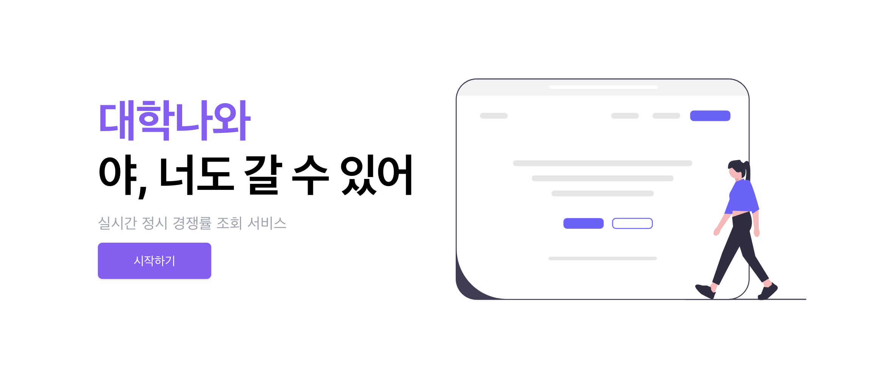

시간이 정말 빨리 흘러가 버렸네요. 2023년도 벌써 마무리되고 2024년이 되었습니다. 처음으로 기술 블로그를 통해 한 해를 돌아보는 시간을 가지게 됐어요. 정신없이 바쁘게 지나가 버린 시간들이었지만, 이번에는 좀 더 진지하게 한 해를 되돌아보면서 배웠던 교훈들을 정리해볼까 합니다. 지난 시간을 돌아보는 것과 함께 새해 목표를 세워보았습니다.

## 1. 밀리언그라운드 서비스 오픈

<figure>
      
      <figcaption>출처: 밀리언그라운드 웹사이트</figcaption>
</figure>

2023년의 업무적인 큰 성과는 밀리언그라운드 서비스의 성공적인 출시였어요. 밀리언그라운드 서비스는 여러 사용자가 하나의 프리미엄 별장을 공동으로 소유하고 각자 30일 동안 사용할 수 있도록 한 건데요, 저는 별장 소유주와 일반 고객들이 밀리언그라운드 별장을 예약할 수 있는 웹사이트 및 관리자 페이지 개발을 맡았습니다.

프론트엔드 개발을 혼자서 진행하면서, 특히 예약 시스템의 복잡한 로직에 대해 많은 고민과 시행착오를 겪었어요. 하지만 동료들과 주변 개발자 지인분들의 인사이트 덕분에 그 어려움을 극복할 수 있었습니다. 밀리언그라운드를 A부터 Z까지 개발할 수 있었던 경험은 정말 큰 행운이었고, 제게 큰 성장의 기회가 되었던거 같아요. 복잡한 프로젝트를 작은 단위로 나누어 접근하는 방법과 다른 팀들과의 협업 기술을 배울 수 있었습니다.

밀리언그라운드 홍천은 완판되어 12월에 오픈을 시작했고, 오너분들이 사용하고 계시더라고요. 지금은 밀리언 그라운드 양평 모집을 진행 중이에요. 앞으로의 서비스 발전이 정말 기대되고, 서비스가 성장하는 만큼 저도 함께 성장해 나가려고 합니다.

## 2. 지속하진 못했던 사이드 프로젝트 “대학나와”

2023년에는 '대학나와'라는 사이드 프로젝트를 시작했습니다. 해당 서비스는 대학 입시 경쟁률 데이터를 제공하는 것이었습니다. 단기간에 개발하여 DAU 5000 정도의 수치를 보여주었지만, 2가지정도의 문제로 인해 서비스를 종료하게 되었습니다.

### [너무 짧은 서비스 수명]

해당 서비스가 필요한 시기는 수시접수기간, 정시접수기간 두번으로 각 일주일 정도 접수 기간이었습니다. 즉 365일중 14일을 위한 서비스.. 비록 14일 짧은 기간 동안 별다른 홍보를 하지 않아도 많은 트래픽을 받을 수 있었지만 퇴근 후 노력을 많이 기울여 만든 나의 서비스가 14일 밖에 서비스를 할 수 없다는 사실에 의욕이 줄었던게 첫번째 이유였습니다.

### [저작권 문제]

제가 정시, 수시 데이터를 얻는 방법은 크롤링이었습니다. 대학교 정시, 수시 데이터를 실시간으로 볼 수 있는 API를 찾아봤지만, 찾을 수 없어서 다른 방법을 사용했죠. 각 학교 사이트와 진학사 등 여러 사이트에서 얼마나 자주 경쟁률이 업데이트되는지 파악해서, 가장 자주 업데이트되는 사이트를 기준으로 지속적으로 크롤링해 데이터를 수집했습니다.

하지만, 이 방법이 법적 문제를 일으킬 수 있다는 것을 알게 되었어요. 예를 들어, 야놀자와 여기어때 사이의 권리 침해 금지 소송에서, 법원은 야놀자가 많은 비용과 시간을 들여 수집하고 분류하고 갱신한 숙박업소 정보를 여기어때가 무단으로 복제한 것은 공정한 상거래 관행이나 경쟁 질서에 반하는 방법이라고 판결했어요 (서울중앙지방법원 2018가합508729 판결 참조).

제 서비스는 영리 목적이 아니었지만, 법적 문제가 있을 수 있다는 것을 인지한 후에는 서비스를 지속하기 어려웠습니다.

### [배운 점]

이번 경험을 통해 '뾰족한' 비즈니스, 즉 특정 유저 그룹을 타겟으로 하는 전략이 얼마나 효과적인지 깨달았어요. 특히 마케팅의 중요성을 직접 체감했습니다. 서비스만 잘 만들면 사용자들이 저절로 찾아올 거라고 생각했었는데, 마케팅을 통해 서비스의 존재를 알리지 않으면 사용자들이 서비스를 찾을 수 없더라고요.

회사에서는 기획이나 디자인팀과의 협업은 자주 있었지만, 마케팅 팀과 함께 일할 기회는 그리 많지 않아 잘 몰랐거든요. 이번 프로젝트를 통해 마케팅이 얼마나 중요한지, 그리고 그것이 사업에 미치는 영향을 다시 한번 실감하게 되었습니다.

## 3. 금연 성공

7월부터 지금까지 금연을 계속하고 있는데요. 금연을 결심하게 된 계기는 갑작스럽게 느낀 담배 냄새에 대한 거부감이었습니다. 평소처럼 점심을 먹고 담배를 피운 후에 회사 엘리베이터를 타는데, 앞에 계신 분이 담배 냄새를 많이 풍기고 있었어요. 그때 담배 냄새가 정말 불쾌하게 느껴졌어요. 저 역시 담배를 피고 온 터라 담배 냄새가 났을 텐데 말이에요.

그 순간, 저 자신을 깊이 돌아보게 되었습니다. 담배가 건강에 해롭고 냄새도 나서 좋은 점이 하나도 없다는 생각도 들었구요. 그래서 담배를 끊기로 결심했고, 그 결심이 지금까지 계속 이어지고 있답니다. 주변에서 금연을 잘 유지하다가 다시 담배를 피우는 경우를 많이 봤기 때문에, 저는 금연을 계속 유지하기 위해 늘 의식하면서 노력하고 있어요.

## 4. 2024년 목표

<strong>첫 번째 목표</strong>는 개발 커뮤니티를 통해 다양한 분야의 개발자들을 만나는 거예요. 스타트업 환경에서는 개발자 인력이 부족하고, 프론트엔드 작업을 혼자 진행하다 보니 다른 사람들의 코드를 볼 기회가 적었거든요. 또한, 문제를 해결할 수 있는 사람이 많지 않아 어려움을 겪었죠. 2024년에는 외부 개발 커뮤니티에 더욱 적극적으로 참여하여 다양한 코드와 경험을 배워보려고 합니다.

<strong>두 번째 목표</strong>는 지속 가능한 사이드 프로젝트를 만드는 거에요. 2023년의 사이드 프로젝트 경험을 바탕으로, 언제든지 사용할 수 있는 서비스를 만드는 것을 목표로 하고 있습니다. 이미 몇 가지 아이디어가 있어서 빨리 만들어 보고 싶은 마음이 크네요.

<strong>세 번째 목표</strong>는 일주일에 최소 3번 이상 헬스장에 가는 거예요. 금연 성공 후 살이 조금 쪘는데요. 금연은 어느 정도 성공했으니 이제 다이어트를 해보려고 합니다. 목표를 명확히 설정하기 위해 일주일에 최소 3번 이상 헬스장에 가는 것을 목표로 잡았습니다.

<strong>네 번째 목표</strong>는 독서입니다. 예전에는 독서와 거리가 멀었지만, 스테이빌리티에 입사한 후 조금씩 독서를 시작했어요. 팀장님의 영향으로 책을 읽기 시작했고, 이번년도에는 6권을 읽었습니다. 책을 얼마나 읽었는지는 중요하지 않지만, 배우고 싶은 것이 많아 이번 목표는 한 달에 최소 1권 읽기(1년에 12권)를 설정했습니다.

## 마치며

지금까지 2023년도 회고와 2024년 목표를 작성해 보았습니다. 이렇게 적어보니 많은 배움과 경험이 있었던 한 해였던 것 같아요. 이런 소중한 경험을 할 수 있었던 것에 대해 정말 감사하게 생각하고 있습니다.

2024년 말에 이 글을 보며 '아! 계획했던 것들을 모두 이루었구나' 라는 날이 올 것을 기대하며, 계획했던 목표들을 모두 달성하기 위해 열심히 노력할 예정입니다.

여러분은 2023년 한 해 어떠셨나요? 2024년에는 더 많은 행복과 성공이 함께하시길 바랍니다. 모두 새해 복 많이 받으세요!

 

**궁금하신 점이 있다면 아래 `댓글`로 남겨주세요!👇**
