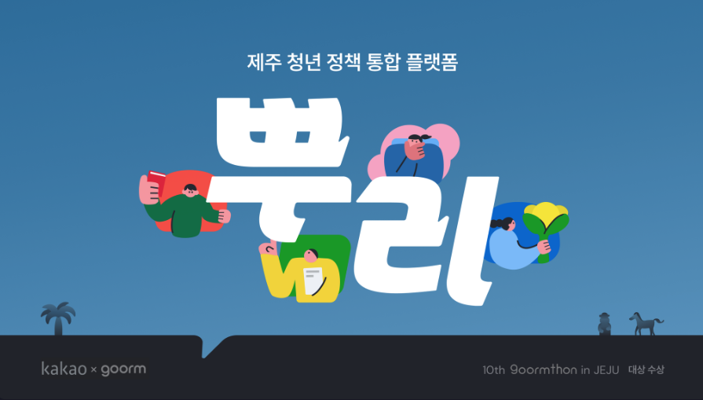
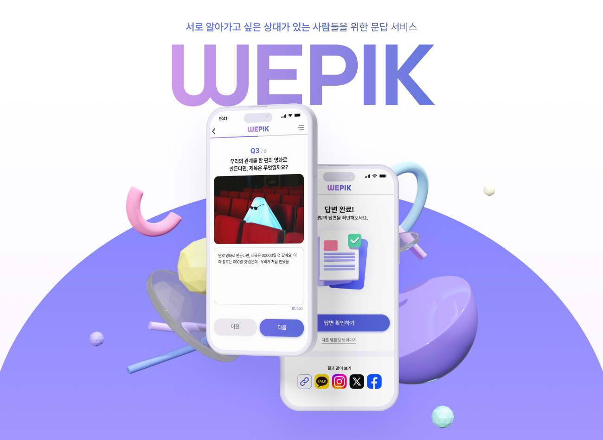
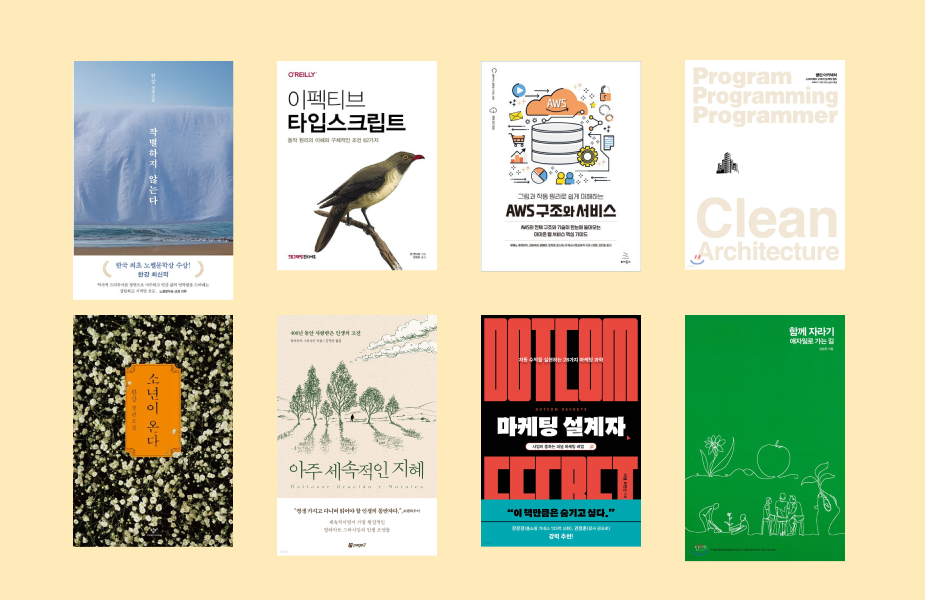
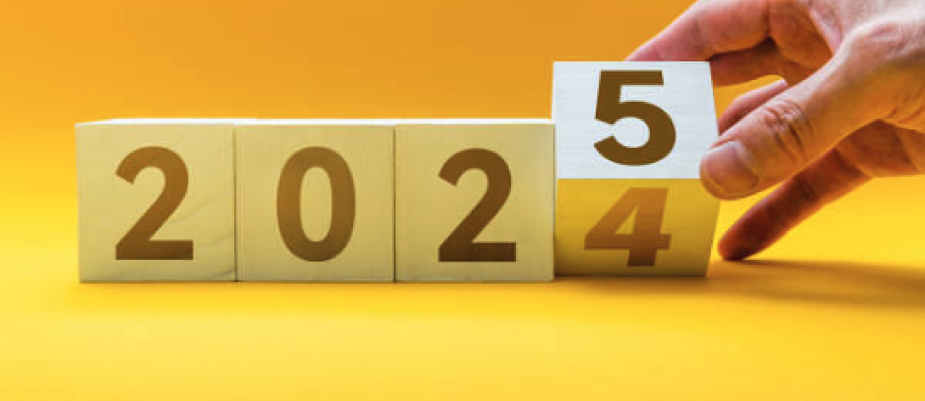
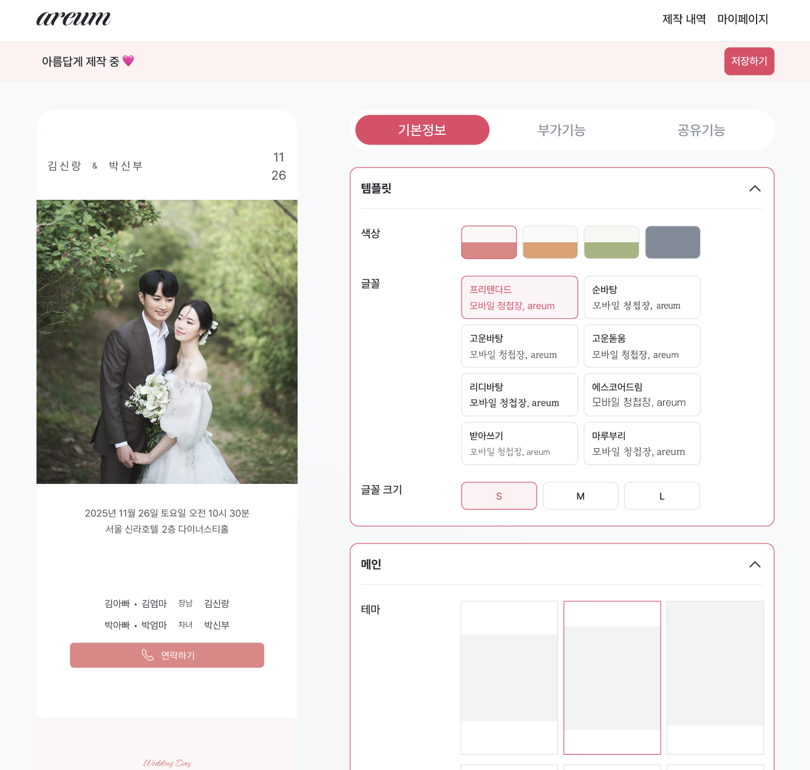

2025년이 시작된 지 얼마 되지 않았습니다. 매년 이맘때가 되면 지난 한 해를 돌아보며 새로운 한 해를 계획하게 되는데요. 시간이 참 빠르게 흘러간다는 걸 느끼면서도, 그 안에서 의미 있는 도전과 성장을 만들어냈다는 점에 감사함을 느낍니다.

2024년은 도전의 연속이었어요. 완벽하지는 않았지만, 작은 성과와 배움들이 모여 지금의 저를 만들어주었다고 생각합니다. 회고를 통해 스스로를 점검하는 과정을 좋아하는 이유도 바로 여기에 있어요. 우리는 완벽하지 않더라도 꾸준히 나아가려는 노력 속에서 성장해 나가니까요.

이번 글에서는 2024년에 세웠던 목표들이 얼마나 잘 이루어졌는지 되돌아보고, 그 과정에서 얻은 인사이트와 느낀 점들을 나누려 합니다. 그리고 2025년에는 어떤 목표와 마음가짐으로 나아갈지 정리하며, 이 글을 저만의 이정표로 삼아보려고 합니다.

## 2024년 목표는 무엇이었나

### 1. 개발 커뮤니티에서 다양한 개발자 만나기

**(목표 점수: 5점 → 결과 점수: 4점)**

2024년은 협업의 중요성을 다시금 깨달은 해였어요. 회사에서는 혼자 프론트엔드 개발을 담당하다 보니, 다양한 분야의 개발자들과 소통하고 협업하는 경험이 정말 절실했거든요. 그래서 참여한 **구름톤 해커톤**은 단연 올해의 하이라이트였습니다.

해커톤에서 만난 팀원들과 밀도 있는 소통을 통해 결국 대상을 받을 수 있었는데요. 각자의 강점을 살려 짧은 시간 안에 프로젝트를 완성해 나가는 과정에서 직장에서는 느끼기 어려웠던 독특한 성취감을 맛볼 수 있었습니다.

지금도 그때의 팀원들과 정기적으로 만나 서로의 인사이트를 나누며, 함께 성장의 발판을 만들어가고 있습니다. 이런 관계가 앞으로도 계속 이어진다면, 더 멋진 협업의 기회를 만들어낼 수 있을 것 같아요.

사이드 프로젝트 팀을 꾸려 다양한 역할의 개발자들과 협업하며 “위픽”이라는 문답 서비스를 개발하기도 했습니다. 이 과정에서 코드 컨벤션과 CI/CD를 설정하며, 효율적인 협업 방식을 고민했던 경험이 특히 기억에 남아요.

팀원들과 다양한 관점에서 문제를 해결해 나가면서, 그 과정에서 정말 많은 것을 배울 수 있었습니다. 이런 경험들은 앞으로의 개발 여정에서도 큰 자산이 될 것 같아요.

### 2. 지속 가능한 사이드 프로젝트 만들기

**(목표 점수: 5점 → 결과 점수: 3점)**

문답 서비스 "위픽"은 열정적으로 시작했던 프로젝트였지만, 아쉽게도 사용자 확보라는 현실의 벽에 부딪히고 말았습니다. 열심히 유지보수하며 서비스를 발전시키려 노력했지만, 실질적인 성과를 내지 못해 아쉬움이 많이 남는 한 해였어요.

현재 진행 중인 또 다른 사이드 프로젝트는 **모바일 청첩장 서비스**입니다. 이 프로젝트는 1인 개발로 시작했는데요. 기존 유료 서비스보다 더 나은 품질을 무료로 제공하겠다는 목표로 기술적인 부분부터 디자인까지 하나하나 신중히 고민하며 만들어가고 있습니다.

아직 오픈하지 못했지만, 이 프로젝트가 저와 사용자 모두에게 긍정적인 영향을 줄 것이라는 확신이 있어요. 2025년 상반기에는 반드시 세상에 선보이고 싶습니다. 이 서비스가 사람들에게 실질적인 가치를 줄 수 있기를 바라며, 오늘도 열심히 작업 중입니다!

### 3. 일주일에 최소 3번 이상 헬스장 가기

**(목표 점수: 5점 → 결과 점수: 3점)**

운동은 올해 꾸준히 지켜온 목표 중 하나였어요. PT를 시작하면서 매주 3회 이상 헬스장에 다니는 습관을 만들었는데, 덕분에 신체적으로 더 건강해지는 걸 느낄 수 있었어요. 몸이 건강해지니까 자연스럽게 정신적으로도 안정감을 얻는 기분이 들더라고요.

그런데 금연은 아쉽게도 실패하고 말았어요. 운동을 통해 체력을 유지하며 건강을 챙긴 만큼, 내년에는 금연에도 꼭 성공해서 더 건강한 몸과 마음을 만들어가고 싶습니다. 한 단계씩 꾸준히 변화해나가 보려 합니다.

### 4. 1년 동안 12권의 책 읽기

**(목표 점수: 5점 → 결과 점수: 3점)**

2024년 한 해 동안 총 8권의 책을 읽었습니다. 문학 작품부터 기술 서적, 자기계발서까지 다양한 분야를 골고루 접했는데요. 독서를 통해 단순히 지식을 얻는 것을 넘어, 삶의 태도를 돌아보고 새로운 영감을 얻는 소중한 시간을 보낼 수 있었습니다.

올해 목표했던 12권에는 살짝 미치지 못했지만, 한 권 한 권 읽으며 느끼고 배운 점들이 내년 독서 습관을 더 잘 만들어가는 데 큰 밑거름이 될 것 같아요.

올해 읽은 책들을 다시 떠올리면서, 어떤 점이 기억에 남았고 무엇을 배웠는지 정리해보았습니다. 독서에 관심이 있으신 분들께 제 경험이 작은 영감이 되길 바라며, 아래는 그 목록과 함께 간단한 후기입니다.

#### 1. **『작별하지 않는다』, 『소년이 온다』**

한강 작가님의 『작별하지 않는다』는 제주 4.3 사건을 배경으로 한 작품인데요. 깊이 있는 서사와 감성적인 문체가 정말 인상적이었어요. 인간의 상처와 아픔을 무겁게 그려낸 이 소설은 읽는 내내 진실과 슬픔이 교차하면서 긴 여운을 남겼습니다.

또 한강 작가님의 『소년이 온다』는 5.18 민주화운동을 배경으로, 한 소년의 시선을 통해 아픔과 상처, 그리고 그로부터의 회복을 섬세하게 담아냈어요. 작가 특유의 깊은 서사와 감정선을 제대로 느낄 수 있는 작품이었죠. 문학이 가진 감정의 깊이와 사회적 메시지가 동시에 녹아 있어서, 복잡한 현실 속에서도 희망을 성찰하게 만드는 특별한 경험을 선사했습니다.

두 작품 모두 가볍게 읽기엔 무거운 주제를 다루고 있어서, 왜 호불호가 갈릴 수 있는지 조금은 이해가 되더라고요. 하지만 저 같은 문학 비전공자에게도 작품 안에 담긴 상징적인 소재들과 시처럼 느껴지는 문체, 그리고 독특한 형식이 굉장히 매력적으로 다가왔습니다.

2025년에는 『채식주의자』를 비롯해 한강 작가님의 다른 작품도 꼭 읽어보려고 해요. 한 권 한 권 읽을수록, 문학 세계에 더 깊이 빠져드는 것 같습니다.

#### 2. **『AWS 구조와 서비스』**

9월에 심플사파리라는 회사로 이직하면서 AWS를 더 깊이 활용할 기회가 많아졌습니다. 그래서 기본적인 AWS 서비스 구조와 개념을 익히고 싶어 선택한 책이 바로 이 책인데요. 클라우드 기술의 기초를 다지는 데 정말 큰 도움이 되었습니다.

책에서는 AWS의 다양한 서비스와 실무 적용 사례를 명확히 설명해 주었고, 이를 통해 실무에서 놓치고 있던 클라우드 아키텍처의 기본 원리를 다시 정리할 수 있었어요. 특히, AWS와 같은 기술을 이해하는 것이 단순히 개발 효율성을 높이는 것 이상으로, 시스템 설계의 근간을 탄탄히 하는 데 얼마나 중요한 역할을 하는지 다시 한번 깨달았습니다.

#### 3. **『마케팅 설계자』**

회사의 비즈니스 성장과 사이드 프로젝트를 진행하며 가장 크게 느낀 점은 "아무리 훌륭한 제품이라도, 브랜딩과 마케팅이 없다면 사용자에게 도달할 수 없다"는 것이었습니다. 마케팅 업무를 하고 있는 친구의 추천으로 읽게 된 이 책은 마케팅에 대한 이해도를 한층 높여줬어요.

이 책을 통해 사용자의 요구를 파악하고 이를 비즈니스 전략에 녹여내는 방법을 배웠습니다. 마케팅은 단순히 제품을 알리는 활동이 아니라, 사용자와 소통하며 가치를 전달하는 과정이라는 점에서 깊은 통찰을 얻을 수 있었어요.

#### 4. **『이펙티브 타입스크립트』**

최근 회사에서 자바스크립트 기반 코드를 타입스크립트로 마이그레이션하면서 이 책을 읽게 되었습니다. 책에서는 타입스크립트를 사용하는 데 있어 실용적인 팁과 모범 사례를 체계적으로 다루고 있었는데요, 특히 코드의 안정성과 유지보수성을 높이는 방법을 실무에 직접 적용하며 큰 도움을 받았습니다.

단순히 기술적인 지식 전달을 넘어, 효율적인 코드를 작성하는 사고방식을 기르도록 도와준 책으로, 앞으로도 꾸준히 참고하게 될 것 같습니다.

#### 5. **『클린 아키텍처』**

소프트웨어 설계와 구조에 대한 깊이 있는 통찰을 제공한 책입니다. 복잡한 시스템을 유연하고 견고하게 설계하는 방법을 배우는 데 많은 영감을 받았어요.

물론 모든 내용을 100% 이해했다고는 말할 수 없지만, 큰 그림을 보는 데 정말 많은 도움이 되었습니다. 이 책은 시스템 설계의 원칙뿐만 아니라, 개발자로서의 사고 방식을 확장하는 데도 중요한 역할을 해주었어요.

#### 6. **『함께 자라기』**

올해 가장 감명 깊게 읽은 책 중 하나입니다. 애자일 철학을 기반으로 개인과 조직의 성장을 다루고 있는 책인데요, 특히 "피드백의 중요성"을 강조한 부분이 가장 기억에 남습니다.

업무든 개인적인 일이든, 성장의 핵심은 **스스로를 돌아보고 개선해 나가는 과정**이라는 걸 다시 한번 깨달았어요. 이 책을 통해 얻은 통찰을 제 업무와 일상에 적극적으로 적용하며, 앞으로 더 성장하기 위해 노력하려 합니다.

#### 7. **『아주 세속적인 지혜』**

우연히 서점에서 발견한 책인데 삶에 대한 현실적이고 지혜로운 통찰을 담고 있었습니다. 책 속의 좋은 말들을 모두 실천 하기는 쉽지 않겠지만, 읽는 내내 제 삶을 돌아보고 조금 더 성숙한 시선으로 세상을 바라보게 만들어준 책이에요.

## 2024년 목표에 대한 느낀 점

2024년은 다양한 도전을 하며 정말 많은 것을 배운 한 해였던 것 같아요. 물론 모든 목표를 완벽히 달성하지는 못했지만, 그 과정에서 느낀 점들이 저를 한층 더 성장시켜 주었다고 믿습니다.

올해 가장 크게 느낀 교훈은 **목표를 세우는 것 자체의 중요성**이었습니다. 구체적인 목표가 있었기에 그 방향성을 따라 열심히 노력할 수 있었고, 도전 속에서 성취와 아쉬움을 동시에 경험할 수 있었어요.

만약 이정표가 없었다면, 2024년은 단순히 시간이 흘러가는 한 해로만 남았을지도 모르겠다는 생각이 드네요. 목표를 세우는 것만으로도 한 해를 의미 있게 채울 수 있다는 점을 다시금 깨달은 소중한 시간이었습니다.

### 성과와 배움

올해는 특히 **협업의 가치**를 크게 느낀 한 해였어요. 개발 커뮤니티, 해커톤, 그리고 사이드 프로젝트를 통해 다양한 배경을 가진 사람들과 함께하며 서로 다른 시각에서 문제를 해결하는 경험을 했습니다. 단순히 기술적인 배움을 넘어서, 사람들과의 관계 속에서 성장하는 법을 배운 소중한 시간이었어요.

또한, **지속 가능한 성장을 위한 준비**도 시작했습니다. 운동을 꾸준히 하며 건강을 관리하는 습관을 들였고, AWS와 같은 새로운 기술에 도전하며 전문성을 확장하려 노력했는데요. 이런 작은 습관들이 내년, 그리고 그 이후에도 저를 더 단단한 사람으로 만들어 줄 거라 믿습니다.

### 아쉬움과 교훈

아쉬움이 없었다면 회고의 의미도 없겠죠. 올해 가장 큰 아쉬움은 **목표에 대한 꾸준한 실행력**이었습니다. 예를 들어, 책 읽기 목표는 12권 중 8권을 읽는 데 그쳤고, 사이드 프로젝트도 기대만큼의 성과를 내지는 못했어요.

하지만 그 속에서도 배움은 있었습니다. 목표 달성을 위해서는 구체적인 계획과 작은 실행 단위가 얼마나 중요한지 깨달았거든요. 2025년에는 목표를 더 세밀하게 쪼개고, 매일 실천 가능한 계획을 세워 조금씩 나아가 보려고 합니다.

### 앞으로의 다짐

2024년은 완벽하지는 않았지만, 도전과 배움으로 가득한 한 해였어요. 그리고 각 목표의 결과물보다도 그 과정에서 얻은 경험과 성장이 더 소중하다는 걸 다시 한번 느꼈습니다.

2025년에는 지금까지 쌓아온 배움을 발판 삼아, 조금 더 구체적이고 꾸준한 도전을 이어가고 싶습니다. 목표를 이루는 것도 중요하지만, 그것을 통해 더 나은 내가 되는 여정을 만들어가는 것이야말로 제게 가장 큰 목표인 것 같아요.

## 2025년 목표는?

### 1. 국내 개발 컨퍼런스 스피커로 참여하기

2024년에는 FECONF 같은 개발 컨퍼런스에 참가하며 정말 많은 영감을 받을 수 있었어요. 다양한 세션을 들으면서 발표자분들이 자신만의 노하우를 공유하고, 관객들에게 동기를 부여하는 모습이 특히 인상 깊었어요. 그중에는 저와 비슷한 경험을 가진 개발자들도 많아서, 그들의 이야기에 더욱 공감하며 새로운 아이디어를 얻을 수 있었습니다.

이 경험을 통해 저도 배운 것을 나누고, 제 경험을 공유하는 발표자로 무대에 서보고 싶다는 목표를 가지게 되었어요. 발표 준비 과정 자체가 제 지식을 체계적으로 정리하고, 부족한 부분을 보완하며 스스로 한 단계 더 성장할 수 있는 좋은 기회가 될 거라 생각합니다.

이를 이루기 위해 발표할 기회가 있다면 주저하지 않고 적극적으로 도전하려고 해요. 앞으로 발표자로서 무대에 설 수 있도록 최선을 다해 준비할 계획입니다. 언젠가 제 이야기가 누군가에게 영감이 되기를 바라며 한 걸음씩 나아가 보려고 합니다.

### 2. 모바일 청첩장 서비스 오픈하기

현재 개발 진행 중인 모바일 청첩장 프로젝트는 기존 유료 서비스보다 더 나은 품질을 무료로 제공하는 것을 목표로 하고 있어요. 디자이너와 협업하며 서비스를 지속적으로 발전시키고 있고, 많은 사람들이 편리하게 이용할 수 있도록 실질적인 도움을 주고자 노력하고 있습니다.

이 프로젝트는 제가 가진 기술을 활용해 사회에 선한 영향을 끼칠 수 있다는 점에서 더 큰 의미가 있다고 생각해요. 2025년 상반기 오픈을 목표로, 완성도 높은 서비스를 제공하기 위해 최선을 다해 준비하고 있습니다. 이 프로젝트가 사용자들에게 유용한 도구가 되길 바라며, 매일 조금씩 앞으로 나아가고 있어요.

### 3. 오픈소스 컨트리뷰터 되기

개발자로서 오픈소스는 제 업무와 깊게 연관되어 있는데요. React, Next.js, Zod 등 다양한 오픈소스를 활용하며 정말 많은 도움을 받아왔습니다. 그래서 이제는 단순히 사용하는 것을 넘어, 개발 생태계의 발전에 기여하고 싶다는 목표를 가지게 되었어요.

단순히 번역이나 오타 수정에 그치지 않고, **기능 추가나 버그 수정 같은 실질적인 작업**을 통해 릴리즈에 제 코드가 포함되는 경험을 목표로 하고 있습니다. 이를 통해 스스로 한 단계 성장하는 동시에, 오픈소스 생태계에 조금이나마 기여할 수 있는 개발자로 자리 잡고 싶습니다.

### 4. 기술 블로그 글 6개 이상 작성하기

2024년에는 기술 블로그에 단 두 개의 글만 작성했더라고요. 글을 쓰는 데 생각보다 시간이 걸리다 보니 점점 작성 횟수가 줄어든 것 같아요. 하지만 그동안 작성했던 글들이 다른 분들에게 조금이나마 도움이 되었다는 피드백을 받을 때마다 정말 뿌듯했어요. 또, 제가 쓴 글을 다시 보면서 그동안 어떤 일을 했는지 되돌아볼 수 있는 점도 기술 블로그 작성의 큰 장점이라고 생각합니다.

2025년에는 기술 블로그 글 6개를 목표로 세웠습니다. 이를 위해 의도적으로 글쓰기 시간을 확보하고 꾸준히 작성하려고 해요. 글을 쓰는 과정은 단순히 지식을 공유하는 것을 넘어, 제 성장 기록으로 남기고 스스로를 되돌아볼 수 있는 좋은 기회가 될 거라고 믿습니다. 더 많은 사람들과 소통하며, 적극적으로 글쓰기에 도전할 계획입니다.

### 5. 건강 챙기기

2024년에는 헬스장을 꾸준히 다니며 운동 습관을 만들어 체력을 관리했지만, 금연에 실패한 점은 여전히 아쉬움으로 남아 있습니다.

운동을 통해 몸이 조금씩 건강해지는 걸 느끼며, 정신적으로도 긍정적인 영향을 받았는데요. 특히 PT를 통해 올바른 자세와 체계적인 운동법을 배우면서 자신감도 많이 높아졌어요.

하지만 건강한 생활습관을 완성하려면 **금연**이라는 중요한 과제가 남아 있다고 생각합니다. 2025년에는 반드시 금연을 성공시켜 건강을 한 단계 더 끌어올리고 싶어요. 이를 위해 금연 프로그램이나 동기부여를 얻을 수 있는 방법들을 적극적으로 찾아볼 계획입니다.

또한, 운동을 꾸준히 이어가는 것뿐만 아니라, 식습관 개선에도 신경을 쓸 생각입니다. 단순히 건강을 유지하는 것을 넘어, 더 활기차고 에너지가 넘치는 생활을 만들어가는 한 해를 목표로 하고자 합니다.

## 마치며

2024년은 부족한 점도 있었지만, 그로 인해 더 많은 깨달음을 얻을 수 있었던 소중한 시간이었습니다.

2025년에는 더 큰 목표와 도전을 향해 나아가며, 올해보다 더 의미 있는 성과를 이뤄내고 싶어요. 이 글이 내년 이맘때 더 성장한 저를 돌아볼 수 있는 소중한 기록으로 남길 바랍니다.

이 글을 읽는 여러분도 다가오는 새해에 원하는 모든 것을 이루시길 진심으로 응원합니다. 우리 모두 힘내서 멋진 한 해를 만들어봐요! 파이팅! 😊

 

**궁금하신 점이 있다면 아래 `댓글`로 남겨주세요!👇**
