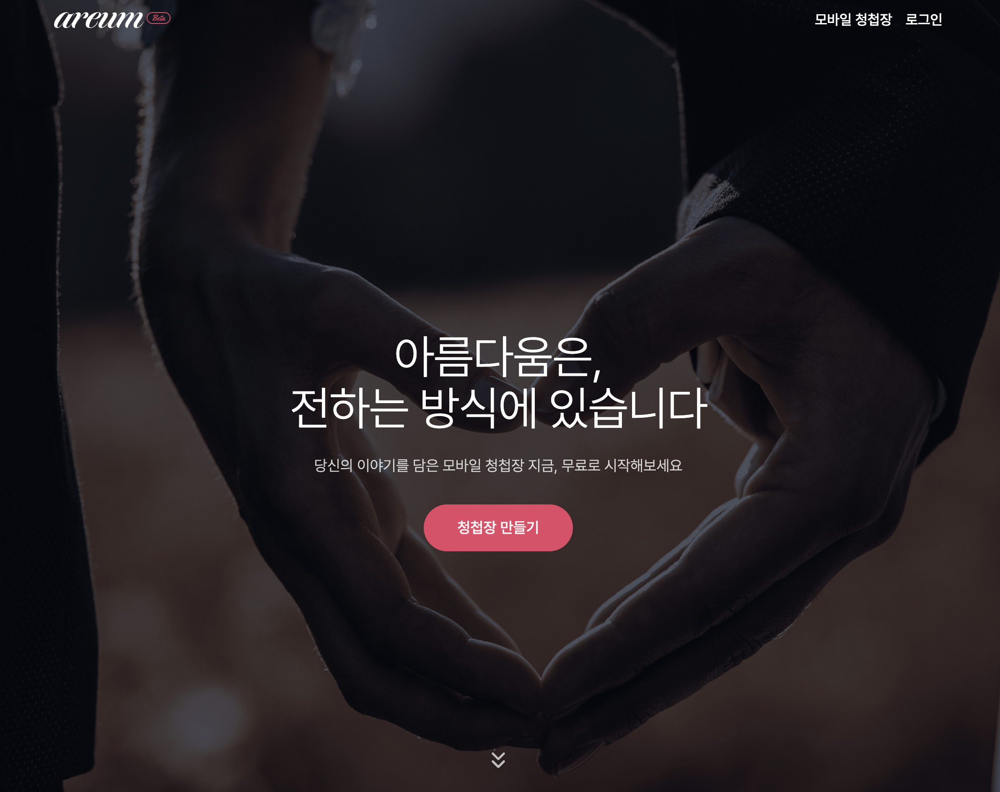
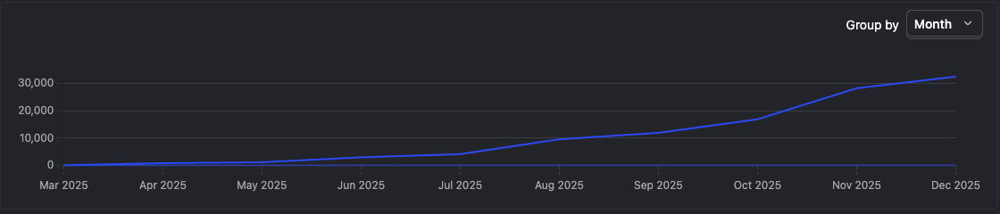
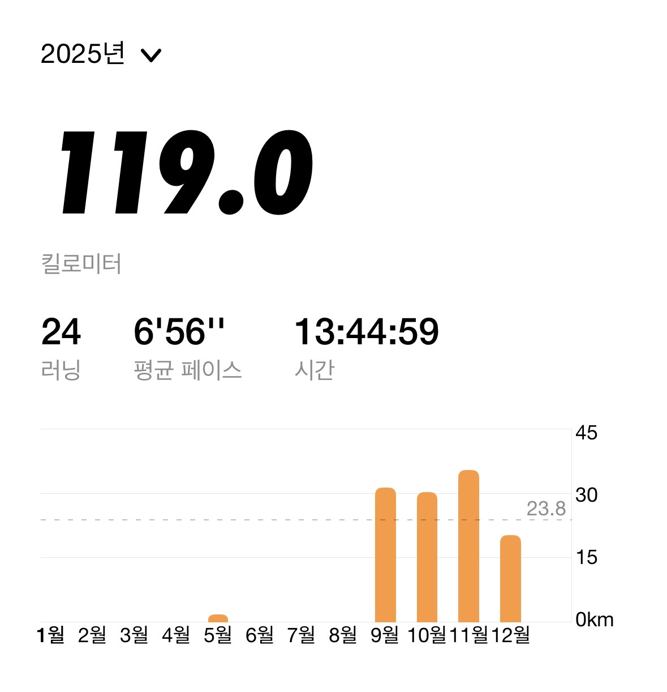
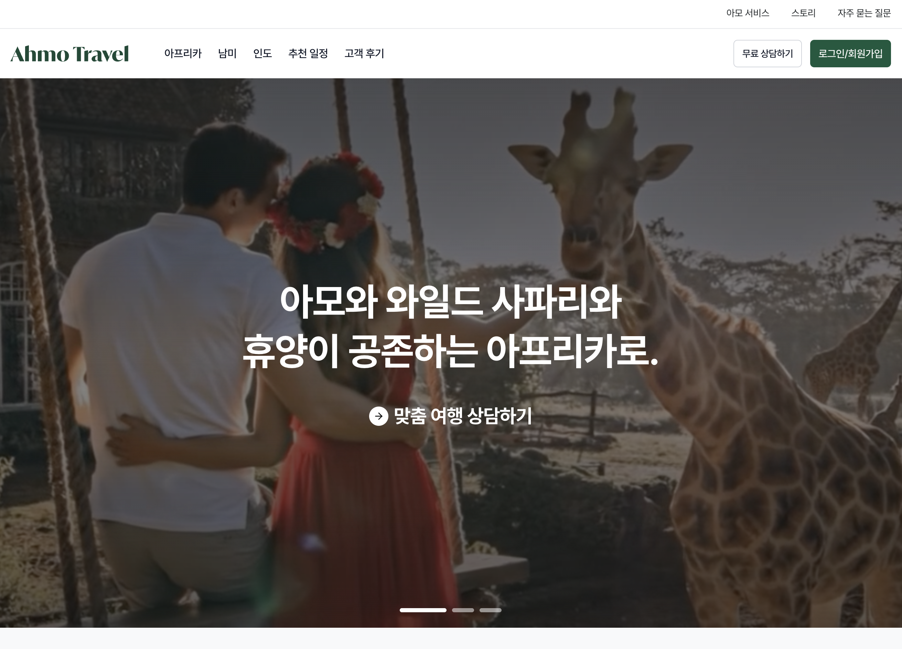
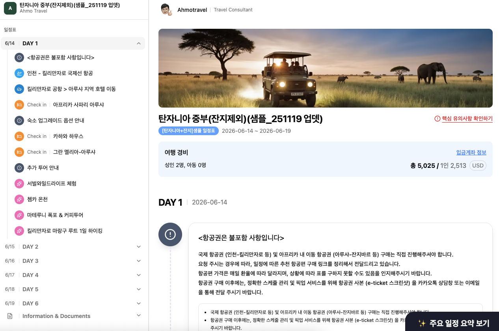
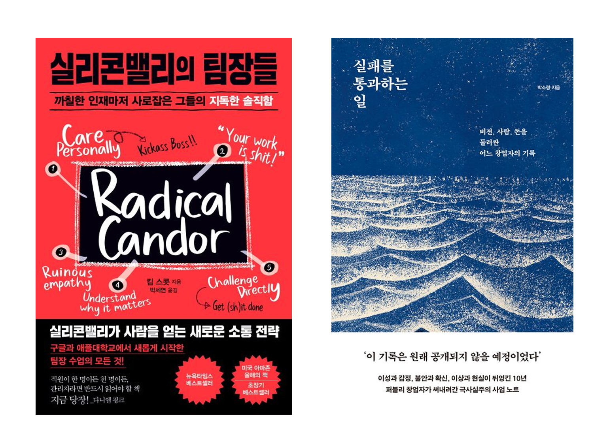

2026년이 시작된 지 벌써 보름이 지났습니다. 작년 이맘때 2024년 회고를 쓰면서 2025년 목표를 세웠던 게 엊그제 같은데, 시간이 정말 빠르게 흘러가네요. 매년 회고를 쓸 때마다 드는 생각이지만, 목표를 세우고 돌아보는 이 과정 자체가 저를 성장시켜 주는 것 같습니다.

2025년을 돌아보니, **"함께여서 가능했던"** 한 해였다는 생각이 들어요. 처음에는 혼자 다 할 수 있다고 생각했던 것들도 있었는데, 돌이켜보면 좋은 결과가 나왔던 건 결국 함께한 분들 덕분이었거든요. 혼자의 한계를 느끼고, 함께의 소중함을 깨달은 한 해였습니다.

이번 글에서는 2024년 회고에서 세웠던 2025년 목표들을 얼마나 달성했는지 돌아보고, 예상치 못했던 성과들과 느낀 점들을 나누려 합니다. 그리고 2026년에는 어떤 목표와 마음가짐으로 나아갈지 정리하며, 이 글을 또 하나의 이정표로 삼아보려고 해요.

## 2025년 목표는 무엇이었나

### 1. 국내 개발 컨퍼런스 스피커로 참여하기

**(목표 점수: 5점 → 결과 점수: 3점)**

처음 목표했던 FECONF나 인프콘 같은 대형 컨퍼런스 무대에는 서지 못했어요. 하지만 **월간 로그 3기** 활동을 통해 처음으로 개발자분들 앞에서 발표하는 경험을 할 수 있었습니다.

월간 로그는 프론트엔드 개발자분들이 모여 매달 2개 이상의 글을 쓰고 서로 리뷰하는 스터디 형태의 모임인데요. 처음에는 단순히 블로그 글쓰기를 강제하려고 합류했지만, 좋은 분들과 인사이트를 나눌 수 있는 소중한 시간이 되었습니다.

3기 활동이 마무리되면서 발표할 수 있는 시간이 있었는데, 주저하지 않고 신청했어요. **또 망한 사이드 프로젝트? 청첩장 서비스로 MAU 10K 달성한 방법**이라는 주제로 발표하게 되었습니다.

처음 개발자분들 앞에서 발표하는 거라 어떻게 준비해야 할지 고민이 많았어요. 그래서 먼저 사이드 프로젝트를 하면서 느꼈던 점들을 담담하게 회고글로 작성하고, 거기서 인사이트를 발굴하는 방식으로 준비했습니다. 정말로 겪었던 어려움들, 고민했던 포인트들, 해결 과정들을 솔직하게 풀어냈죠.

발표를 듣고 계신 많은 개발자분들께서 사이드 프로젝트 경험이 있으셔서 그런지 공감을 많이 해주셨어요. "좋았다", "도움이 됐다"라는 말씀을 해주실 때 정말 보람을 느꼈습니다. 이 발표 내용을 정제해서 블로그에 [사이드 프로젝트 3번 해보니 알게 된 것들](https://joy.pe.kr/side-project-experience/) 글로도 작성했고요.

대형 컨퍼런스는 아니었지만, 처음으로 개발자분들 앞에서 제 경험을 나누는 값진 경험이었어요. 이 경험을 발판 삼아 2026년에는 더 큰 무대에도 도전해보고 싶습니다.

### 2. 모바일 청첩장 서비스 오픈하기

**(목표 점수: 5점 → 결과 점수: 5점+)**

2024년 회고에서 "2025년 상반기에 반드시 오픈하겠다"고 다짐했던 아름 모바일 청첩장 서비스, **3월에 정식 오픈**했습니다! 목표를 달성한 것 자체도 기쁘지만, 그 이후의 성장이 예상을 훨씬 뛰어넘었어요.

처음 오픈했을 때는 솔직히 반응이 저조했습니다. "이게 정말 사람들에게 필요한 서비스인가?" 하는 의문도 들었고요. 하지만 포기하지 않고 꾸준히 개선해 나갔더니, 점점 사용자가 늘어나기 시작했어요. 지수적으로 성장하더니 **10월에는 MAU 1만 명을 돌파**했고, 지금은 **MAU 3만 명 이상**을 기록하고 있습니다.

기술 스택은 **Next.js**를 메인으로, 프론트 서버는 **Vercel**, 백엔드는 **Supabase**를 사용했어요.

처음에는 디자인부터 명세, 피그마 작업까지 shadcn/ui 기반으로 직접 진행했어요. 혼자 다 할 수 있다고 생각했거든요. 하지만 솔직히 한계가 느껴졌습니다. 개발은 그나마 할 수 있는데, 디자인쪽은 아무래도 미숙한 부분이 많았어요.

그러던 중 우연히 평소 알고 지내던 **쏘야 디자이너님**께 아름 서비스 기획에 대해 공유드렸는데, 흔쾌히 합류해 주셨어요. 그 이후로는 디자인은 함께 논의하고 결정하면서 진행하고 있습니다.

함께하니까 확실히 서비스 퀄리티가 달라졌어요. 혼자 했을 때는 몰랐던 부분들을 짚어주시고, 더 좋은 방향을 제안해 주시더라고요. **좋은 서비스가 되기까지는 함께한 분의 도움이 정말 컸습니다.**

가장 뿌듯했던 순간은 고객분들께서 하단에 있는 제 메일을 확인하시고 "서비스가 너무 좋다"고 연락해 주실 때였어요. 따로 소통 창구가 없는데도 일부러 메일을 보내주시는 분들을 보면서, 목표했던 바를 잘 이루며 성장하고 있다는 확신이 들었습니다.

그리고 올해 중요하게 생각했던 건 지속 가능한 서비스 구조를 만드는 것이었어요. 무작정 유료 결제를 도입하고 싶지는 않았거든요. 좋은 서비스를 최대한 무료로, 혹은 적은 비용으로 제공해드리고 싶었습니다. 고민 끝에 화환 서비스를 통한 BM 구조를 설계했고, 안정적으로 서비스를 운영할 수 있는 기반을 마련할 수 있었어요. 그 고민 과정은 해당 포스팅에서 확인하실 수 있어요. [사이드 프로젝트 3번 해보니 알게 된 것들](https://joy.pe.kr/side-project-experience/)

서비스 URL: [https://www.areum.co.kr](https://www.areum.co.kr)

### 3. 오픈소스 컨트리뷰터 되기

**(목표 점수: 5점 → 결과 점수: 1점)**

솔직하게 말씀드리면, **시작조차 못했습니다.**

shadcn/ui, Next.js, React 등 수많은 오픈소스 덕분에 개발을 편하게 하고 있으면서, 정작 개발자라는 저는 오픈소스 생태계에 기여하지 않는다는 게 잘못됐다고 생각해서 목표로 잡았었는데요. 회사 업무가 바빴고, 아름 서비스를 챙기느라 바빴고, 개인적인 사유도 있었고... 너무 많은 핑계거리들이 있지만, 사실 말 그대로 핑계일 뿐이에요.

제가 좋아하는 말 중 하나가 **그럼에도 불구하고**인데요. 그럼에도 불구하고 충분히 할 수 있었다고 생각합니다. 게을렀던 거예요.

이 목표는 2026년에 반드시 재도전하려고 합니다. 이번에는 핑계 없이요.

### 4. 기술 블로그 글 6개 이상 작성하기

**(목표 점수: 5점 → 결과 점수: 4점)**

2024년 회고글을 제외하면 총 **5개의 글**을 작성했습니다. 목표했던 6개에는 1개 부족하지만, 어느 정도 맞춘 것 같아서 다행이라고 생각해요.

사실 글을 쓴다는 게 별거 아닐 수 있지만, 어떤 지식을 습득하거나 느낀 점을 잘 정리해서 글로 쓴다는 건 시작하기가 참 어렵더라고요. 그럼에도 5개 정도의 글을 쓸 수 있었던 건 **의지를 다른 곳에서 구하는 방식** 덕분이었어요.

그게 바로 앞서 말씀드린 **월간 로그**입니다. 이 모임은 매달 2개 이상의 글을 쓰고 서로 리뷰하는 스터디 같은 곳인데요. 신청해서 합류한 덕분에 좋은 분들과 인사이트를 나눌 수 있었습니다.

혼자 힘으로 하기 힘든 부분들이 살아가며 많은 것 같아요. 이렇게 반강제적으로 저지르고, 다른 분들과 함께 작성하니까 그나마 어떻게든 붙들려서 5개라도 작성할 수 있지 않았나 싶습니다.

이 방법이 저는 나쁘지 않다고 생각해요. 처음 시작은 단순히 "블로그 글 쓰는 걸 강제하자"라고 생각하고 합류한 거지만, 좋은 분들과 인사이트를 나눌 수 있는 시간도 생겼고요. 꼭 혼자서 스스로 진행해야 하는 것만은 아니라는 걸 느꼈고, 오히려 **같이 하는 게 더 즐겁고 많은 걸 배울 수 있다**는 걸 깨달을 수 있는 계기가 되었습니다.

### 5. 건강 챙기기

**(목표 점수: 5점 → 결과 점수: 3점)**

건강은 계속해서 도전과 실패를 반복했던 영역인 것 같아요.

연초에는 PT 20회를 끊어서 꾸준히 헬스장을 다녔는데, PT가 끝나자마자 언제 그랬냐는 듯 헬스장 가는 빈도가 확 줄었어요. 이래서는 안 되겠다 싶어서 **회사 동료들과 러닝 동아리**를 만들었습니다. 주 2회씩 러닝하고 나이키 러닝 클럽 앱으로 인증하는 방식으로요. 한 번 할 때마다 5km씩 뛰었어요.

처음 러닝을 할 때는 5km를 한 번에 뛸 수도 없었고, 숨이 끝까지 올라와서 정말 죽을 것 같았어요. 하지만 "이것도 못하면..."이라는 생각으로 계속 뛰었더니, 어느새 5km 완주를 할 수 있게 되었고, 또 계속하다 보니 페이스만 조절하면 숨이 많이 안 차오르면서도 5km를 뛸 수 있게 되었습니다. 참고 완주했을 때 느끼는 뿌듯함이 정말 좋더라고요.

팀원들과 **2026년 초에는 10km 마라톤**도 같이 뛰기로 약속했어요. 지금은 날씨가 너무 추워서 러닝을 잠깐 멈추고 바로 헬스장을 다시 등록해서 주 2회 운동을 이어가고 있습니다.

다만 **금연은 실패**했어요. 8개월 정도 잘 금연했었는데, 어찌하다 다시 피게 되었습니다. 정말 잘못됐다고 생각하는 부분이고, 나 자신 하나 컨트롤 못한다는 게 조금 자괴감이 느껴지는 포인트이긴 해요. 동기를 잃어버린 것도 큰 것 같지만... 이 부분은 2026년에 다시 도전해야 할 것 같습니다.

---

## 2025년 성과

### 아모트래블 홈페이지 리뉴얼

아모트래블(구 심플사파리) 홈페이지를 전면 리뉴얼했습니다.

리뉴얼을 하게 된 계기는 기존 그로스 데이터를 분석하면서부터였어요. 디자이너분, 기획자분들과 함께 데이터를 살펴보니 홈페이지 방문자 수도 낮고, 세션 유지율도 너무 낮다는 걸 파악했거든요.

아모트래블은 결국 전문 상담사와 상담을 시작해야 매출이 발생하는 구조인데요. 데이터를 더 파고들어 보니 흥미로운 점을 발견했어요. 한 페이지만 보고 나가는 사람들보다 **추천 일정 같은 콘텐츠를 여러 개 둘러보는 사람들의 문의율이 2배 이상 높았던 거예요.**

이 데이터를 근거로 이번 리뉴얼의 테마를 **탐색**으로 잡았습니다. 기존에는 상담 문의 중심의 구조였다면, 이제는 상담 전에도 아모트래블이 다루는 다양한 국가, 여행지, 액티비티를 직접 둘러볼 수 있도록 설계했어요. 자체 고객 후기 블로그도 새롭게 개설해서, 실제로 다녀오신 분들의 생생한 경험담도 확인할 수 있게 했고요.

이번 리뉴얼에서 프론트엔드부터 백엔드까지 1인으로 담당했기에 저에게는 더 뜻깊은 서비스입니다.

🔗 [https://www.amotravel.com](https://www.amotravel.com)

### 트래블러리 서비스 오픈

아모트래블에서 **트래블러리**라는 내부 서비스도 오픈했어요. 여행 견적서와 일정표를 자동으로 생성해 주는 서비스인데요.

이 서비스를 만들게 된 계기는 오퍼레이션 팀의 반복 작업을 줄여보자는 고민에서 시작됐어요. 기존에는 견적서 하나 만드는 데도 꽤 많은 시간이 걸렸거든요. "이걸 자동화하면 얼마나 좋을까?" 하는 생각이 계속 있었습니다.

놀라웠던 건 **AI의 도움을 받아 기획부터 개발까지 단 2달 만에 오픈**했다는 거예요. 솔직히 처음엔 이렇게 빨리 될 거라고 생각 못 했어요. AI를 활용해 보면서 "아, 진짜 시대가 바뀌었구나" 하는 걸 몸소 느꼈습니다. 물론 AI가 다 해준 건 아니고, 프로덕트 팀 전체가 밀도 있게 집중했기에 가능했던 것 같아요.

오픈하고 나서 오퍼레이션 팀께서 "기존 방식 대비 작업이 너무 편하고 빠르다"고 해주실 때 정말 뿌듯했어요. 내가 만든 게 실제로 누군가의 일을 편하게 해준다는 게 개발자로서 느끼는 가장 큰 보람인 것 같거든요.

아직 검증 중인 단계라 앞으로 해야 할 일이 많아요. 정확히 어느 정도의 속도 차이가 있는지, 정확도는 얼마나 높아졌는지, 일정표를 받아보시는 고객분들께서는 어떻게 느끼시는지 트래킹하면서 계속 발전시켜 나가야 할 것 같습니다.

### 회사에서의 성장

돌이켜보면 아모트래블에서 올해 정말 많은 것들을 경험했어요.

홈페이지 리뉴얼, 트래블러리 개발 외에도 **사용자 행동 추적 시스템**을 세팅하면서 데이터 기반으로 의사결정하는 문화를 만들어가는 데 기여할 수 있었고요. 이전에는 감으로 "이게 더 나을 것 같은데?"라고 했던 부분들을 이제는 데이터로 검증할 수 있게 된 거죠.

그리고 올해 **백엔드 개발자분이 합류**하셨어요. 혼자 개발하던 시절에는 "내가 다 해야 하는데..."라는 부담감이 있었는데, 이제는 역할을 나눠서 더 깊이 있게 집중할 수 있게 되었습니다. 협업하면서 서로 코드 리뷰도 하고, 기술적인 논의도 하니까 혼자 할 때보다 훨씬 많이 배우는 것 같아요.

가장 새로웠던 건 **채용 프로세스에 직접 참여**한 경험이에요. 이력서를 검토하고 기술 과제를 출제하면서, 예전에 제가 지원자였을 때는 몰랐던 것들을 알게 되었어요. "어떤 사람과 함께 일하고 싶은가?"를 진지하게 고민하게 됐고, 그 과정에서 저 스스로도 어떤 개발자가 되고 싶은지 다시 생각해 볼 수 있었습니다.

짧은 시간 동안 정말 많은 걸 경험했고, 1년 전의 나와 비교했을 때 확실히 많이 성장했다고 느껴요.

---

## 올해 읽은 책

올해는 책을 많이 읽지 못했어요. 그래도 기억에 남는 두 권을 소개해 드릴게요.

### 1. 『실리콘밸리의 팀장들』

개발 리드셨던 데이비드께서 생일 선물로 주신 책인데요. 이 책에서는 **래디컬 캔더(Radical Candor)**, 즉 완전한 솔직함에 대해 계속 이야기합니다.

완전한 솔직함이라는 게 팀원들에게 "너 완전 못해, 능력없어, 잘못되었어!"라고 말하는 게 끝이 아니라 그전에 **상호 간의 신뢰를 쌓을 수 있어야** 한다는 것, 그리고 **지적을 미루면 안 된다**는 것 등을 강조했어요.

제가 팀장이 아니더라도 팀원으로서 회사 생활을 하며 항상 고민되는 부분들이 있는데, 어느 정도 인사이트를 얻을 수 있었어요. 팀원들에게 최대한 좋은 말만 하고 싶고, 안 좋은 상황에서도 잘 둘러서 이야기하는 게 능력이라고 생각했는데요. 이 책에서는 너무 문제 뒤로 물러나 좋은 사람인 척하는 것을 **죄악**이라고까지 표현하더라고요.

글을 읽고 나서 한 번씩 그런 고민이 있을 때, "정말 팀원을 위한 게 아니라 내가 편하려고 그런 순간에 이야기를 안 했던 건 아니었을까?" 하고 돌아보게 되었습니다. 솔직한 피드백을 위해 서로 간의 신뢰를 더 쌓아야겠다고 다짐했어요.

### 2. 『실패를 통과하는 일』

아모트래블 대표님께서 추천해 주시면서 선물해 주신 책인데요. 퍼블리 창업자 박소령 님의 창업 여정을 담은 책입니다.

그중 **리더의 태도**에 관한 말이 기억에 남아요.

> "느슨하게 문제 뒤에 있는 리더보다는 미친 사람이라는 소리를 듣더라도 일을 정면으로 들이받는 리더가 신뢰받을 수 있다."

느슨하게 문제 뒤로 물러나 있는 리더를 좋아할 사람은 없겠지만, 그렇다고 일을 정면으로 들이받는 리더가 항상 신뢰받을 수 있을까? 리더십이란 게 참 어렵다고 느꼈어요. 그래도 이 책을 통해 문제 해결을 미루지 않아야 하는 이유, 조언자의 필요성, 채용할 때의 조언 등 대표의 입장에서 생각해 볼 수 있는 좋은 기회였습니다.

저도 직원이지만 항상 대표의 마음으로 오너십을 가지고 일한다고 생각하거든요. 그래서 공감 가는 부분들도 있었고, "아... 정말 대표는 이렇게 생각하는 건가?" 하는 포인트들도 있어서 생각의 전환을 할 수 있는 글이었습니다.

---

## 2025년을 돌아보며 느낀 점

2025년을 한 단어로 정리하면 **함께**입니다.

돌이켜보면 저 혼자의 힘으로 해낸 건 거의 없었던 것 같아요. 좋은 결과가 나올 수 있었던 건 결국 함께한 분들 덕분이었거든요.

아름 서비스가 MAU 3만까지 성장할 수 있었던 건 **쏘야 디자이너님**이 합류해서 디자인과 기획을 함께 고민해 주셨기 때문이에요. 아모트래블 홈페이지 리뉴얼도 **기획자분, 디자이너분**들과 함께 방향을 잡고 진행했고요. 트래블러리는 **프로덕트 팀 전체**가 밀도 있게 집중했기에 2달 만에 오픈할 수 있었습니다.

월간 로그가 없었다면 블로그 글 5개를 쓰지 못했을 거예요. 러닝 동아리가 없었다면 운동을 꾸준히 하지 못했을 거고요.

올해 가장 큰 깨달음은 **혼자서보다는 함께**라는 거예요. 처음에는 혼자 다 할 수 있다고 생각했는데, 함께할 때 더 좋은 결과가 나온다는 걸 몸소 느꼈습니다. 오히려 같이 하면 더 즐겁고, 더 많이 배우고, 더 멀리 갈 수 있더라고요.

혼자 하기 힘든 부분들은 환경을 만들어서 반강제적으로라도 해내는 것. 이게 저한테는 잘 맞는 방식인 것 같아요. 글쓰기도, 운동도, 결국 함께할 환경을 만들어서 해냈거든요.

---

## 2026년 목표는?

### 1. 아름 서비스 MAU 10만 명 달성

2025년 목표가 "모바일 청첩장 서비스 오픈하기"였는데, 어느덧 MAU 3만 명을 달성하게 되었어요. 2026년에는 기존 모바일 청첩장 서비스뿐만 아니라 추가적인 기획과 개발이 이미 진행되고 있는데요. 그 시너지로 **MAU 10만 명**을 목표로 하려고 합니다.

사실 MAU만 목표로 한다면 더 높게도 할 수 있다고 생각하지만, 그것보다는 **더 좋은 서비스와 사용자 경험을 채우는 데만 집중**할 거예요. 그렇게 된다면 MAU 또한 자연스럽게 따라올 거라고 믿거든요.

목표라는 게 한번 던져놓으면 회수하기 위해 2026년의 내가 열심히 할 거기 때문에, 모든 사람이 볼 수 있는 곳에 공표합니다.

### 2. 프로덕트 엔지니어로 성장

올해 아름 서비스와 아모트래블에서 일하면서 느낀 게 있어요. 프론트, 백엔드, 인프라 가리지 않고 다 해왔는데, 솔직히 백엔드와 인프라 쪽은 "돌아가게만" 만든 느낌이 강했거든요. AI 덕분에 기본 베이스만 있어도 개발이 가능한 시대가 됐지만, 그렇다고 깊이 없이 넘어가면 결국 한계가 온다는 걸 느꼈어요.

그래서 2026년에는 **프로덕트 엔지니어**라는 타이틀에 걸맞게 개발 영역을 더 넓게 공부하려고 합니다. 프론트엔드만큼 백엔드와 인프라도 자신 있게 말할 수 있는 수준이 되고 싶어요.

그리고 요즘에는 개발 공부만큼이나 **AI를 어떻게 하면 더 효율적으로 다룰지** 공부하는 시간이 많아졌어요. 회사에서 Claude Code를 지원해 줘서 개발팀 모두 사용하고 있는데, 단순 프롬프트를 넘어서 subagent, hooks, skills, plugins 같은 것들을 적절하게 활용하려고 계속 시도하고 있습니다.

솔직히 AI가 이렇게 빠르게 발전하는 걸 보면 두렵기도 해요. 하지만 그 물살에 휩쓸리기보다는 잘 올라타야 한다고 생각합니다. 도구를 잘 쓰는 것도 실력이니까요.

### 3. 오픈소스 컨트리뷰터 되기 - 3개 이상 기여

솔직히 이 목표는 작년에 1점을 준 제 자신에 대한 반성에서 나온 거예요. 1개도 못 했으면서 3개로 상향하는 게 말이 되나 싶기도 하지만, 오히려 그래서 더 높게 잡았어요.

작년에 핑계를 대며 미뤘던 게 너무 아쉬웠거든요. "그럼에도 불구하고"라는 말을 좋아한다면서 정작 실천하지 못했으니까요. 이번에는 핑계 없이 해보려고 합니다.

근거는 없어요. 그냥 이렇게 공표하면 2026년의 내가 또 어떻게든 해낼 거라고 믿습니다. 매일 쓰는 오픈소스들에 조금이나마 기여하는 개발자가 되고 싶어요.

### 4. 건강 - 운동 꾸준히 유지

몇 키로 빼겠다, 바디 프로필을 하겠다 같은 다짐보다는 이번 목표는 **쉬지 않고 꾸준히 하기**입니다.

1달 이상은 쉬지 말자. 이번 주 못했다고 "아... 망했네" 하고 그만두지 말고, 그럼 다음 주에 이어서 계속하며 끝까지 꾸준히 해보는 거예요.

그리고 팀원들과 약속한 **4월 10km 마라톤 1시간 이내로 클리어**하는 게 목표입니다!

---

## 마치며

함께의 가치를 깨달은 한 해였습니다. 환경을 만들고, 함께하면 더 멀리 갈 수 있다는 걸 몸소 느꼈어요.

완벽하지는 않았지만, 도전하고 배우고 성장한 시간이었습니다. 오픈소스 기여 같은 미달성 목표는 아쉽지만, 그 아쉬움이 2026년의 원동력이 될 거라 믿습니다.

2026년에는 아름 서비스 MAU 10만 달성, 프로덕트 엔지니어로의 성장, 오픈소스 컨트리뷰터 되기, 그리고 꾸준한 운동까지. 더 큰 목표를 향해 나아가려고 합니다. 물론 혼자가 아니라 **함께** 말이죠.

이 글이 내년 이맘때 더 성장한 저를 돌아볼 수 있는 소중한 기록으로 남길 바랍니다. 그리고 이 글을 읽는 여러분도 다가오는 새해에 원하는 모든 것을 이루시길 진심으로 응원합니다.

우리 모두 힘내서 멋진 한 해를 만들어봐요! 파이팅! 😊

 

**궁금하신 점이 있다면 아래 `댓글`로 남겨주세요!👇**
