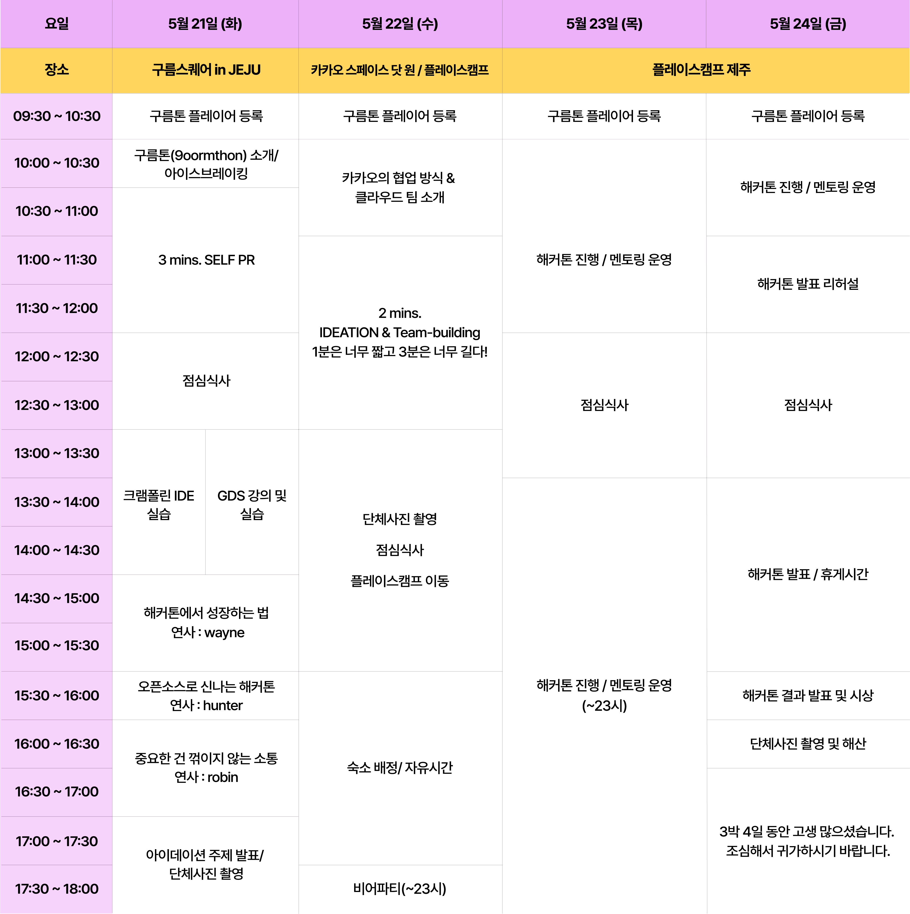
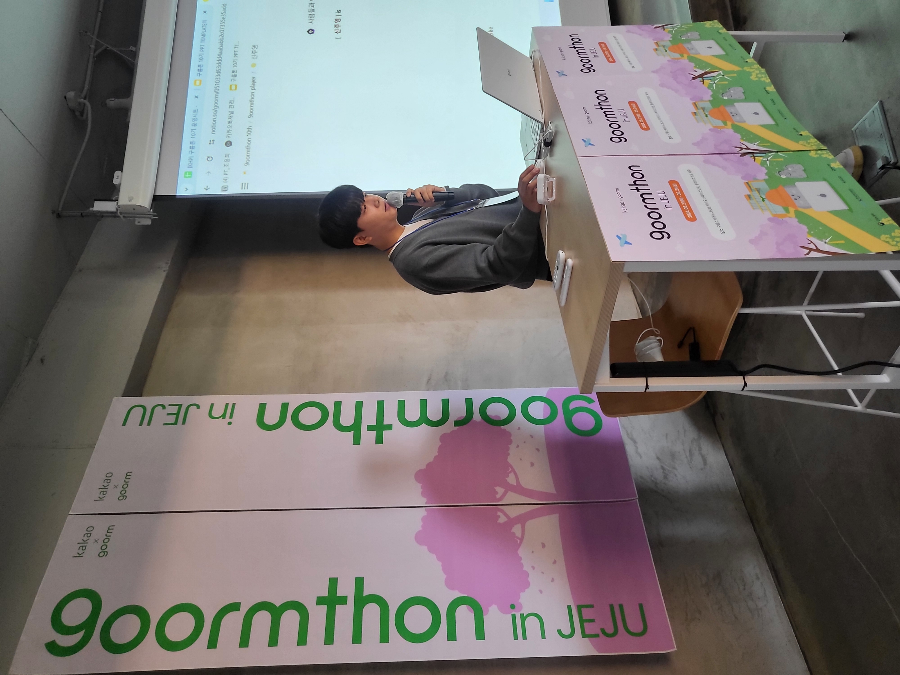
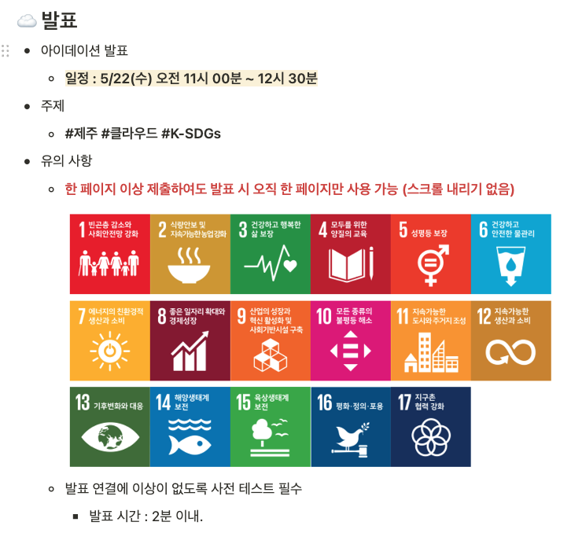
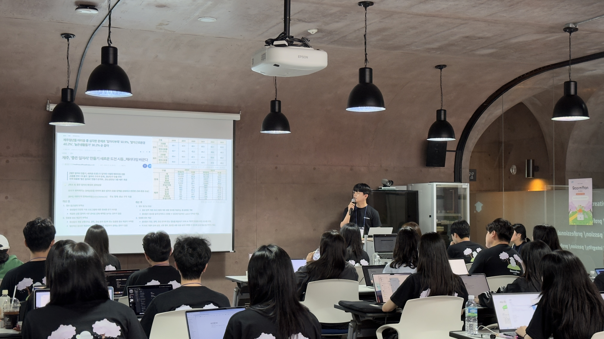
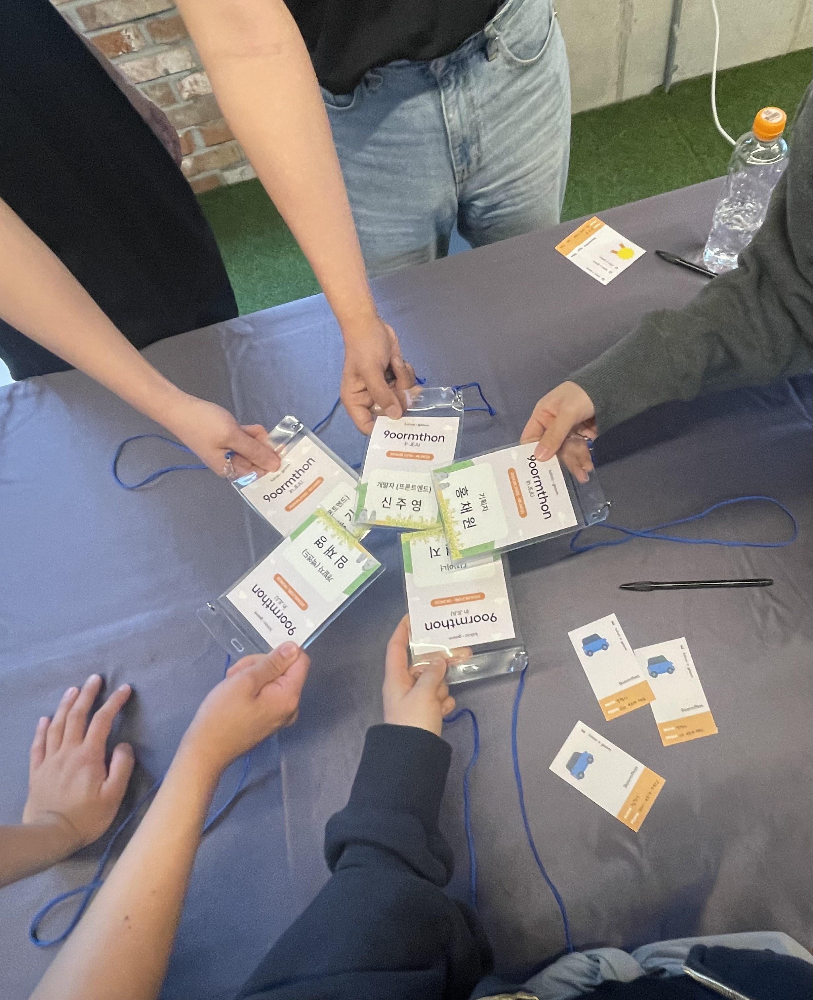
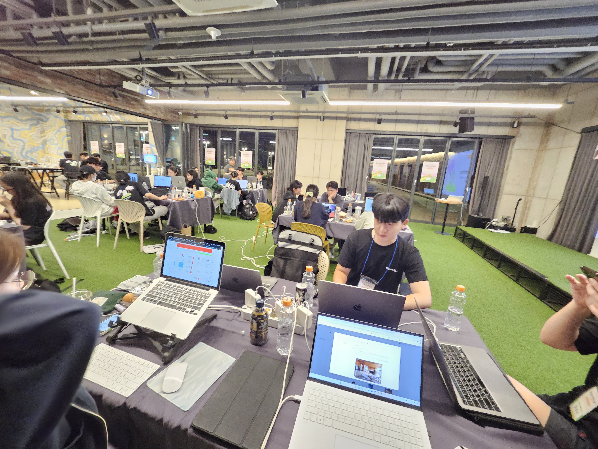
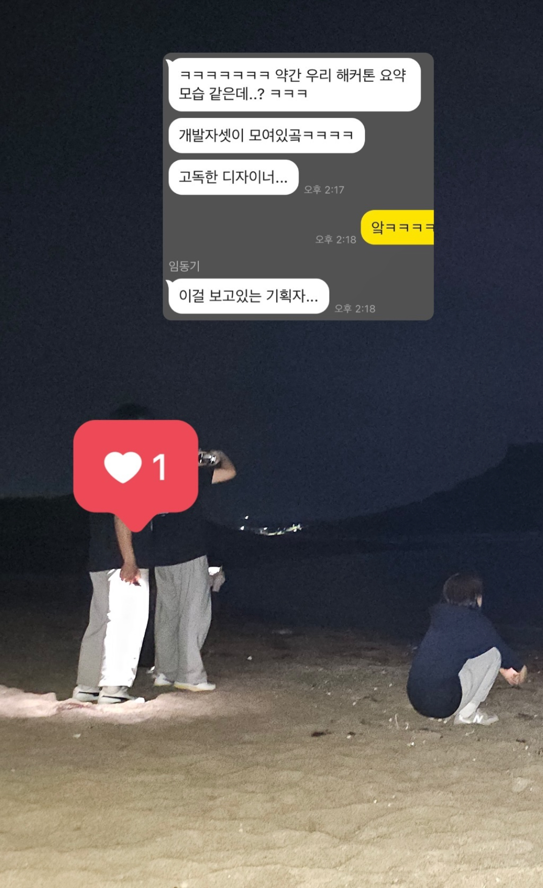
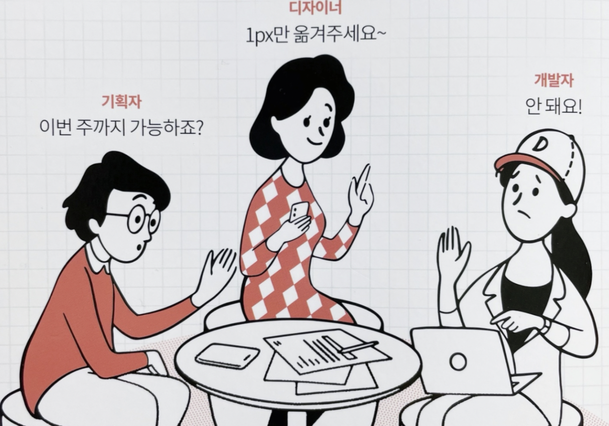
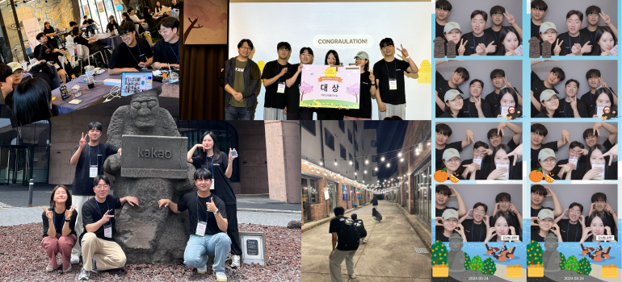

안녕하세요. 오늘은 제가 최근 참가했던 구름톤 10기 경험에 대해 이야기해보려고 합니다. 회사에 다닌 지 2년 차에 접어들면서 새로운 자극이 필요하다고 느끼기도 하고, 기획자, 디자이너, 개발자 분들과의 만남을 늘리고 싶어 구름톤 해커톤에 참여하게 되었습니다.

이번 포스팅에서는 구름톤 참가 과정과 느낀 점들을 솔직하게 풀어볼 예정입니다. 구름톤이나 다른 해커톤에 관심 있으신 분들께 조금이나마 도움이 되길 바랍니다. 그럼 본격적으로 시작해보겠습니다.

## 구름톤 10기, 왜 지원하게 되었을까?

회사 생활을 하면서 늘 마음 한켠에 갈망이 있었던 것 같아요. 바로 다양한 사람들과의 협업이었어요. 현재 회사에서도 기획, 디자인, 백엔드 개발자분들과 함께 서비스를 A부터 Z까지 개발해볼 수 있어 좋았지만, 소수의 개발팀으로 운영되다 보니 다른 회사 개발자 분들은 어떻게 일하고 있는지 늘 궁금했거든요.

그리고, 지금까지 쌓아온 제 능력으로 짧은 시간 안에 좋은 결과물을 낼 수 있을지 테스트해보고 싶기도 했고요. 일종의 자기 도전이라고 할 수 있겠네요. 이런 생각들로 구름톤에 지원하게 되었고, 참가를 위해 4일 휴가를 냈습니다. 결과 발표가 나오고 최종 확정을 할 때까지 '이게 정말 맞는 선택일까?' 하는 고민도 했던 것 같아요.

그래도 처음 지원할 때의 그 설렘과 열정을 떠올리며 마음을 다잡았습니다. 제주도에서 해커톤을 하는 모습을 상상하니 꽤나 낭만적으로 느껴졌기 때문이에요. 결국 이런 설렘과 도전 정신으로 끝까지 지원 과정을 마무리했습니다.

## 구름톤 타임 테이블

구름톤은 총 4일 동안 진행되었습니다. 타임 테이블을 간단히 요약하면 다음과 같아요:

1. **1-2일차**: 교육, 팀 빌딩, 네트워킹
2. **3-4일차**: 본격적인 해커톤 시작

실제 개발에 할애할 수 있는 시간이 이틀 정도밖에 되지 않는다는 점을 알게 되었습니다. 이를 통해 구름톤을 시작하기 전 몇 가지 중요한 포인트를 생각하며 제주도로 향했어요.

1. **개발 시간이 생각보다 짧다.**
2. **아이템 선정과 팀 빌딩을 빠르게 진행해야 한다.**
3. **개발 시간을 최대한 확보하는 것이 중요하다.**

위의 포인트를 바탕으로 해커톤에 임해야겠다고 생각했어요. 짧은 개발 기간 동안 효율적으로 작업하기 위해서는 빠른 의사결정과 명확한 역할 분담이 필수적이라고 판단했습니다. 또한, 이런 타이트한 일정은 실제 업무 환경에서도 마주칠수 있기에 제한된 시간 내에 최선의 결과물을 만들어내는 능력을 기르는 좋은 기회라고 생각했구요.

## 1일 차 - 설렘반 기대반 구름톤 시작

### 1-1 자기 PR: 시간 관리의 중요성

첫 번째 일정은 자기 PR이었어요. 3분이라는 시간이 주어졌는데, 처음엔 "3분이면 충분하겠지?"라고 생각하며 발표를 진행했는데 막상 말하다 보니 시간이 훌쩍 지나가버려서 모든 내용을 다 전달하지 못했어요. 아쉬움이 크더라고요.

다음에 이런 기회가 있다면 반드시 시간을 체크하면서 충분히 연습해야겠다고 다짐했답니다. 시간 관리의 중요성을 몸소 체험한 셈이죠!

### 1-2 실습: GDS(구름 디자인 시스템) vs 카카오 크램폴린 IDE

자기 PR 시간이 끝나고 나서는 두 가지 교육 중 하나를 선택할 수 있었어요. 카카오 크램폴린 IDE와 GDS(구름 디자인 시스템) 중에서요.

솔직히 카카오 크램폴린 IDE가 어떻게 구성되어 있는지 궁금하기도 했지만, 현재 회사에서 디자인 시스템 도입을 고민 중이어서 GDS 강의를 듣기로 결정했어요.

구름의 디자인 시스템을 살펴보니 엄청 체계적이었어요. 색상, 타이포그래피, 그림자 등 디자인 토큰이 아주 꼼꼼히 정리되어 있더라고요. "이런 디자인 시스템이라면 디자이너와 협업하기 너무 편할 것 같다"라는 생각이 들었죠. 기회가 된다면 우리 회사 서비스에도 꼭 도입하고 싶다는 욕심이 생겼던 디자인 시스템이었어요.

### 1-3 강의: 값진 인사이트

마지막으로 카카오 멘토분들의 강의를 들었어요. 이 시간이 정말 값졌던 것 같아요. 강의 내용에 계속 고개를 끄덕이면서 많은 공감을 하고 배울 수 있었거든요.

강의를 들으면서 한 줄로 요약하여 느낌점을 작성해보았는데요. 실제로 해당 느낀점들 덕분에 해커톤을 어떤 마음가짐으로 임해야 할지 길잡이가 되었습니다.

> 완벽함을 추구하기보다는, 주어진 시간 내에 원하는 결과를 정확히 보여줄 수 있을 정도로 만드는 것이 중요하다. 완성이 어려워 보이는 업무 범위라면, 범위를 줄이고 완성할 수 있도록 해야 한다.

> 기능을 추가할려는데 고민하는것 보다 기능을 빼는데 집중하여, 선택과 집중해야한다. 핵심 로직에만 집중하자.

### 1-4 교육 마무리 단계: 아이디어 발표 준비

교육 마무리 단계에서 2일차에 있을 아이디어 발표를 위한 미션을 받았어요. 주어진 키워드는 **제주**, **클라우드**, **K-SDGS**였어요. 이 세 가지 키워드를 모두 포함한 아이디어를 생각해내고, 그걸 1장짜리 PPT로 정리해야 했습니다.

발표 준비를 위해 호텔로 돌아왔는데, 고민을 엄청 했던 것 같아요. 침대에 누워서, 책상에 앉아서, 심지어 화장실에서도 계속 아이디어를 고민했습니다.

- "제주도의 환경 문제를 클라우드 기술로 해결하면 어떨까?"
- "K-SDGS 목표 달성을 위한 청년 플랫폼은 어떨까?"

이런 식으로 여러 아이디어들이 머릿속을 맴돌았죠. 하나의 아이디어가 떠오르면 그게 정말 실현 가능한지, 임팩트가 있을지 계속 따져보며 고민했습니다.

## 2일 차 - 너무 좋은 팀과의 만남

### 2-1 아이디어 발표 시간

드디어 아이디어 발표 시간이 왔습니다. 전날 호텔에서 고민하고 준비한 내용을 발표하는 시간이에요.

제가 선택한 아이디어는 **제주도의 청년 일자리 부족 해결을 위한 정책 정보 서비스**였어요. 주어진 키워드인 '제주', 'K-SDGS', '클라우드'를 모두 녹여내려고 노력했습니다.

발표 준비 과정에서 가장 신경 썼던 부분은 **시간 관리**와 **시각적 효과**였어요. 2분이라는 짧은 시간 동안 아이디어를 효과적으로 전달해야 했거든요. 그래서 최대한 텍스트는 줄이고 이미지 위주로 구성했습니다.

발표할 때는 PPT의 이미지를 보조 자료로 활용하면서, 말로 아이디어를 설명하는 방식을 택했어요. **제주도 청년들의 일자리 문제**, **현재 지원 중인 정책들**, **이 정보들을 쉽게 볼 수 있는 서비스의 필요성** 등을 차근차근 설명하려 노력했습니다.

### 2-2 팀 빌딩과 아이디어 선정

이후 팀 빌딩이 진행되었는데요. 팀 빌딩은 정말 빠르게 진행됐어요. 사실 1일차부터 마음에 드는 분들과 이야기를 나눴거든요. 덕분에 팀 빌딩을 빨리 마무리할 수 있었어요. 능력자 분들과 함께하게 되어 개발 시작 전부터 든든한 마음이 들더라고요. 주위를 돌아보니 다른 팀들도 거의 다 빠르게 팀 빌딩을 마쳤던 것 같아요. 여러분, 해커톤에서는 빠른 행동이 중요해요. 함께하고 싶은 분이 있다면 주저하지 말고 어필하세요!

우리 팀은 주제도 빠르게 결정되어 기획부터 바로 시작할 수 있었어요. 너무 순조로워서 "어? 이렇게 잘 되어도 되나?" 하는 생각도 들더라고요. 팀 빌딩 후에는 비어 파티가 있었는데, 파티가 끝난 후에도 우리는 결정한 아이디어를 더 구체화하고, 디자인 방향과 개발 요구사항을 논의했습니다.

### 2-3 첫 번째 아이디어: 제주도 장바구니

우리 팀이 처음 선정한 주제는 **제주도 장바구니**였어요. 제주도 여행 가기 전 원하는 음식과 물건들을 미리 골라 최저가로 예산을 정할 수 있게 해주는 서비스였죠. 최근 제주도 물가가 비싸져 관광객들이 부담을 느낀다는 피드백을 반영한 아이디어였습니다.

#### 문제점 1: 카카오 지도 API 이슈

처음에 우리 팀은 카카오 지도 API를 사용해 음식점을 조회하는 서비스를 만들기로 했어요. 카카오 행사니까 카카오 API를 쓰면 좋겠다 싶었거든요. 그런데 음식점은 조회되는데 메뉴까지는 조회할 수 없더라고요. 우리 서비스의 핵심은 메뉴 선택이었기 때문에, 이 부분은 꼭 필요했거든요. 팀원들과 회의 결과 먼저 카카오 API로 음식점을 조회한 다음, 크롤링으로 메뉴 데이터를 긁어오는 방법을 사용하기로 했어요. 하지만 해커톤 특성상 시간이 많이 없었기 때문에 데이터를 모으는 데 많은 시간을 할애해야 해서 고민이 되었습니다.

#### 문제점 2: 데이터 전처리 압박

그런데 이게 끝이 아니었어요. 데이터를 어떻게든 긁어온다 해도, 또 다른 문제가 기다리고 있었거든요. 바로 음식점마다 가격 표기 방식이 제각각이라는 거죠.

- A 돼지고기집: 삼겹살 150g에 15,000원
- B 돼지고기집: 삼겹살 100g에 13,000원

우리 서비스는 최저가를 추천해줘야 하는데, 단순히 가격만 크롤링 한다면 B 음식점을 추천하게 되는 거예요. 하지만 실제로는 A 음식점이 더 저렴하잖아요? 결국 이 데이터를 우리가 원하는 형태로 가공하는 전처리 작업이 필수였어요. 그런데 해커톤에서 이런 작업을 하기엔 시간이 너무 부족했어요.

긴 회의 끝에, 우리는 아쉽지만 현재 주제를 포기하고 새로운 주제를 선정하기로 했어요. 그렇게 탄생한 게 바로 **제주 청년 정책 통합 플랫폼 뿌리**예요.

### 2-4 새로운 아이디어: 제주 청년 정책 통합 플랫폼 뿌리

제주도의 청년들이 취업난 때문에 수도권으로 많이 떠나면서 제주도의 고령화와 경제 저하 문제가 심각해지고 있거든요. 우리는 이 문제를 해결하기 위해, 제주도의 청년 정책을 더 쉽고 편하게 알려주는 플랫폼을 만들기로 최종 결정했습니다.

3일차를 앞두고 잠깐 눈을 붙이러 갔을 때가 새벽 5시쯤이었어요. 잠들면서 이런 생각을 했던 것 같아요. "개발을 한참 진행하다 주제를 엎는 것보다는 훨씬 낫지 않나?" 우리 팀원들 모두 의욕이 넘쳐서 잘할 수 있을 거라는 확신이 들었어요. 그때 정말 '아, 이제 진짜 해커톤이 시작됐구나'하고 느꼈습니다.

## 3일 차 - 죽어보자 본격적인 지옥의 해커톤 시작

3시간 정도 눈을 붙이고 나서, 아침 9시에 다시 모여 본격적으로 디자인과 개발을 시작했어요. 프론트엔드를 맡은 저로서는 디자인과 API가 완성될 때까지 기다리기엔 시간이 아깝다고 판단했습니다. 그래서 디자이너분이 만들어 놓으신 와이어프레임과 백엔드분이 초안으로 만드신 API 명세서를 기반으로 작업을 진행했습니다. 이렇게 하면 실제 디자인과 API가 완성됐을 때 바로 적용할 수 있으니까요.

개발하면서 페이스가 늦춰지는 걸 방지하기 위해 제가 택한 방법이 있었어요. **컴퓨터에 프로젝트 마감까지 남은 시간을 보여주는 타이머**를 띄워놓고 개발했죠. 남은 시간이 20시간에서 19시간으로 바뀌는 순간, 정말 심장이 쿵쾅거리더라고요. 다른 팀들보다 디자인과 개발을 늦게 시작했다는 생각에 더 조급해졌던 것 같아요.

사실 기획, 디자인, 개발 과정이 정신없이 진행됐어요. 디자인을 하다가 갑자기 변경되기도 하고, 백엔드에서 API를 만들다가 보여줄 수 없는 데이터가 있다는 게 파악되어 또 그에 맞게 디자인을 변경하기도 했죠. 다행히 프론트엔드는 2명이어서, 이런 변경사항들을 바로바로 반영하며 프로젝트 완성을 향해 달릴 수 있었습니다.

## 4일 차 - 하얗게 불태웠다..

멘토님의 조언대로 "아무리 좋은 기획이라도 미완성은 좋게 평가받을 수 없다"는 말을 가슴에 새기고 완성을 목표로 달렸어요. 3일 차부터는 팀원 모두가 잠도 안 자고 프로젝트 마감 시간인 11시까지 계속해서 개발에 매진했습니다.

그래도 중간중간 추억도 쌓았어요. 새벽에 팀원들과 함께 제주도 밤바다도 보고, 이야기도 나누면서 진행했거든요. 다 같이 열심히 하니까 몸은 힘들어도 마음은 편했던 것 같아요. 정신없이 개발하다 보니 어느새 프로젝트 마감 시간이 코앞으로 다가왔었고 11시에 정각에 프로젝트를 제출하였습니다.

멘토님이 말씀해주셨던 것처럼 아무리 좋은 기획이라도 미완성은 좋게 평가받을 수 없다는 말을 기억하며 완성을 목표로 하며 열심히 달렸던 것 같아요. 3일 차 이후로 우리 팀원들은 자는 시간 없이 프로젝트 마감 11시까지 계속해서 개발을 진행했습니다.

막상 제출하고 천천히 다시 확인해보니 아쉬운 점들이 보이더라고요. 디자이너가 만든 UI를 제대로 반영 못한 부분도 있고, QA 테스트도 충분히 못 해서 문제가 있는 부분도 있었어요. 그래도 정말 후회 없이 열심히 했기에, 결과보다는 과정에서 얻은 게 많았어요. 그래서 큰 아쉬움 없이 마무리할 수 있었습니다.

## 대망의 발표 - 시작은 미약하였으나 끝은 창대하리라

각 팀의 발표가 끝나고 우리 팀 차례가 왔습니다. 그리고 놀랍게도 우리 팀이 **대상을 수상**하게 됐습니다! 평가진 분들이 우리 팀의 접근 방식에 공감해주셨더라고요. 제주 청년들의 취업 문제를 어떻게 해결하려 했는지, 그 고민의 과정을 잘 봐주신 것 같아요.

사실 팀원 모두 결과보다는 과정에서 얻은 게 많아서 수상에 대한 욕심은 없었어요. 그래서 대상 수상 소식을 들었을 때 더욱 기뻤던 것 같아요.

다들 밤을 새워 피곤한 눈빛이었는데, 대상 소식을 듣자마자 마치 푹 잔 사람들처럼 활기를 되찾았던 것 같아요. 처음 주제를 엎고 새로운 주제로 여기까지 달려온 시간들이 스쳐 지나가면서, 팀원 모두가 수상의 기쁨을 즐겼습니다. **이맛에 해커톤 하는구나** 싶은 순간이었어요.

모든 세션이 끝난 후에는 팀원들과 함께 식사하면서 대상의 여운을 즐겼어요. 서울에 돌아와서도 계속 연락하면서 프로젝트의 부족했던 부분들을 보완하기도 했고요.

## 구름톤을 통해 느낀점

이번 해커톤은 기획자, 디자이너, 개발자 간의 사고방식 차이를 이해하는 좋은 기회였어요. 같은 상황에 대해 각자 다르게 접근하는 걸 보면서 많이 배웠습니다.

이번 경험을 통해 팀원들의 관점을 더 잘 이해하게 되었고, 협업 시 서로의 입장을 고려하는 게 얼마나 중요한지 깨달았어요.

구름톤이 끝나고 코드를 다시 살펴보면서 제 자신을 돌아보게 되기도 했습니다. 시간에 쫓겨 세심하게 코드를 짜지 못한 부분들이 눈에 띄더라고요.

1. **디자인 적용 미스**: 피그마로 명확히 디자인된 부분을 다르게 구현.
2. **컴포넌트 분리 부족**: 효율을 위해 분리가 필요한 부분도 그냥 한 번에 작성.

물론 시간이 충분했다면 이런 실수를 줄일 수 있었겠지만, 오히려 이렇게 짧은 시간 안에 개발하면서 제 약점을 발견할 수 있었어요. 이런 경험을 바탕으로 앞으로 더 발전할 수 있을 것 같아요. 기술적인 성장뿐만 아니라 협업 능력, 시간 관리 능력까지 모든 면에서 성장할 수 있는 시간이었습니다.

## 마치며

구름톤에 참가하며 시간 순서대로 제게 있었던 일을 작성해 보았는데요. 저에겐 4일 다른 곳으로 놀러가는 것보다 구름톤에서의 4일이 너무나 소중한 시간이었습니다. 새로운 곳에서 열정 넘치는 사람들과 몰두하며 무언가를 만들어보는 시간이 저에게 동기 부여와 많은 성장을 준 것 같아요. 좋은 사람들을 많이 알게 된 것도 그렇고요.

취준생이시거나 이미 직장인이신 분들도 현재 하고 계신 일을 잠깐 내려놓고 새로운 곳에서 개발을 해보시는 건 어떠실까요? 또 다른 느낌으로 좋은 기운을 얻을 수 있을 것 같습니다. 이상으로 글을 마무리하며, 해커톤에 대해 궁금했던 분들에게 조금이나마 도움이 되었으면 합니다.

구름톤에서 제가 했던 프로젝트가 궁금하신 분들은 아래 구름톤 전시를 통해 확인해보시면 됩니다. 추가적으로 팀원들과 디벨롭할 예정이라 좋은 아이디어 있으시다면 편하게 연락 주세요!

<a href="https://9oormthon.goorm.io/83182701-089a-4441-8589" target="_blank" rel="noopener noreferrer nofollow">[뿌리] 제주 청년 정책 통합 플랫폼</a>

 

**궁금하신 점이 있다면 아래 `댓글`로 남겨주세요!👇**
