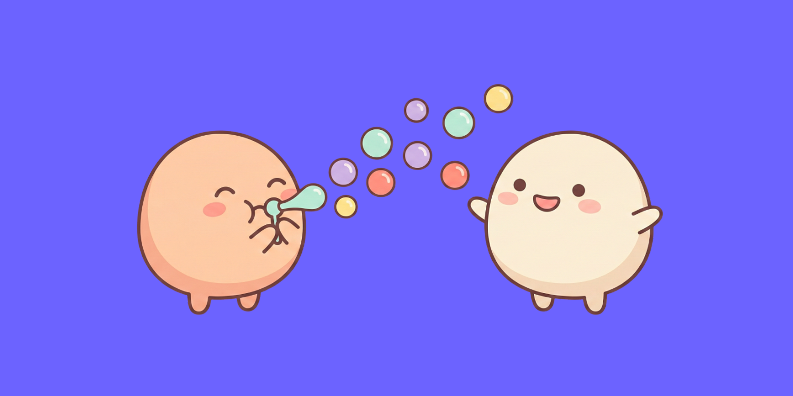
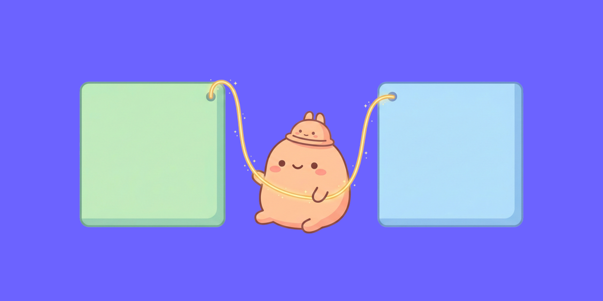

> AI 에이전트한테 복잡한 작업을 시켜놓고 30초 동안 로딩 스피너만 바라본 적 있으신가요? 에이전트가 지금 뭘 하는지, 어디까지 진행됐는지, 내 승인이 필요한 건지 — 화면에는 아무것도 보이지 않았거든요. 그런데 최근 CopilotKit 팀이 이 문제를 정면으로 겨냥한 오픈 프로토콜을 공개했습니다. 이번 글에서는 AG-UI가 뭔지, 그리고 프론트엔드 개발자인 우리가 왜 관심 가져야 하는지 정리해보려 합니다.

## 에이전트가 일하는 동안 UI는 뭘 보여줘야 할까

요즘 AI 에이전트를 앱에 통합할 때 가장 답답한 순간이 언제인지 아시나요? 에이전트가 **일하고 있는 동안**이에요. 사용자 입장에서는 세 가지 문제에 부딪히게 됩니다.

**1) 투명성 부재** — 에이전트가 뭘 하고 있는지 모릅니다. "여행 일정 짜줘"라고 요청했는데, 30초 동안 로딩 스피너만 돌고 있으면 불안하잖아요. 지금 항공편을 검색하는 건지, 숙소를 비교하는 건지, 아니면 에러가 나서 멈춘 건지 알 수가 없어요.

**2) 도구 호출 블랙박스** — 에이전트가 외부 API를 호출하거나 데이터베이스를 조회하는 과정이 완전히 가려져 있습니다. 사용자는 결과만 받아볼 뿐, 중간 과정을 전혀 볼 수 없어요.

**3) 승인 통신 규격 부재** — "결제를 진행할까요?" 같은 승인이 필요한 순간에도 표준화된 방법이 없습니다. 프레임워크마다 제각각이라 이식성이 전혀 없고요.

[이전 글에서는 웹사이트가 에이전트에게 도구를 노출하는 WebMCP](/chrome-webmcp-ai-agent-web-standard/)를 다뤘는데, 이번에는 **반대 방향**입니다. 에이전트가 프론트엔드에게 "나 지금 이거 하고 있어"라고 알려주는 프로토콜이에요.

비유하자면 이렇습니다. **WebMCP가 식당 메뉴판**(손님에게 뭘 시킬 수 있는지 알려줌)이라면, **AG-UI는 주방에서 홀로 나오는 주문 벨**("5번 테이블 음식 나왔어요!")인 거죠.

## AG-UI란? — 에이전트에서 앱으로 흐르는 이벤트 스트림

**AG-UI**(Agent-User Interaction Protocol)는 AI 에이전트와 프론트엔드 애플리케이션 사이의 통신을 표준화하는 오픈 프로토콜이에요. CopilotKit 팀이 주도하고, LangChain·Microsoft·Google 등이 참여하고 있습니다.

핵심 아이디어는 간단합니다. 에이전트가 작업하는 과정을 **JSON 이벤트 스트림**으로 실시간 전달하는 거예요. 기존 REST API처럼 "요청 보내고 → 완성된 응답 받기"가 아니라, **작업하는 매 순간을 이벤트로 흘려보내는** 방식이죠.

전송 방식은 **SSE(Server-Sent Events)** 기반이라 기존 HTTP 인프라와 바로 호환되고요. WebSocket보다 도입 장벽이 낮습니다.

|                        | REST/GraphQL        | AG-UI                     |
| ---------------------- | ------------------- | ------------------------- |
| **통신 방식**          | 요청 → 응답 (1회성) | 이벤트 스트림 (지속적)    |
| **에이전트 진행 상황** | 완료될 때까지 모름  | 실시간 전달               |
| **텍스트 응답**        | 전체 완성 후 반환   | 글자 단위 스트리밍        |
| **도구 호출**          | 클라이언트가 모름   | TOOL_CALL 이벤트로 알림   |
| **상태 동기화**        | 별도 구현 필요      | STATE_DELTA로 자동 동기화 |
| **사용자 개입**        | 별도 구현 필요      | 프로토콜 내장 (인터럽트)  |

## 이벤트 타입으로 에이전트의 모든 순간을 전달한다

AG-UI의 이벤트는 크게 **5개 카테고리**로 나뉩니다. 프론트엔드 개발자 입장에서 각 카테고리를 어떻게 활용할 수 있는지 정리해봤어요.

| 카테고리         | 주요 이벤트                                                | 프론트엔드 활용              |
| ---------------- | ---------------------------------------------------------- | ---------------------------- |
| **Lifecycle**    | `RunStarted`, `RunFinished`, `RunError`                    | 로딩 상태 토글, 에러 UI 표시 |
| **Text Message** | `TextMessageStart`, `TextMessageContent`, `TextMessageEnd` | 글자 단위 스트리밍 렌더링    |
| **Tool Call**    | `ToolCallStart`, `ToolCallArgs`, `ToolCallEnd`             | "API 호출 중..." 진행 UI     |
| **State**        | `StateSnapshot`, `StateDelta`                              | 에이전트-UI 공유 상태 동기화 |
| **Special**      | `Custom`, `Raw`                                            | 승인 대기, 커스텀 UI 트리거  |

이 외에도 **Step**(단계 추적), **Activity**(활동 상태 표시), **Reasoning**(추론 과정 시각화) 이벤트가 있어서, 에이전트의 사고 과정까지 UI에 보여줄 수 있어요.

### 여행 예약 에이전트로 보는 이벤트 흐름

"제주도 2박 3일 여행 일정 짜줘"라고 요청했을 때 이벤트가 어떻게 흐르는지 보면 바로 감이 옵니다.

| 순서 | 이벤트 | 사용자가 보는 화면 |
|:---:|---|---|
| 1 | `RunStarted` | 로딩 표시 시작 |
| 2 | `TextMessageContent` | "제주도 여행 일정을 검색하고 있어요..." |
| 3 | `ToolCallStart("searchFlights")` | **항공편 검색 중...** 진행 UI 표시 |
| 4 | `StateDelta({ flights: [...] })` | 검색 결과 3건이 화면에 나타남 |
| 5 | `ToolCallStart("searchHotels")` | **숙소 검색 중...** 진행 UI 전환 |
| 6 | `TextMessageContent` | "3개 항공편과 5개 숙소를 찾았어요" |
| 7 | `StateDelta({ itinerary: {...} })` | 1일차~3일차 일정표가 화면에 렌더링 |
| 8 | `TextMessageContent` | "일정이 완성됐어요! 확인해보세요 😊" |
| 9 | `RunFinished` | 로딩 표시 종료 |

사용자는 이 과정을 실시간으로 지켜볼 수 있어요. "항공편 검색 중..." → "숙소 검색 중..." → 결과 표시까지, 에이전트가 뭘 하고 있는지 **매 순간 화면에 보이는** 거죠. 30초 동안 로딩 스피너만 보는 것과는 완전히 다른 경험이에요.

## 어떻게 동작하는 걸까?

AG-UI의 동작 구조는 간단합니다. **서버가 이벤트를 만들어서 SSE로 흘려보내고, 클라이언트가 이벤트 타입별로 UI를 업데이트**하는 거예요.

서버 쪽에서는 `@ag-ui/core`의 `EventEncoder`로 이벤트를 인코딩해서 SSE 스트림으로 보냅니다. `RUN_STARTED` → `TEXT_MESSAGE_CONTENT`(텍스트 청크) → `TOOL_CALL_START`(도구 호출) → `STATE_DELTA`(상태 변경) → `RUN_FINISHED` 순서로 이벤트를 발행하면, 전송 포맷은 프로토콜이 알아서 처리해요.

클라이언트 쪽에서는 `@ag-ui/client`의 `HttpAgent`로 이벤트 스트림에 연결하고, 이벤트 타입별 콜백을 등록합니다. `TEXT_MESSAGE_CONTENT`가 오면 채팅창에 글자를 추가하고, `TOOL_CALL_START`가 오면 "검색 중..." 같은 진행 UI를 보여주고, `STATE_DELTA`가 오면 앱 상태를 업데이트하는 식이죠.

| 역할 | 패키지 | 핵심 클래스 | 하는 일 |
|---|---|---|---|
| **서버** | `@ag-ui/core` | `EventEncoder` | 이벤트를 SSE 형식으로 인코딩 → 스트리밍 |
| **클라이언트** | `@ag-ui/client` | `HttpAgent` | SSE 구독 → 이벤트 타입별 콜백으로 UI 업데이트 |

기존에 REST API로 에이전트를 연동했다면, 응답이 올 때까지 아무것도 못 하고 기다려야 했을 거예요. AG-UI를 쓰면 **작업 과정 자체가 UI가 됩니다**. 새 프로젝트에서 직접 해보고 싶다면 `npx create-ag-ui-app my-agent-app` 한 줄이면 스캐폴딩이 끝납니다.

## 에이전트 시대의 프로토콜 지도 — MCP, A2A, AG-UI, A2UI

AI 에이전트 생태계에는 프로토콜이 여러 개 있어서 처음에는 좀 헷갈릴 수 있어요. 각자 해결하는 문제가 다르거든요. 레이어로 정리하면 이렇습니다.

| 레이어 | 프로토콜 | 방향 | 핵심 질문 | 예시 |
|:---:|---|---|---|---|
| 4 | **A2UI** | 에이전트 → UI 컴포넌트 | 어떤 UI를 보여줄까? | 차트, 폼, 카드 동적 생성 |
| 3 | **AG-UI** ★ | 에이전트 → 프론트엔드 | 진행 상황을 어떻게 알릴까? | 텍스트 스트리밍, 도구 호출 UI |
| 2 | **MCP / WebMCP** | 에이전트 ↔ 도구 | 어떤 도구를 쓸 수 있을까? | DB 조회, API 호출 |
| 1 | **A2A** | 에이전트 ↔ 에이전트 | 다른 에이전트에게 뭘 시킬까? | 여행 에이전트 → 결제 에이전트 위임 |

여기서 주목할 건 **AG-UI와 A2UI의 관계**예요. AG-UI는 "이벤트를 어떻게 전달할지"를 정의하는 **전송 프로토콜**이고, A2UI(Google)는 "어떤 UI를 보여줄지"를 정의하는 **선언적 명세**입니다. 경쟁이 아니라 **다른 레이어**에서 작동하는 거예요.

실제로 CopilotKit은 Google의 공식 A2UI 런칭 파트너이기도 합니다. A2UI로 UI 구조를 정의하고, AG-UI로 그 구조를 실시간 전달하는 식으로 함께 쓸 수 있어요.

그리고 [이전 글에서 다뤘던 WebMCP](/chrome-webmcp-ai-agent-web-standard/)는 MCP 레이어의 브라우저 확장이에요. **WebMCP + AG-UI를 합치면**: 에이전트가 WebMCP로 웹사이트의 기능을 호출하고, AG-UI로 그 과정을 사용자에게 실시간으로 보여주는 것. 경쟁이 아니라 **세트**입니다.

## 프론트엔드 개발자가 주목할 포인트들

### 이미 프로덕션에서 사용 중

W3C 제안 단계인 WebMCP와 달리, AG-UI는 **이미 프로덕션에서 쓰이고 있어요**. Microsoft Agent Framework, Google ADK, LangGraph, CrewAI, AWS Strands 등 주요 에이전트 프레임워크가 공식 연동을 지원합니다. "나중에 나올 스펙"이 아니라 **지금 당장 써볼 수 있는** 프로토콜이에요.

### TypeScript SDK로 바로 시작

프론트엔드 개발자라면 TypeScript SDK만 알면 됩니다. `@ag-ui/client` 패키지를 설치하고 `HttpAgent`로 이벤트 스트림에 연결하면 끝이에요. 새로운 프로젝트라면 `npx create-ag-ui-app my-agent-app`으로 스캐폴딩할 수도 있고요.

### SSE 기반이라 도입 장벽이 낮음

WebSocket 대신 **SSE(Server-Sent Events)** 를 기본 전송 방식으로 채택했기 때문에, 기존 HTTP 인프라에서 바로 동작합니다. 프록시 설정이나 로드밸런서 이슈를 걱정할 필요가 훨씬 적어요. 고성능이 필요하면 바이너리 프로토콜도 선택할 수 있고요.

### 인터럽트 — 사람이 끼어들 수 있는 구조

에이전트가 결제 같은 민감한 작업을 수행할 때, **상태 손실 없이 일시 중지하고 사용자 승인을 받은 뒤 재개**할 수 있어요. 이게 프로토콜 레벨에서 지원되니까 프레임워크마다 직접 구현할 필요가 없습니다.

## 솔직한 한계들

물론 아직 초기 단계인 만큼 한계도 분명히 있어요.

**CopilotKit 팀 주도** — 오픈 프로토콜이라고는 하지만, 현재는 CopilotKit 팀이 거의 전적으로 이끌고 있습니다. W3C나 IETF 같은 표준 기구의 거버넌스가 없어서, 장기적으로 커뮤니티 주도로 전환될 수 있을지는 지켜봐야 해요.

**A2UI와의 경계** — "이벤트 전달"과 "UI 명세"를 분리하는 개념은 깔끔하지만, 실무에서 이 경계가 항상 명확할지는 미지수예요. 복잡한 에이전트 앱을 만들다 보면 두 레이어가 얽히는 지점이 생길 수도 있을 것 같습니다.

**CopilotKit 생태계 중심** — 공식 클라이언트가 현재 CopilotKit 위주이고, 다른 프론트엔드 프레임워크(Vue, Svelte 등)에서의 레퍼런스는 아직 적어요. TypeScript SDK 자체는 프레임워크 독립적이지만, 실전 사례는 React/CopilotKit에 집중되어 있습니다.

## 정리하며

[이전 글의 WebMCP](/chrome-webmcp-ai-agent-web-standard/)가 **"에이전트가 뭘 할 수 있는지"** 알려주는 프로토콜이었다면, AG-UI는 **"에이전트가 뭘 하고 있는지"** 알려주는 프로토콜이에요. 방향이 반대인 이 둘을 합치면 양방향 통신이 완성됩니다.

프론트엔드 개발자의 역할이 달라지고 있다고 느껴요. "화면을 그리는 것"에서 **"에이전트와 사용자 사이의 실시간 인터페이스를 설계하는 것"**으로 확장되고 있는 거죠. AG-UI 같은 프로토콜이 그 변화의 기반을 만들어가고 있고요.

아직 초기 단계이고 생태계도 더 성장해야 하지만, 방향성은 꽤 명확하다고 느꼈습니다. 에이전트가 점점 더 복잡한 작업을 수행하게 될수록, "그 과정을 사용자에게 어떻게 보여줄 것인가"는 피할 수 없는 질문이 될 테니까요.

<!-- 🎨 Gemini 이미지 생성 프롬프트:
Cute kawaii illustration, soft pastel colors. Two round blob characters — a peach one (with a tiny antenna) and a cream one (with a tiny monitor on its head) — holding hands and looking up together at a bright soft golden star above them. A gentle glowing bi-directional arrow connects them at chest level. Tiny sparkles and small hearts float around them. Both have dot eyes, rosy cheeks, and warm hopeful smiles. Solid #6C63FF purple background. Simple, clean, minimal details, soft drop shadows. Molang/Sumikko Gurashi inspired style. No text.
→ 파일명: future-connection.png -->

 

**궁금하신 점이 있다면 아래 `댓글`로 남겨주세요!👇**
