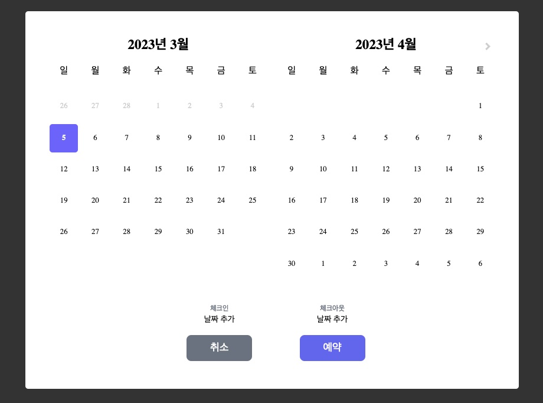
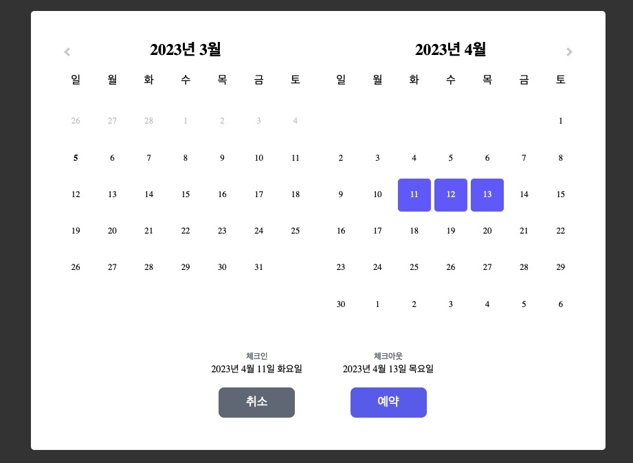
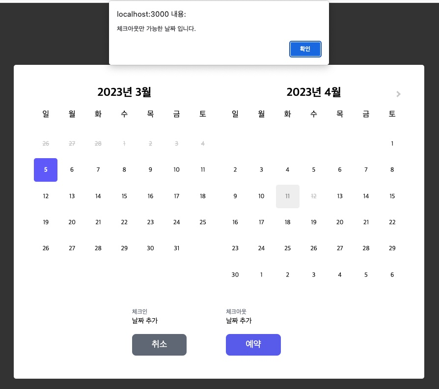
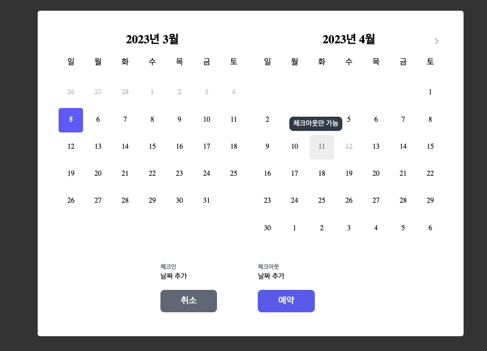
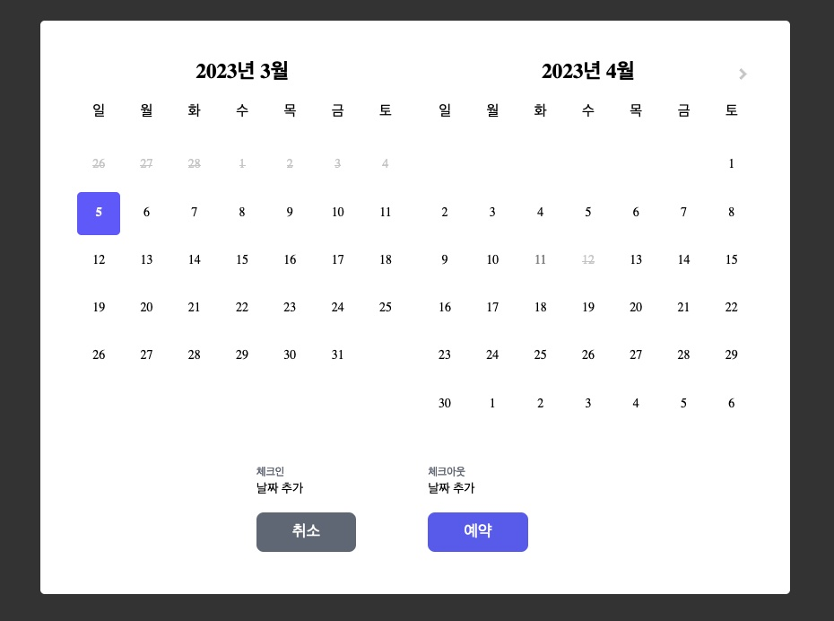
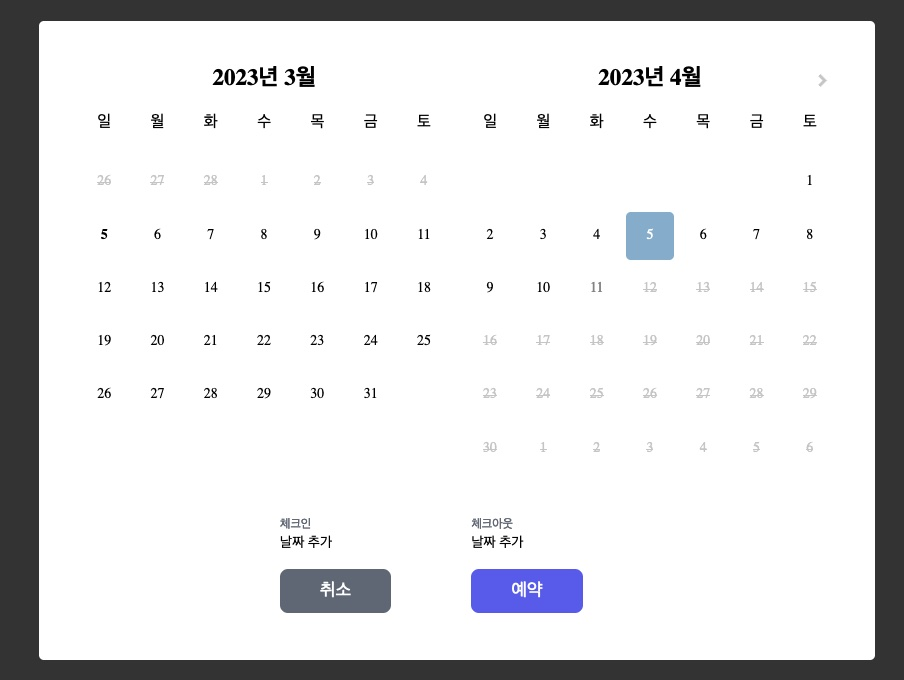

여러분들은 여행을 가실 때 에어비앤비를 사용해본 적이 있으신가요? 저는 저렴한 가격에 숙소를 구하기 위해서 여행할 때 종종 사용하는 서비스입니다. 평소에 자주 사용하는 에어비앤비의 예약 캘린더를 보고 사용자가 사용하기에 직관적으로 잘 만들어져 있다고 느꼇습니다.

에어비앤비의 예약 캘린더가 정확히 어떻게 만들어져 있는지는 알 수 없지만, 제 나름대로 추측하여 기능들을 구현해보았고, 저는 어떻게 구현하였는지 설명하는 시간을 가져보도록 하겠습니다.

## 에어비앤비 캘린더 기능

1. 체크아웃만 가능한 날, 예약이 모두 가능한 날, 예약이 안되는 날이 구분되도록 표시
2. 체크아웃만 가능한 날에는 hover시 tooltip으로 표시
3. 예약 기간 사이에 이미 예약된 날이 포함되지 못하도록 설정

> 기능을 구현하기 위하여 react-datepicker, date-fns 라이브러리를 사용하였습니다.

## 캘린더 UI

본격적으로 에어비앤비 기능을 구현하기 전 react-datepicker 라이브러리를 사용하여 기본적인 기능과 UI를 만들었습니다. 기본적인 기능으로 체크인과 체크아웃을 클릭하면 아래에 날짜가 나올 수 있도록 구현되어 있습니다. 해당 포스트의 코드들은 아래에 첨부해드릴 예정이니 필요하신 분들은 사용하셔도 좋습니다.



## 예약별 처리(체크인, 체크아웃)

해당 기능을 구현하기 위해서는 예약된 날 데이터가 조금 달라야 하는데요. 예를 들어 4월 11일을 체크인으로, 4월 13일을 체크아웃으로 예약하게 된다면 해당 날짜는 예약된 날로 변하기에 모두 disabled 시켜야 한다고 생각 될 수 있습니다.

하지만 다른 사람이 위의 날짜로 예약하였어도 10일 ~ 11일은 예약 가능해야하고 13일 ~ 14일도 예약이 가능해야합니다. 즉, 다른 사람들이 캘린더를 보았을 때 11일은 체크아웃만 가능한 날, 12일은 예약 불가로 표시되어야하고 다른 날은 제약이 없어야 한다는 말과 동일합니다.

해당 로직을 처리하기 위하여 아래와 같이 데이터를 처리해야합니다. 아래 셈플 데이터는 11일 ~ 13일을 예약하였을시의 아래와 같이 데이터가 나온다고 가정해봅시다.

```json
 "reservationList" : [
  "20230411_PM",
  "20230412_AM",
  "20230412_PM",
  "20230413_AM",
]
```

- 해당 날짜에 PM만 있다면 체크아웃만 가능한 날짜입니다.
- 해당 날짜에 AM만 있거나 아무것도 없다면 예약이 모두 가능한 날입니다.
- 해당 날짜에 AM,PM 둘 다 있다면 예약이 불가능한 날입니다.

해당 로직을 처리하기 위해 먼저 날짜와 시간 표시를 분리해야합니다.

```typescript
const splitReservationList = reservations.map((reservation) => reservation.split('_'));

OUTPUT: [
  ['20230411', 'PM'],
  ['20230412', 'AM'],
  ['20230412', 'PM'],
  ['20230413', 'AM'],
];
```

분리된 `splitReservationList`를 통해 날짜를 Key로 시간 표시를 Value로 가진 오브젝트를 만듭니다. 해당 오브젝트를 만들면서 AM, PM이 같이 들어있다면 모두 예약이 됐다는 표시로 Value 값을 ALL로 수정합니다.

```typescript
const parseReservationList: { [key: string]: string } = {};

splitReservationList.map((splitReservation) => {
  if (parseReservationList[splitReservation[0]]) parseReservationList[splitReservation[0]] = 'ALL';
  else parseReservationList[splitReservation[0]] = splitReservation[1];
});

OUTPUT: parseReservationList = {
  '20230411': 'PM',
  '20230412': 'ALL',
  '20230413': 'AM',
};
```

완성된 오브젝트에서 Value 값이 ALL인 것과 PM인 것을 분리하여 저장합니다. AM 데이터는 필요없기 때문에 따로 저장하지 않습니다. 마지막으로 react-datepicker에 값을 넣기 위해서는 Date 타입이어야 하므로 스트링 타입을 Date 타입으로 바꿔줍니다.

```typescript
const reservationAllList = Object.keys(parseReservationList).filter((key) => parseReservationList[key] === 'ALL');
const reservationPmList = Object.keys(parseReservationList).filter((key) => parseReservationList[key] === 'PM');

OUTPUT:
reservationAllList = ["20230412"]
reservationPmList  = ["20230411"]

const parseReservationAllList = reservationAllList.map((key) => parse(key, 'yyyyMMdd', new Date()));
const parseReservationPmList = reservationPmList.map((key) => parse(key, 'yyyyMMdd', new Date()));

OUTPUT:
parsereservationAllList = [Wed Apr 12 2023 00:00:00 GMT+0900 (대한민국 표준시)]
parsereservationPmList = [Tue Apr 11 2023 00:00:00 GMT+0900 (대한민국 표준시)]
```

### 체크아웃만 가능한 날 처리

지금까지 하였다면 기능을 처리하기 위한 사전작업이 완료되었습니다. 체크인 날짜가 위에서 파싱한 `parseReservationPmList` 에 포함되어 있다면 경고 메시지 처리 후 체크인 날짜를 초기화 시킵니다. `handleChange`에서 받는 dates 매개변수는 [체크인, 체크아웃]인 배열입니다.

```typescript
const [parseReservationAllList, parseReservationPmList] = handleReservationList(reservationList);

export const isInArray = (array: Date[], value: Date) => {
  return !!array.find((item) => {
    return item.getTime() == value.getTime();
  });
};

const handleChange = (dates: (Date | null)[]) => {
  if (dates[0] && isInArray(parseReservationPmList, dates[0])) {
    console.log('체크아웃만 가능한 날짜 입니다.');
    setDateRange([null, null]);
  } else {
    setDateRange(dates);
  }
};

return(
<DatePicker
	...
	onChange={handleChage}
	...
>
...
</DatePicker>
)
```

### 체크아웃만 가능한 날 색상 변경

react-datepicker의 dayClassName props를 이용하여 체크아웃만 가능한 날에 checkout 이라는 클레스 네임을 추가시키고 해당 클래스 네임을 이용하여 회색 색상으로 변경시킵니다.

```typescript
//.css----
.checkout {
  color: #8e8e8e !important;
}
//--------
export const isInArray = (array: Date[], value: Date) => {
  return !!array.find((item) => {
    return item.getTime() == value.getTime();
  });
};

export const convertDateColor = (parseReservationPmList: Date[], date: Date) => {
	if (isInArray(parseReservationPmList, date)) return 'checkout';
	return '';
};

return(
<DatePicker
	...
	dayClassName={(date) => convertDateColor(date)}
	...
>
...
</DatePicker>
)
```

### 예약이 불가능한 날 처리

react-datepicker 라이브러리의 excludeDates props를 이용하여 예약이 불가능한 날짜를 disabled시킵니다.

```typescript
const [parseReservationAllList, parseReservationPmList] = handleReservationList(reservationList);

return(
<DatePicker
	...
	excludeDates={parseReservationAllList}
	...
>
...
</DatePicker>
)
```

[예약 전]



[예약 후]



## tooltip으로 표시

에어비앤비에서는 체크아웃만 가능한 날에 hover시 tooltip으로 표시합니다. 또한 체크아웃 날을 클릭할 때는 표시되지 않고 체크인 날을 클릭할 때만 알려줍니다.

해당 기능을 구현하기 위해서는 HTML 태그 자체의 tooltip을 사용할 수도 있지만, 그렇게 한다면 커스텀이 불가능합니다. 그렇기에 저는 CSS를 활용하여 tooltip 기능을 만들었습니다. 만든 tooltip 기능을 React-datepicker 라이브러리의 renderDayContents props를 이용하여 삽입합니다.

```typescript
const [dateRange, setDateRange] = useState<(Date | null)[]>([]);
const [startDate, endDate] = dateRange;
const [parseReservationAllList, parseReservationPmList] = handleReservationList(reservationList);

const isInArray = (array: Date[], value: Date) => {
  return !!array.find((item) => {
    return item.getTime() == value.getTime();
  });
};

const renderDayContents = (day: number, date: Date) => {
  return (
    <>
      <div className="group w-full relative inline-block duration-300">
        <span className="text-sm">{getDate(date)}</span>
        {!startDate && isInArray(parseReservationPmList, date) && (
          <span className="absolute hidden group-hover:flex -left-10 -top-2 -translate-y-full w-25 px-2 py-1 bg-gray-700 rounded-lg text-center text-white text-sm">
            체크아웃만 가능
          </span>
        )}
      </div>
    </>
  );
};

return(
<DatePicker
	...
	renderDayContents={renderDayContents}
	...
>
...
</DatePicker>
)
```



## 예약된 날이 포함되지 못하도록 설정

체크인 날과 체크아웃 날 사이에는 이미 예약된 날이 포함될 수 없습니다. 그렇기에 체크인 날을 입력하였을 시, 체크인 날짜와 가장 가까운 이미 예약된 날 뒤로는 전부 disabled시켜 포함되지 못하도록 해야합니다.

```typescript
const [parseReservationAllList, parseReservationPmList] = handleReservationList(reservationList);
const [maxDate, setMaxDate] = useState<Date>();

const calculateMaxDate = (parseReservationAllList: Date[], currentDateList: (Date | null)[]) => {
  const maxDateList: (Date | undefined)[] = [];

  parseReservationAllList.map((reservation) => {
    if ((currentDateList[0] as Date) > reservation) return;
    maxDateList.push(reservation);
  });

  if (currentDateList[1] !== null || maxDateList.length < 1) return;

  return min(maxDateList as Date[]);
};

const handleChange = (dates: (Date | null)[]) => {
    setMaxDate(calculateMaxDate(parseReservationAllList, dates));
};

return(
<DatePicker
	...
	onChange={handleChange}
	maxDate={maxDate}
	...
>
...
</DatePicker>
)
```

[체크인 입력 전 화면]



[체크인 입력 후 화면]



## 마치며

지금까지 에어비앤비의 달력 기능을 구현하는 방법에 대해 설명해 보았습니다. 체크아웃만 가능한 날짜를 처리하고, 예약이 불가능한 날짜를 disabled 시키는 등 여러 기능을 구현하는 방법을 설명해 보았는데요. 이 글을 통해 에어비앤비의 달력 구현에 대해 이해하는 데 도움이 되길 바랍니다. 해당 포스트를 쓰며 작성한 코드는 아래의 링크에 첨부해 드리도록 하겠습니다. 긴 글 읽어주셔서 감사합니다.

## 링크

[포스트 관련 소스](https://github.com/S-jooyoung/react-datepicker-reservation)

[react-datepicker 공식 사이트](https://reactdatepicker.com/)

[date-fns 공식 사이트](https://date-fns.org/)

<br/>
