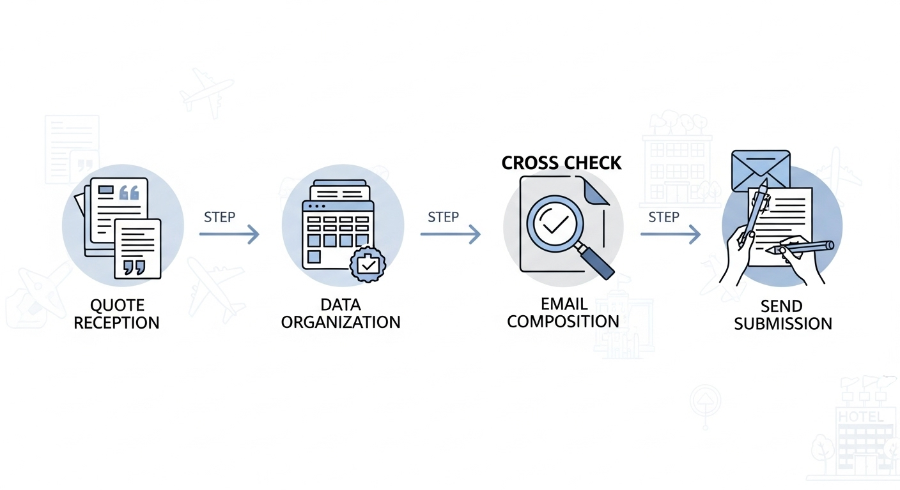
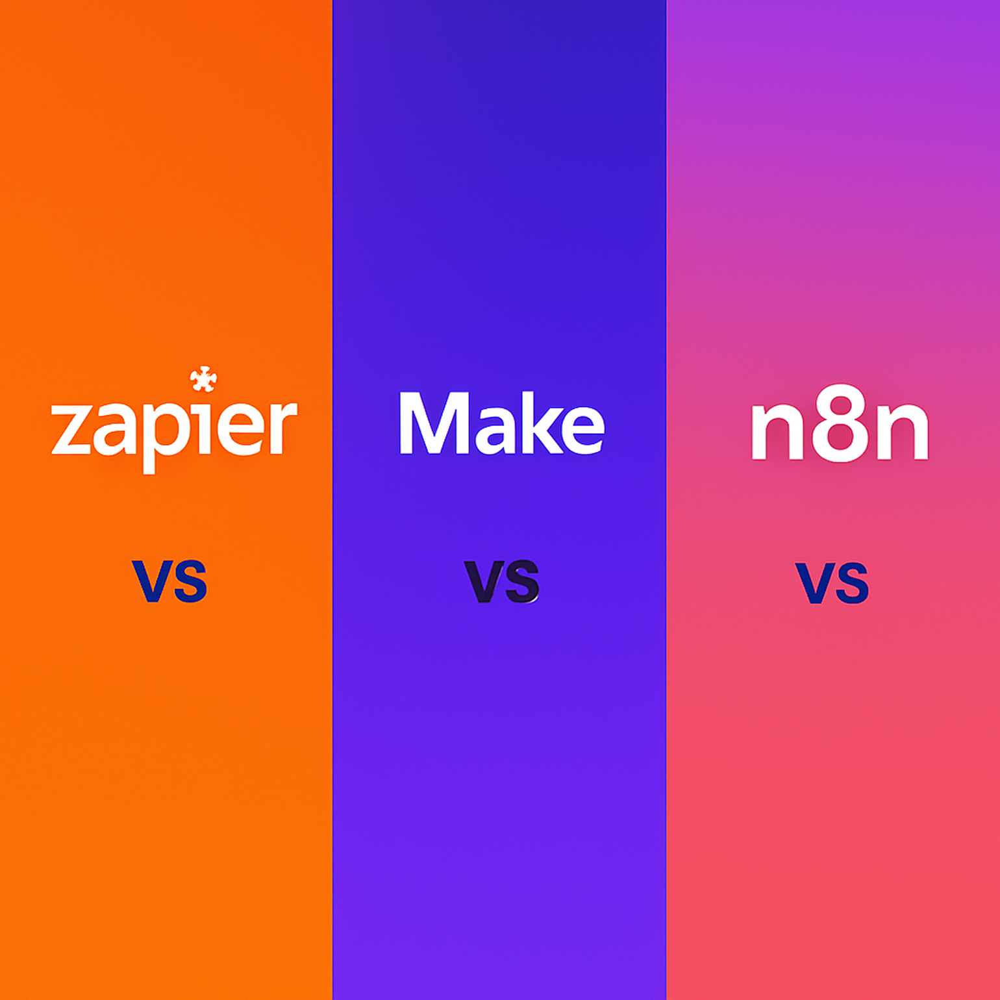
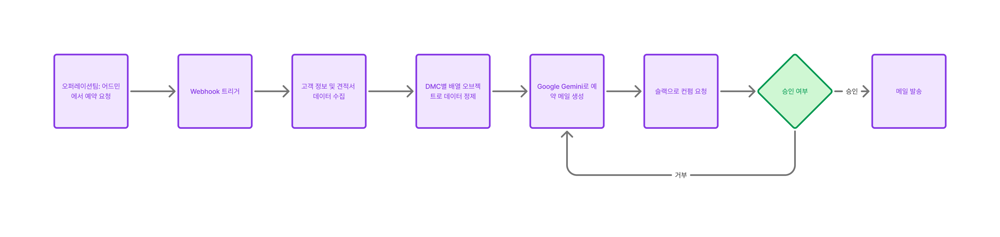

“하루 5시간을 예약 메일 작성에만 쓰고 있는 동료를 본 적이 있나요?”

안녕하세요! 오랜만에 글을 쓰게 되었네요. 모바일 청첩장 서비스 '아름' 개발과 회사 업무로 바쁜 시간을 보내다 보니 어느새 이렇게 시간이 흘렀습니다.

오늘은 회사에서 **1건당 평균 30분 걸리던 예약 요청 작업을 5분 이내로 단축**시킨 n8n 자동화 구축 경험을 공유해드리려 합니다. 수동 작업의 지옥에서 벗어나고 싶은 분들께 도움이 되길 바라며, 바로 시작해보겠습니다!

## 문제 발견: 하루 5시간을 메일 작성에 쓰는 현실


우선 이 작업을 시작하게 된 배경부터 말씀드려야겠네요.

저는 **1:1 맞춤형 여행 서비스**를 제공하는 아모트래블이라는 스타트업에 재직중에 있습니다. 정해진 코스와 패키지가 아닌, 고객 한 분 한 분의 니즈에 맞춰 담당 여행 전문가가 배정되어 일정부터 숙박, 액티비티, 코스까지 A-Z로 맞춤 설계해드리는 프리미엄 서비스죠.

> 특히 아프리카, 인도, 남미 등 일반인들이 예약하기 어려운 지역을 전문으로 합니다. 사파리 투어나 특색 있는 신혼여행을 원하시는 분들이 많이 찾아주시고 계세요. (많은 관심 부탁드립니다! 😊)

최근 예약팀 동료와 밥을 먹다가 우연히 듣게 된 하소연이 시작이었습니다.

**"예약 요청할 때 시간이 너무 많이 들어가요..."**

무심코 "그냥 DMC(현지 여행사)에게 메일로 예약 가능한지 보내면 되는 거 아닌가요?"라고 물었더니, 동료분이 알려주신 현실은 **충격적**이었습니다.

### 현실의 숫자들

- **하루 평균 50건 이상**의 메일 송수신
- **새로운 예약 요청**만 하루 10건 이상
- **1건당 평균 30분** 소요 (최대 1시간까지도!)
- 결국 **하루 5시간**이 첫 예약 요청에만 사라짐
- 나머지 3시간으로 답변 처리, 수정, 재요청까지...

"이건... 뭔가 잘못됐다"는 생각이 들었고, 더 자세히 파악해보고 싶어졌습니다.

## 현장 관찰: 30분짜리 예약 요청의 실체

호기심이 생긴 저는 예약팀에게 제안했습니다.

**"예약 요청 프로세스를 처음부터 끝까지 참관하고 싶어요. 혹시 한 건 정도 녹화와 함께 보여주실 수 있나요?"**

그렇게... **어마어마한 수작업의 현실**을 목격하게 됩니다.

### 기존 예약 요청 프로세스



**1단계: 견적서 해부하기 (10-15분)**

- 오퍼레이션팀에서 받은 견적서 열기
- 20-30개 항목을 하나씩 확인하며 스프레드시트에 정리
- 호텔명, 체크인/아웃 날짜, 객실 타입, 인원수...
- 액티비티별 시간, 픽업 장소, 특별 요청사항...

**2단계: 데이터 크로스체크 (3-5분)**

- 견적 내용과 고객 요청사항 대조
- 날짜 충돌, 인원수 불일치 등 확인

**3단계: 영어 메일 작성 (8-12분)**

```
Dear [DMC Name],

Hope this email finds you well.

We have a booking inquiry for one of our valued clients:

Client Name: [고객명을 영어로 변환]
Travel Date: [날짜 형식 변환]
Pax: [인원수]
Purpose: [여행 목적 - 신혼부부면 Honeymoon으로 변환]

Here are the details:
- Hotel: [호텔명 복붙]
- Room Type: [객실 정보 복붙]
- Check-in: [날짜 복붙]
- Check-out: [날짜 복붙]
...
(20-30줄 반복)

Could you please confirm the availability and rates?

Best regards,

```

**4단계: 최종 검토 및 발송 (2-3분)**

### 시간 분석의 충격적 결과

| 작업 단계                     | 평균 소요시간 | 주요 병목                       |
| ----------------------------- | ------------- | ------------------------------- |
| **견적서 분석 & 데이터 정리** | **12분**      | 수동 복붙의 향연                |
| **데이터 검증**               | **4분**       | 휴먼 에러 방지를 위한 필수 과정 |
| **영어 메일 작성**            | **10분**      | 매번 똑같은 템플릿 반복         |
| **검토 및 발송**              | **4분**       | 최종 확인                       |
| **총 소요시간**               | **30분**      | **1개 견적서 기준**             |

**실제 업무량 계산:**

- 하루 10건 × 30분 = **300분 (5시간)**
- 주 50건 × 30분 = **25시간** (야근 필수)
- 월 200건 × 30분 = **100시간** (정신건강 위험)

## 해결책 모색: 개발자의 시선으로 본 자동화 기회



이 상황을 보니 **개발적으로 반드시 해결해야 할 문제**라는 확신이 들었습니다. 최근 링크드인과 유튜브에서 자주 봤던 자동화 툴들이 떠올랐어요.

### 자동화 가능성 분석

**높은 자동화 적합도:**

- ✅ **반복적인 작업**: 똑같은 패턴의 무한 반복
- ✅ **규칙 기반**: 명확한 로직으로 처리 가능
- ✅ **구조화된 데이터**: 견적서 항목들이 일정한 형식
- ✅ **즉시 효과**: 시간 단축 효과가 명확히 측정 가능

최근 링크드인과 유튜브에서 자주 봤던 자동화 툴들이 떠올랐어요.

### 자동화 툴 후보군 비교

| 도구       | 장점           | 단점                 | 결정         |
| ---------- | -------------- | -------------------- | ------------ |
| **Zapier** | 사용하기 쉬움  | 월 $20~, 작업량 제한 | ❌ 비용 부담 |
| **Make**   | 강력한 기능    | 월 $9~, 복잡한 설정  | ❌ 비용 부담 |
| **n8n**    | 오픈소스, 무료 | 셀프호스팅 필요      | ✅ **선택!** |

다행히 저희 회사는 **AWS 크레딧이 충분**했고, **서버 세팅 하는것에는 큰 문제가 없기** 때문에 n8n으로 방향을 정했습니다.

## 프로젝트 승인: 스프린트에 정식 편입

### 업무 효율성 개선 제안

스크럼 미팅에서 다음과 같은 **현황 분석**을 제시했습니다:

**현재 상황:**

- **예약팀**이 하루 대부분의 시간을 메일 작성에 소요
- **개인당 5시간씩** = 하루 업무의 **65%** 단순 반복 작업
- **핵심 업무**(고객 상담, 전략 기획)에 투입할 시간 **부족**

**자동화 후 기대효과:**

- **83% 시간 단축**: 개인당 5시간 → **50분**으로 감소
- **절약된 시간**으로 **더 중요한 업무** 집중 가능
- **업무 만족도**: 단순 반복 작업에서 해방
- **처리 속도**: 고객 응답 시간 대폭 단축

**개발 투자:**

- **소요 기간**: 3일 (설계 + 구현 + 테스트)
- **즉시 효과**: 완성되면 바로 활용 가능

**결과**: 다음 스프린트에 공식 업무로 편입! 🎉

## 자동화 워크플로우 설계

이제 본격적인 설계 단계입니다. 제가 그린 **10단계 자동화 플로우**는 다음과 같이 간단합니다.

### 완성된 워크플로우 구조



**1단계: 트리거 설정**

- 어드민 툴에서 "예약 요청" 버튼 클릭 시 webhook 발생

**2단계: 데이터 수집**

- 고객명, 출발일, 도착일, 인원수, 여행목적
- 견적서 JSON 데이터 (호텔, 액티비티, 특별요청 등)

**3단계: 데이터 정제**

- 견적서를 DMC별로 그룹핑
- 각 DMC가 담당할 예약 항목들을 배열로 구성

**4단계: AI 메일 생성**

- Google Gemini API로 자연스러운 영어 메일 작성
- 템플릿 기반이 아닌 상황별 맞춤 문구 생성

**5단계: 슬랙 승인 워크플로우**

- 생성된 메일을 슬랙 채널에 전송
- 승인/수정/거절 버튼으로 간편 피드백

**6-10단계: 반복 및 완료**

- 승인 시: 메일 발송 → 다음 DMC
- 수정 시: 4단계부터 재시작
- 전체 완료 시: 어드민 상태 업데이트

### 현실적인 기대 효과

**시나리오별 시간 단축 예상:**

| 작업 영역       | 현재 방식                                                     | 자동화 후                                      | 시간 단축      |
| --------------- | ------------------------------------------------------------- | ---------------------------------------------- | -------------- |
| **데이터 정리** | 손으로 하나씩 복붙<br/>_"엑셀 열고 → PDF 보고 → 복붙 → 반복"_ | 자동 파싱<br/>_클릭 한 번에 완료_              | **12분 → 1분** |
| **메일 작성**   | 템플릿 복붙 후 수정<br/>_"템플릿 찾고 → 수정하고 → 검토"_     | AI 자동 생성<br/>_상황에 맞는 자연스러운 문장_ | **10분 → 2분** |
| **검토 과정**   | 여러 번 읽어보며 확인<br/>_"오타 없나? 정보 맞나?"_           | 슬랙으로 간편 확인<br/>_승인 버튼 클릭_        | **4분 → 2분**  |
| **발송 작업**   | 이메일 주소 찾아서 발송<br/>_"DMC 연락처 찾기"_               | 자동 발송<br/>_버튼 클릭 즉시_                 | **4분 → 0분**  |

**최종 결과:**

- **기존**: 30분/건 (하루 5시간, 월 100시간)
- **자동화 후**: 5분/건 (하루 50분, 월 17시간)
- **시간 단축**: **83% 절약** (월 83시간 절약!)

### 추가 예상 효과

**정량적 효과:**

- 처리량 증가: 같은 시간에 6배 더 많은 업무 가능
- 오류 감소: 수작업 실수 99% 제거

**정성적 효과:**

- 직원 만족도 향상 (단순반복 업무 해소)
- 고객 응답 시간 단축
- 더 전략적인 업무에 시간 투자 가능

## 다음 편 예고: 실전 구축기

여기까지가 문제 발견부터 설계까지의 여정이었습니다.

**"진짜 이게 될까?"** 싶었던 계획이 어떻게 현실이 되었는지, 그리고 예상치 못한 삽질들은 어떻게 극복했는지...

### 다음 편에서 다룰 내용

- **n8n 워크플로우 실제 구축 과정**
- **Google Gemini API 연동**으로 자연스러운 메일 생성하기
- **슬랙 승인 워크플로우** 구현의 핵심 포인트
- **실제 30분 → 5분 단축 달성**까지의 험난한(?) 여정
- **예상치 못한 버그들**과 해결 과정
- **팀원들의 반응**과 실제 업무 개선 효과

내용이 길어져 다음 포스팅에서 이어가겠습니다.

수동 업무 자동화에 관심 있으신 분들께 도움이 되는 실전 노하우를 가득 담아 돌아올게요! 🚀

<br/>

**궁금하신 점이 있다면 아래 `댓글`로 남겨주세요!👇**
