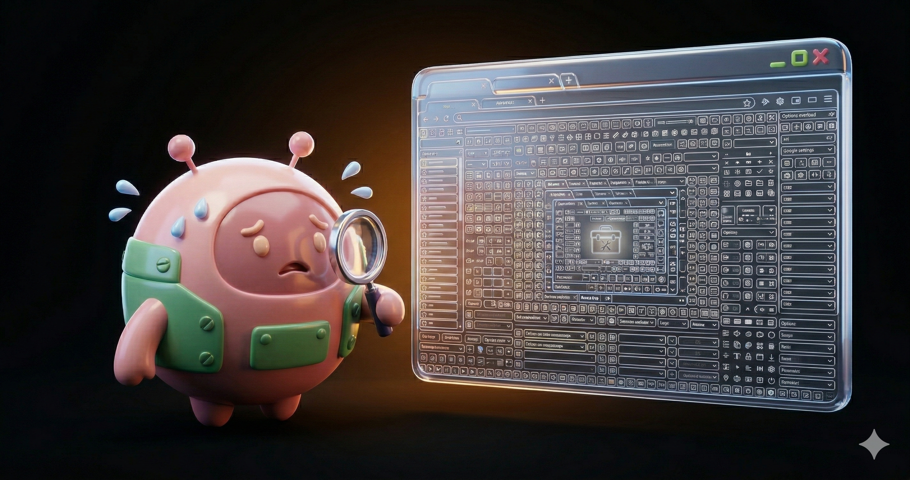
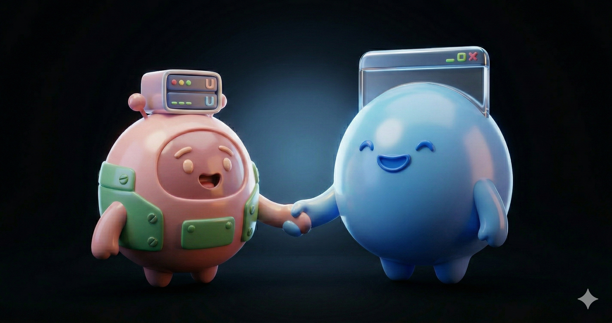

> AI 에이전트한테 "항공권 좀 예약해줘"라고 시켜본 적 있으신가요? 스크린샷 찍고, DOM 긁어오고, 좌표 추측해서 버튼 클릭하는 그 과정이 얼마나 불안정한지 한 번이라도 겪어보셨다면 공감하실 거예요.
>
> 그런데 최근 Google이 이 문제에 대해 아예 다른 접근을 들고 나왔습니다. 웹사이트가 AI에게 "여기 누르세요" 대신 구조화된 함수를 직접 제공하는 **WebMCP**라는 새로운 웹 표준 제안인데요.
>
> 이번 글에서는 WebMCP가 뭔지, 그리고 프론트엔드 개발자인 우리에게 어떤 의미인지 정리해보려 합니다.

## 지금 AI 에이전트가 웹을 다루는 방식, 뭐가 문제일까

요즘 AI 에이전트가 웹에서 작업을 수행하는 과정을 보면, 사람이 하는 방식을 그대로 흉내 내고 있어요.

1. 스크린샷을 찍거나 DOM을 파싱해서 페이지 구조를 파악한다
2. 버튼이나 입력 필드의 좌표를 추측한다
3. 마우스 클릭/키보드 입력을 시뮬레이션한다

이 과정에서 에이전트는 거대한 화면 정보를 추출하고, 정리해서, 모델에 전달하는 **번역 레이어**를 만들어야 해요. 때로는 스크린샷을 찍어서 비전 모델로 해석하기도 하고요.

문제는 이 방식이 본질적으로 **비결정론적(non-deterministic)** 이라는 거예요. 대부분의 웹사이트는 사람이 소비하도록 설계되어 있어서, 에이전트 입장에서는 노이즈가 너무 많거든요. 레이아웃이 조금만 바뀌어도 엉뚱한 곳을 클릭하고, 반응형 디자인이나 A/B 테스트로 UI가 달라지면 바로 깨집니다.

> 웹 UI는 사람을 위한 것인데, AI 에이전트에게는 구조가 필요하다.

항공권을 예약하려면 에이전트가 출발지 입력 필드를 찾고, 날짜 선택 달력을 열고, 검색 버튼 좌표를 추측해서 클릭해야 하잖아요. 사람이라면 직관적으로 할 수 있는 건데, 기계에게는 매번 "이게 맞나?" 하는 불확실한 추측의 연속인 거죠. 그래서 작업 완료에 실패하는 경우도 꽤 많고요.

그렇다고 모든 웹사이트가 자체 MCP 서버를 구축할 수도 없는 노릇이에요. 일반 웹사이트에는 너무 과한 방식이니까요.



## WebMCP란? — 에이전트에게 결정론적 도구를 직접 제공하는 것

2026년 2월 10일, Google과 Microsoft가 공동으로 **WebMCP**(Web Model Context Protocol)의 얼리 프리뷰를 공개했습니다. W3C Community Group Draft로 제안된 새로운 웹 표준이에요.

핵심 개념은 간단합니다. **웹사이트가 AI 에이전트에게 구조화된 도구(Tool)를 직접 노출**하는 거예요. 에이전트가 스크린샷을 해석하는 게 아니라, 사이트가 "이 페이지에서는 이런 작업들을 할 수 있어요"라고 알려주는 방식이죠.

|                        | 기존 방식 (비결정론적)                   | WebMCP (결정론적)                            |
| ---------------------- | ---------------------------------------- | -------------------------------------------- |
| **에이전트가 하는 일** | 스크린샷 → 좌표 추측 → 클릭              | 도구 확인 → 함수 호출                        |
| **항공권 예약**        | 입력 필드 찾기 → 텍스트 입력 → 버튼 클릭 | `book_flight({ origin, destination, date })` |
| **안정성**             | 레이아웃 변경 시 깨짐                    | 스키마 기반으로 안정적                       |
| **결과 예측**          | 성공할 수도, 실패할 수도                 | 결정론적으로 동작                            |

예를 들어, 항공권 예약 사이트가 WebMCP를 지원하면 에이전트는 스크린샷을 분석할 필요 없이 `book_flight({ origin: "ICN", destination: "NRT", outboundDate: "2026-04-01" })` 같은 함수를 직접 호출하면 됩니다.

### 컨텍스트 기반이라는 게 진짜 핵심

여기서 제일 흥미로운 부분은 WebMCP가 **컨텍스트 기반**이라는 점이에요.

기존 MCP를 떠올려보면, 에이전트에게 모든 도구를 한꺼번에 넘겨줬잖아요. 도구가 많아지면 관련 없는 컨텍스트가 토큰을 잡아먹는 문제가 있었거든요.

WebMCP는 다릅니다. **에이전트가 어떤 페이지에 있느냐에 따라 다른 도구가 로드**돼요.

이커머스를 예로 들면 이렇습니다.

- **홈페이지** → `search_products`, `get_categories` 도구 활성화
- **상품 상세 페이지** → `add_to_cart`, `get_similar_products` 도구 활성화
- **결제 페이지** → `apply_coupon`, `complete_checkout` 도구 활성화

페이지마다 맥락에 맞는 도구만 노출되니까 에이전트가 훨씬 정확하게 동작할 수 있어요. 이게 MCP 개념의 자연스러운 진화라고 느꼈습니다.


## 두 가지 설정 방법 — 선언적 vs 명령적

WebMCP는 도구를 등록하는 두 가지 방식을 제공합니다.

### 선언적 방식 (HTML 속성) — 정적 사이트에 딱

기존 HTML `<form>`에 속성 몇 개만 추가하면 끝이에요. 정적 웹사이트를 에이전트 호환으로 만들기에 가장 간단한 방법입니다.

```html
<form toolname="submit_inquiry" tooldescription="고객 문의를 접수합니다" action="/inquiry">
  <label>
    이름
    <input name="name" type="text" required parameterdescription="문의자 이름" />
  </label>
  <label>
    이메일
    <input name="email" type="email" required parameterdescription="답변 받을 이메일 주소" />
  </label>
  <label>
    문의 내용
    <textarea name="message" required parameterdescription="문의 내용을 자유롭게 작성"></textarea>
  </label>
  <button type="submit">문의하기</button>
</form>
```

이렇게 하면 브라우저가 자동으로 폼 필드를 분석해서 도구 스키마로 변환해줍니다. `input`의 `name`, `type`, `required` 속성이 곧 스키마가 되는 거예요. 에이전트가 페이지를 방문하면 이 도구를 발견하고, 자동으로 폼을 채울 수 있습니다.

여기서 중요한 게 `toolautosubmit` 속성인데요.

- **`toolautosubmit` 없음** — 에이전트가 폼을 채워도 **사용자가 최종 제출을 확인**해야 함
- **`toolautosubmit` 있음** — 에이전트가 자동으로 제출까지 완료

```html
<!-- 검색처럼 부담 없는 작업: 자동 제출 허용 -->
<form toolname="search_flights" tooldescription="항공편 검색" toolautosubmit>...</form>

<!-- 결제처럼 민감한 작업: 사용자 확인 필요 -->
<form toolname="complete_payment" tooldescription="결제 진행">...</form>
```

**기존 코드를 최소한으로 수정하면서 AI 에이전트를 지원할 수 있다**는 게 이 방식의 매력이에요. 이미 잘 만들어진 폼이 있다면 속성 2~3개만 추가하면 되니까요.


### 명령적 방식 (JavaScript) — React/Next.js 앱에 적합

SPA나 React 앱처럼 동적인 워크플로우가 필요하다면 JavaScript로 직접 도구를 등록하는 방식을 씁니다.

```js
// 항공편 검색 도구 등록
navigator.modelContext.registerTool({
  name: 'search_flights',
  description: '출발지, 도착지, 날짜로 항공편을 검색합니다',
  inputSchema: {
    type: 'object',
    properties: {
      origin: { type: 'string', description: '출발 공항 코드 (예: ICN)' },
      destination: { type: 'string', description: '도착 공항 코드 (예: NRT)' },
      outboundDate: { type: 'string', description: '출발 날짜 (예: 2026-04-01)' },
    },
    required: ['origin', 'destination', 'outboundDate'],
  },
  async execute(input) {
    const results = await searchFlights(input);
    return { flights: results };
  },
});
```

이 방식이 빛나는 건 **React 컴포넌트와 연동할 때**예요. 컴포넌트가 마운트될 때 `registerTool`로 도구를 등록하고, 언마운트될 때 `unregisterTool`로 제거하면 됩니다.

```tsx
// React 컴포넌트에서 WebMCP 도구 바인딩
function FlightSearchPage() {
  useEffect(() => {
    navigator.modelContext.registerTool({
      name: 'search_flights',
      description: '항공편을 검색합니다',
      inputSchema: {
        /* ... */
      },
      execute: handleSearch,
    });

    return () => {
      navigator.modelContext.unregisterTool('search_flights');
    };
  }, []);

  return <FlightSearchForm />;
}
```

이렇게 하면 사용자가 검색 페이지에 있을 때는 `search_flights` 도구가 활성화되고, 검색 결과 페이지로 이동하면 `filter_results`, `select_flight` 같은 도구로 자동 교체돼요. 페이지 전환에 따라 에이전트가 사용할 수 있는 도구가 자연스럽게 바뀌는 거죠.

관련 메서드도 함께 제공됩니다.

- `unregisterTool(name)` — 등록된 도구 제거
- `provideContext(options)` — 전체 도구 목록 교체. 페이지 상태가 크게 바뀔 때 유용
- `clearContext()` — 등록된 모든 도구 제거

---

## 프론트엔드 개발자가 주목할 포인트들

WebMCP 스펙을 살펴보면서 "이건 프론트엔드 개발자들이 관심 가질 만하겠다" 싶었던 기능들을 정리해봤어요.

### `SubmitEvent.agentInvoked` — AI가 보낸 건지 사람이 보낸 건지

폼 제출이 사용자에 의한 것인지, AI 에이전트에 의한 것인지를 구분할 수 있습니다.

```js
form.addEventListener('submit', (event) => {
  if (event.agentInvoked) {
    // AI 에이전트가 제출한 경우
    console.log('에이전트 요청:', event.formData);
    handleAgentSubmission(event);
  } else {
    // 사용자가 직접 제출한 경우
    handleUserSubmission(event);
  }
});
```

에이전트 제출일 때는 별도 로깅을 한다거나, 추가 검증을 수행하는 분기 처리가 가능해져요.

### `respondWith()` — 사람에겐 UI, 에이전트에겐 JSON

사용자에게는 validation UI를 보여주고, 에이전트에게는 구조화된 응답을 반환할 수 있습니다. 이걸로 **완전한 루프**를 만들 수 있어요. 에이전트가 폼을 제출하고, 결과를 받아서, 다음 액션을 결정하는 흐름이요.

```js
form.addEventListener('submit', (event) => {
  if (event.agentInvoked) {
    event.preventDefault();
    event.respondWith(
      (async () => {
        const data = Object.fromEntries(new FormData(form));
        const result = await processBooking(data);

        if (result.error) {
          return {
            success: false,
            error: result.error,
            suggestion: '날짜를 다시 확인해주세요',
          };
        }
        return { success: true, bookingId: result.id };
      })(),
    );
  }
});
```

폼 검증이 실패하면 에러 메시지를 구조화해서 반환하고, 성공하면 결과 데이터를 넘겨주는 거죠. 에이전트는 이 응답을 받아서 다음에 뭘 해야 할지 판단할 수 있습니다.

### CSS pseudo-class — 에이전트가 뭐 하고 있는지 보여주기

에이전트가 폼을 조작하고 있을 때 사용자에게 시각적으로 알려줄 수 있는 CSS pseudo-class도 있어요.

```css
/* 에이전트가 폼 필드를 채우고 있을 때 */
form:tool-form-active {
  border: 2px solid #4285f4;
  background-color: rgba(66, 133, 244, 0.05);
}

form:tool-form-active::before {
  content: '🤖 AI 에이전트가 입력 중입니다...';
  display: block;
  padding: 8px 12px;
  background: #e8f0fe;
  border-radius: 4px;
  margin-bottom: 8px;
}

/* 에이전트가 제출하려는 순간 */
button:tool-submit-active {
  animation: pulse 1s infinite;
  box-shadow: 0 0 0 4px rgba(66, 133, 244, 0.3);
}
```

`:tool-form-active`는 에이전트가 폼을 채우는 중일 때, `:tool-submit-active`는 제출 직전일 때 적용돼요. `toolautosubmit`이 없는 폼에서는 "사람이 검토하기를 기다리고 있어요" 같은 UI를 보여줄 수도 있고요. 에이전트가 몰래 뭔가 하는 게 아니라, 사용자가 지켜볼 수 있도록 하는 설계가 좋더라고요.

---

## MCP vs WebMCP — 이름은 비슷하지만 레이어가 다르다

이름 때문에 헷갈릴 수 있는데, MCP와 WebMCP는 작동 위치와 방식이 다릅니다.

| 비교 항목     | MCP                               | WebMCP                                 |
| ------------- | --------------------------------- | -------------------------------------- |
| **실행 위치** | 서버 사이드                       | 브라우저 (클라이언트)                  |
| **프로토콜**  | JSON-RPC (stdin/stdout, HTTP SSE) | 웹 표준 API (`navigator.modelContext`) |
| **대상**      | 서버 측 AI 에이전트               | 브라우저 내 AI 에이전트                |
| **도구 등록** | 서버에서 Tool 정의                | 웹페이지에서 HTML/JS로 등록            |
| **사용 예시** | IDE 확장, CLI 도구, 백엔드 연동   | 웹사이트에서 직접 에이전트 지원        |

MCP는 Claude Desktop이나 IDE 같은 **호스트 앱이 외부 서버와 통신**하는 프로토콜이고, WebMCP는 **웹페이지 자체가 브라우저 내 에이전트에게 도구를 노출**하는 웹 API입니다.

서로 다른 레이어에서 동작하지만, "AI에게 구조화된 도구를 제공한다"는 철학은 같아요. MCP가 서버 사이드의 에이전트 생태계를 열었다면, WebMCP는 그걸 브라우저까지 확장하는 거라고 보면 될 것 같습니다.



---

## 직접 써보려면? 현재 상태와 시작 방법

WebMCP는 아직 초기 단계지만, 지금 바로 체험해볼 수는 있어요.

| 항목               | 현재 상태                                                                        |
| ------------------ | -------------------------------------------------------------------------------- |
| **사용 가능 환경** | Chrome Canary 채널 (최신 베타 버전)                                              |
| **활성화 방법**    | `chrome://flags` → "web-mcp" 검색 → 활성화                                       |
| **디버깅 도구**    | [Model Context Tool Inspector](https://chromewebstore.google.com/) 확장 프로그램 |
| **라이브 데모**    | [travel-demo.bandarra.me](https://travel-demo.bandarra.me/)                      |

Model Context Tool Inspector 확장 프로그램을 설치하면 현재 페이지에 어떤 WebMCP 도구가 등록되어 있는지 바로 확인할 수 있어요. 데모 사이트에서 에이전트가 항공편을 검색하고, 필터를 적용하고, 예약하는 전체 흐름을 볼 수 있습니다.

### 솔직한 한계들

물론 제한사항도 꽤 있어요.

| 제한사항              | 설명                                                             |
| --------------------- | ---------------------------------------------------------------- |
| **헤드리스 미지원**   | 보이는 브라우저 컨텍스트가 필요해서 서버 사이드 자동화에는 못 씀 |
| **디스커버리 미해결** | 에이전트가 어떤 사이트가 WebMCP를 지원하는지 미리 알 방법이 없음 |
| **UI 동기화**         | 에이전트와 사용자가 동시에 조작하면 상태 충돌 가능               |
| **리팩토링 부담**     | 복잡한 앱은 도구 중심으로 아키텍처를 재설계해야 할 수도          |

그리고 **닭과 달걀 딜레마**가 있어요. 사이트가 WebMCP를 지원해야 에이전트가 쓸 수 있고, 에이전트가 써야 사이트가 도입할 동기가 생기거든요. 하지만 반대로 생각하면, **AI 에이전트가 웹 콘텐츠의 주요 소비자가 되는 시대**에 에이전트의 작업 완료를 쉽게 만들어주는 사이트가 더 많이 사용되고 채택될 가능성이 높아지겠죠.

프론트엔드 개발자분들이라면 관심 가질 만한 스펙이라고 생각해요. 특히 여행, 이커머스, 고객 문의처럼 **복잡한 폼이 많은 서비스**를 만들고 있다면요. 현재 얼리 프리뷰 프로그램에 사전 신청이 가능한 걸로 알고 있으니, 관심 있는 분들은 [Chrome 공식 블로그](https://developer.chrome.com/blog/webmcp-epp)를 확인해보시면 좋을 것 같아요.


---

## 정리하며

WebMCP가 표준으로 자리 잡으면 웹앱의 역할이 달라질 수 있습니다. 지금까지 웹앱은 **사람이 보는 UI**가 전부였는데, 앞으로는 **UI + 도구 표면(Tool Surface)** 두 가지를 함께 제공하는 형태가 될 수도 있어요.

"가장 예쁜 인터페이스"를 가진 앱이 아니라, **"가장 명확한 도구 계약"을 가진 앱**이 AI 에이전트 시대에서 선택받을 수도 있다는 이야기입니다.

아직 얼리 프리뷰 단계고, 실무에 바로 적용하기까지는 갈 길이 멉니다. 하지만 방향성은 꽤 명확하다고 느꼈어요. 프론트엔드 개발자라면 "내가 만드는 웹앱이 AI 에이전트에게도 쓸모 있으려면 어떤 구조여야 할까?"를 한 번쯤 생각해볼 타이밍이 아닐까 싶습니다.

<br/>

**궁금하신 점이 있다면 아래 `댓글`로 남겨주세요!👇**
