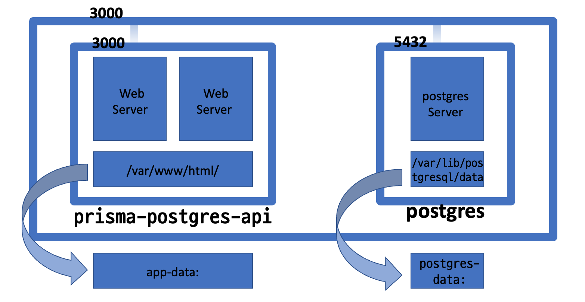

> 이번에는 docker-compose를 사용하여 다중 컨테이너 앱 만들기 포스팅을 가지고 왔습니다. 간략하게 예시를 보여드리도록 하겠습니다. 😁

## 🤔 docker-compose란?

개발자라면 docker 이야기는 많이 들어봤을 것이다. 이번 포스팅에는 docker-compose를 다룰 것이다. 그래서 docker-compose의 기능을 짧게 적어본다면 `복수 개의 컨테이너`를 실행시키는 도구? 정도 될 것 같다. 여러 컨테이너를 한 번에 관리할 수 있도록 도와준다.

> 도커의 컨테이너가 무엇인지 궁금하다면 밑의 링크를 참고해주세요

## 📚 참고

[도커 공식문서](https://www.docker.com/)

## 🤔 docker-compose.yml

위에서 말한 기능들을 실행해줄 수 있는 파일이다. 우리는 이 파일에 도커 실행옵션들을 적으며 postgres와 app을 같이 올릴 것이다.

## 🖼 흐름도



## 💡 코드

```yml
version: '3.3'
services:
  postgres:
    image: postgres:14
    container_name: postgres
    hostname: ${POSTGRES_HOST}
    ports:
      - ${POSTGRES_PORT}:${POSTGRES_PORT}
    environment:
      POSTGRES_USER: ${POSTGRES_USER}
      POSTGRES_PASSWORD: ${POSTGRES_PASSWORD}
      POSTGRES_DB: ${POSTGRES_DB}
    volumes:
      - ./db/initdb.d:/docker-entrypoint-initdb.d
      - postgres-data:/var/lib/postgresql/data
    restart: unless-stopped

  prisma-postgres-api:
    stdin_open: true
    build:
      context: .
      dockerfile: Dockerfile
      args:
        - POSTGRES_PASSWORD=${POSTGRES_PASSWORD}
        - FONTAWESOME_TOKEN_VALUE=${FONTAWESOME_TOKEN_VALUE}
        - DATABASE_URL=${DATABASE_URL}

    container_name: prisma-postgres-api
    depends_on:
      - postgres
    environment:
      PRISMA_CONFIG: |
        managementApiSecret: ${PRISMA_MANAGEMENT_API_SECRET}
        port: 3000
        databases:
          default:
            connector: postgresql
            host: ${POSTGRES_HOST}
            port: ${POSTGRES_PORT}
            user: ${POSTGRES_USER}
            password: ${POSTGRES_PASSWORD}
    ports:
      - '3000:3000'
    restart: always
volumes:
  postgres-data:
```

`${}`로 되어있는 것들은 환경변수 `.env`파일을 만들어 따로 관리해주었다.

## 🧑🏻‍💻 소감

> 😭 docker-compose에 대하여 상세히 적어보았다면 더 좋았겠지만, 이번에는 간단한 예시를 보여드리며 마치도록하겠습니다. 다음 기회에에도커에 대하여 상세히히 포스팅할 테니 기대해주세요 :)

<br/>

**위 과정을 따라하시면서 궁금하신 점이 있다면 아래 `댓글`로 남겨주세요!👇**

```toc

```
