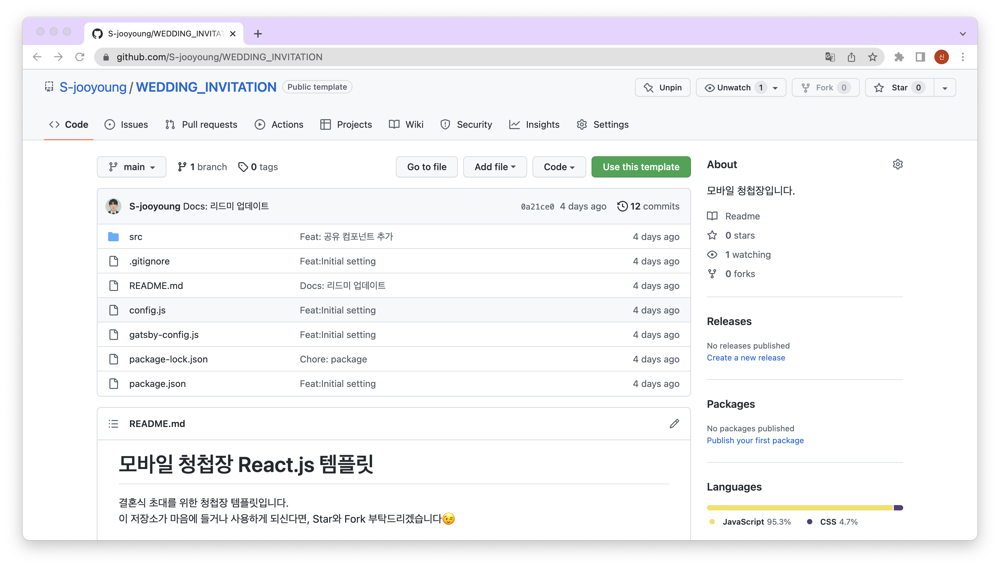
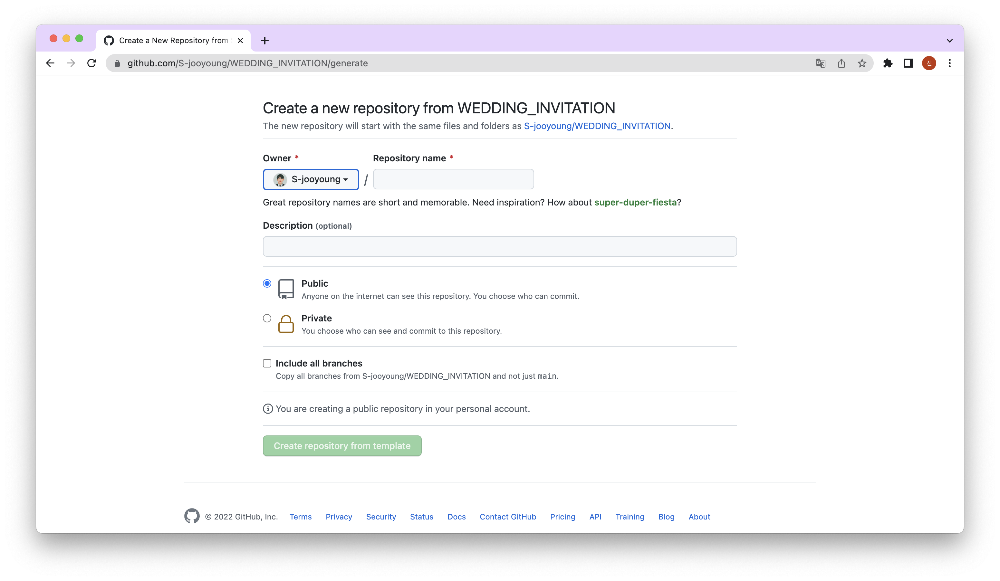
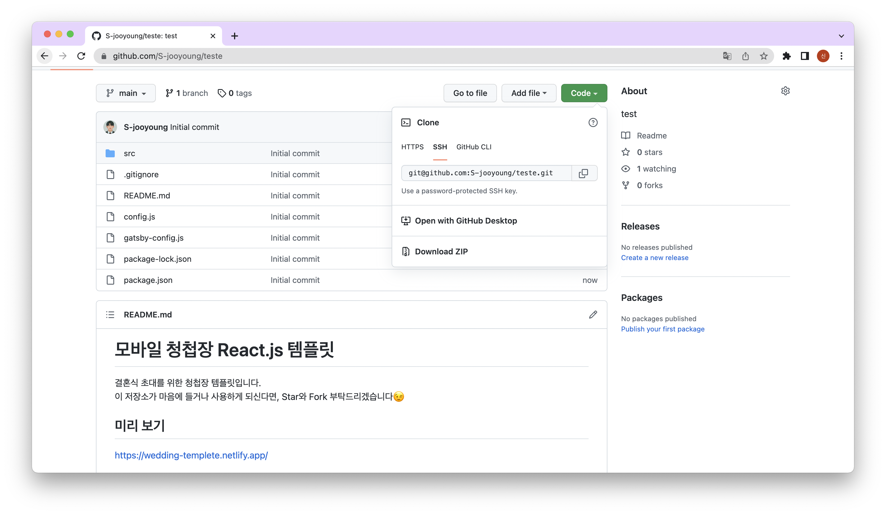
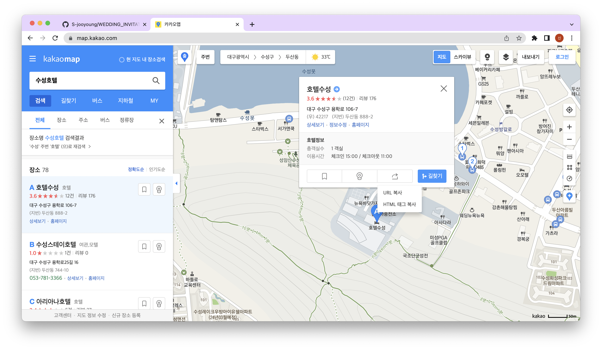
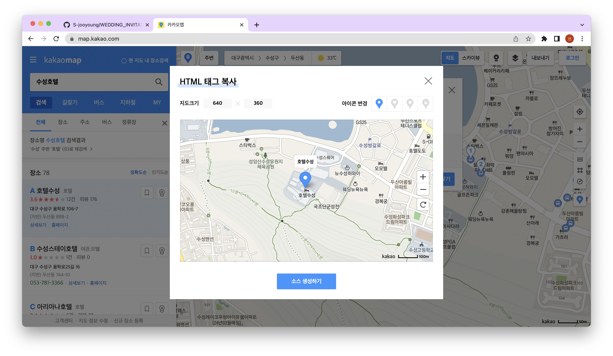
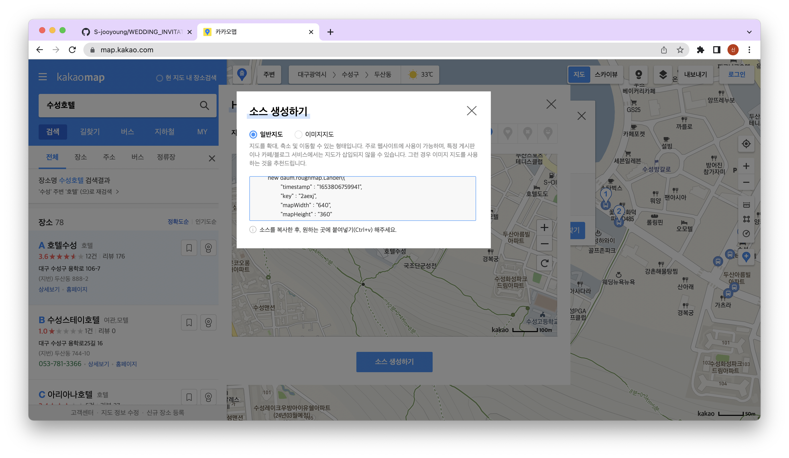
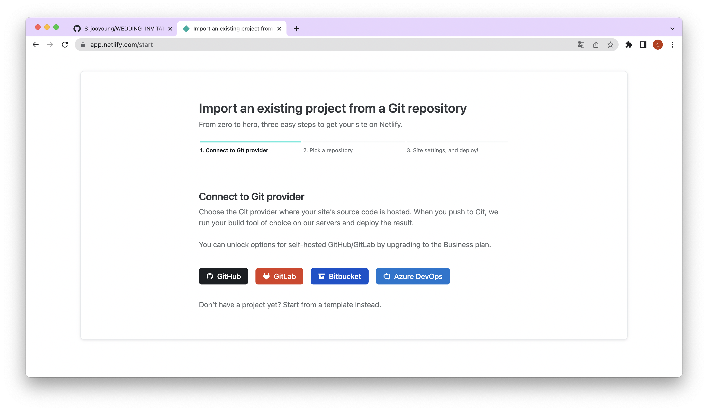
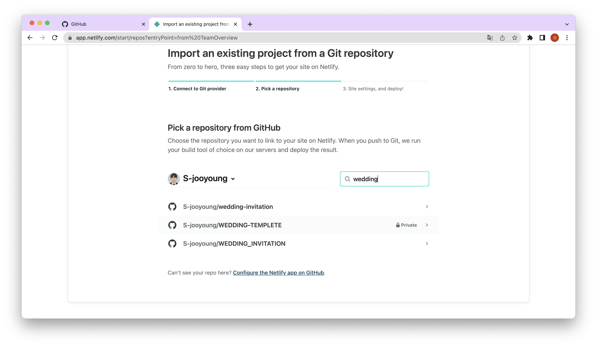
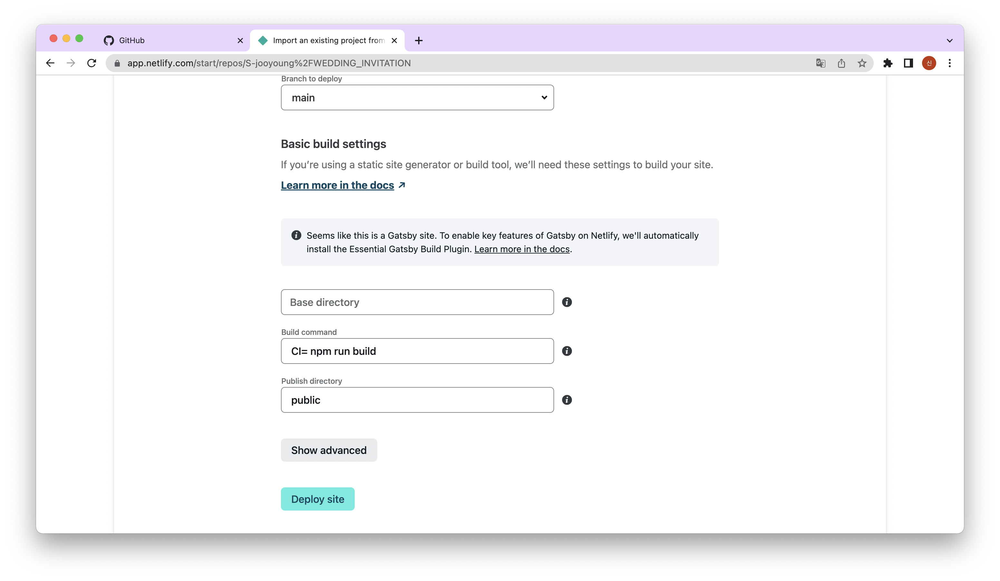
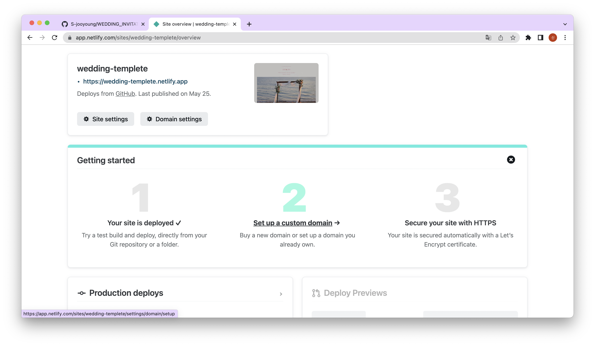

> 제가 만든 결혼 청첩장을 활용해서 그대로 쓰고 싶어 하거나 활용하여 나만의 청첩장을 만들고 싶은 분들이 계실 텐데요! 이런 분들에게 도움을 드리고자 이 글을 쓰게 되었습니다. 잘 안되는 부분이나 궁금한 점을 댓글로 남겨주시면 확인하고 빠르게 답변드리도록 하겠습니다!😁

## 1. 모바일 청첩장 완성본 미리보기

[모바일 청첩장 미리보기](https://wedding-templete.netlify.app/)

## 2. Repository 생성하기

모바일 결혼 청첩장을 netlify로 배포하려면 Github에 Repository를 생성해야 한다. (다른 방법도 있지만 제가 했던 방식으로 포스팅하겠습니다!)

[모바일 결혼 청첩장](https://github.com/S-jooyoung/WEDDING_INVITATION)을 클릭한다.



GitHub에 로그인한 뒤에 우측 상단에 있는 Use this template 버튼을 클릭하면 repository 생성 페이지로 이동하게 된다.



위 페이지에 도달하면 Repository name에 원하는 이름을 적고 레파지토리를 생성한다.

## 3. Repository 가져오기

이제 실제로 수정하고 배포할 수 있도록 내 컴퓨터(local)에 Repsitory를 가져 와야 한다! 먼저 Repository에서 아래와 같이 초록색 Code 버튼을 클릭하면 링크가 나오게 되는데, 이 링크를 복사한다.



그리고 터미널에서 아래 명령어를 수행하여 다운로드한다.

```bash
cd [Repository를 저장할 폴더]
git clone [복사한 주소]
```

## 4. 패키지 설치하기

이제 모바일 청첩장을 동작시킬 수 있도록 패키지들을 다운로드해야 하는데, 다음 명령어를 실행하면 받을 수 있다.

```bash
cd [Repository 주소]
npm install
```

## 5. 커스터마이징하기

기본적인 준비가 끝났다. 코드의 내용을 사용자에게 맞게 바꿔주어야 한다.

```bash
cd [Repository를 저장할 폴더]
code .
```

폴더에 들어온 다음 아래 config.js 내용을 알맞게 바꿔준다.

```javascript
export const WEDDING_INVITATION_URL = 'http://localhost:8000/';
export const KAKAOTALK_API_TOKEN = 'JavaScript 키 입력';
export const KAKAOTALK_SHARE_IMAGE =
  'https://cdn.pixabay.com/photo/2014/11/13/17/04/heart-529607_960_720.jpg';

export const WEDDING_DATE = '1970년 01월 01일, 목요일 오전 12시 00분';
export const WEDDING_LOCATION = '○○○웨딩, ○층 ○○홀';

export const GROOM_NAME = '○○○';
export const GROOM_ACCOUNT_NUMBER = '○○은행 ***-***-******';
export const GROOM_FATHER_NAME = '○○○';
export const GROOM_FATHER_ACCOUNT_NUMBER = '○○은행 ***-***-******';
export const GROOM_MOTHER_NAME = '○○○';
export const GROOM_MOTHER_ACCOUNT_NUMBER = '○○은행 ***-***-******';

export const BRIDE_NAME = '○○○';
export const BRIDE_ACCOUNT_NUMBER = '○○은행 ***-***-******';
export const BRIDE_FATHER_NAME = '○○○';
export const BRIDE_FATHER_ACCOUNT_NUMBER = '○○은행 ***-***-******';
export const BRIDE_MOTHER_NAME = '○○○';
export const BRIDE_MOTHER_ACCOUNT_NUMBER = '○○은행 ***-***-******';
```

마지막 수정이다. 결혼식 장소를 바꾸기 위하여 ./src/components/location.jsx를 수정하여 원하는 위치의 카카오 지도를 사용한다.

1. 원하는 장소를 입력 후 HTML 태그 복사를 클릭한다.
   

2. 소스 생성하기 버튼을 클릭한다.
   

3. timestamp, key, 원하는 넓이와 높이를 기억한다.
   

4.`./src/components/location.jsx`에 위의 timestamp, key 값들로 바꾼다.

```javascript
// <!-- 3. 실행 스크립트 -->
const executeScript = () => {
  const scriptTag = document.createElement('script');
  const inlineScript = document.createTextNode(`new daum.roughmap.Lander({
    "timestamp" : "1652464367301",
    "key" : "2a8fe",
    "mapWidth" : "640",
    "mapHeight" : "360"
  }).render();`);
  scriptTag.appendChild(inlineScript);
  document.body.appendChild(scriptTag);
};
```

## 6. netlify 배포하기

드디어 배포 준비는 다 끝났다. 이제 다음 명령을 실행하면 깃허브에 푸쉬할 수 있다.

```bash
git add .
git commit -m "원하시는 커밋메시지를 작성하세요"
git push
```

1. 정상적으로 완료되었다면 [netlify](https://www.netlify.com/) 에 접속한다.

2. Import an existing project에서 Github를 클릭한다.
   

3. 모바일 청첩장이 있는 저장소를 찾아 클릭한다.
   

4. Build command를 CI= npm run build로 바꾸고 Deploy site를 클릭한다.
   

> 🙋‍♂️ 제 모바일 청첩장 템플릿을 사용하시는 분들을 `node 버전이 14 이상`이어야 합니다.
> node -v를 통해 node 버전을 확인하신 후 낮은 버전이라면 업그레이드를 진행해주세요!

> 💡 혹시 그 외에 다른 에러가 발생하신다면 아래에 댓글로 에러 내용을 알려주세요!

## 7. 배포된 페이지 확인하기

이제 실제로 잘 배포가 되었는지 확인해보자 여태까지 문제가 없었다면 파란색 URL에 접근했을 때 청첩장이 잘 보이는 것을 확인할 수 있을 것이다.



## 8. 수정하고 배포하기

변동사항을 commit 한 후 깃허브에 푸시하면 변동사항이 모바일 청첩장에 배포된다.

<br/>

> 🤔 저의 개발환경에서만 테스트하였기 때문에 혹여나 따라 하시다 안되는 부분이 생길 수 있을 거 같습니다. 망설이지 마시고 댓글 남겨주시면 적극적으로 반영할수 있게 노력하겠습니다 :)

<br/>

**위 과정을 따라하시면서 궁금하신 점이 있다면 아래 `댓글`로 남겨주세요!👇**

```toc

```
