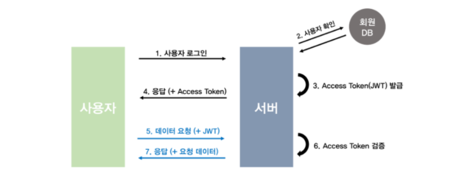
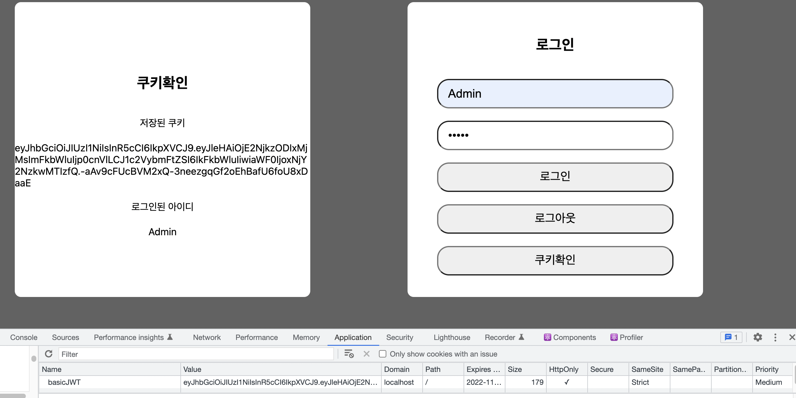
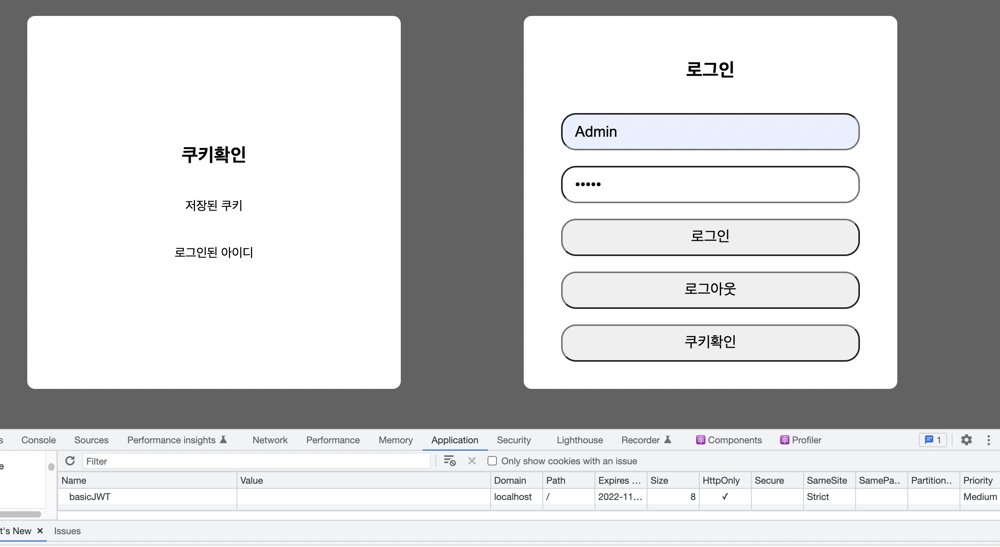

> 전에 포스팅한 [쿠키 vs 세션 vs 토큰](https://s-jooyoung.github.io/basic-next-jwt-auth/)의 이론을 테스트하고자 JWT를 활용한 인증, 인가 부분을 실습해보겠습니다.😁

## 🤔 JWT(Json Web Token)란?

`JWT(Json Web Token)`이란 클라이언트와 서버 간에 정보를 JSON 개체로 안전하고 전송하기 위한 표준이다. 표준규약에 따라 암호화된 토큰으로 복잡하고 읽을 수 없는 string 형태로 저장된다.

> JWT에 대하여 자세한 설명이 궁금하다면 밑의 링크를 참고해주세요.

## 📚 참고

[JWT 공식문서](https://jwt.io/introduction)

## 🤔 JWT 구성요소

JWT는 헤더(header), 페이로드(payload), 서명(signature)으로 나누어져 있다.

### 헤더(header)

헤더는 토큰의 타입과 어떤 알고리즘으로 구성되어있는지를 포함한다.

```typescript
{
  "alg": "HS256",
  "typ": "JWT"
}
```

- alg -> 어떤 해시알고리즘을 사용하였는지 나타낸다.
- typ -> 토큰 유형을 나타낸다.

### 페이로드(payload)

페이로드는 사용자의 정보(사용자 id, 토큰 만료 시간 등)가 담겨 있다. 이 데이터들을 클레임이라고 부른다.

```typescript
{
  "sub": "1234567890",
  "name": "John Doe",
  "admin": true
}
```

### 서명(signature)

서명은 token을 인코딩하거나 유효성을 검증 할 때 사용하는 암호화 코드이다. 헤더와 페이로드 정보를 합치고 서버가 가지고 있는 `secret key`로 암호화시켜 토큰을 변조하기 어렵게 만든다. `secret key`은 오직 서버만 알고있어야 하기 때문에 서버에 저장한다.

```typescript
HMACSHA256(base64UrlEncode(header) + '.' + base64UrlEncode(payload), secret);
```

### 모두합쳐진 결과물


점 3개의 Base 54-URL 문자열로 이루어져 있고 헤더와 페이로드가 인코딩되어 있고 비밀키로 서명된 JWT이다.

## ⚙️ 동작원리에 따른 구현

기본적인 JWT에 대하여 설명했으니 이제 동작 원리를 보면서 구현해보자.



1. 사용자가 id와 password를 입력하여 로그인 요청을 한다.

```typescript
const [username, setUsername] = useState<string>('');
const [password, setPassword] = useState<string>('');

<section className={styles.contatiner}>
  <div className={styles.form}>
    <h1>쿠키확인</h1>
    <span>저장된 쿠키</span>
    <span className={styles.span}>{cookie}</span>
    <span>로그인된 아이디</span>
    <span>{user}</span>
  </div>

  <form className={styles.form}>
    <h1>로그인</h1>
    <input
      className={styles.input}
      type="text"
      name="username"
      value={username}
      onChange={(e) => setUsername(e.target.value)}
    />
    <input
      className={styles.input}
      type="password"
      name="password"
      value={password}
      onChange={(e) => setPassword(e.target.value)}
    />
    <input className={styles.button} type="button" value="로그인" onClick={handleSubmit} />
    <input className={styles.button} type="button" value="로그아웃" onClick={handleLogout} />
    <input className={styles.button} type="button" value="쿠키확인" onClick={handleGetUser} />
  </form>
</section>;
```

2. 서버는 회원 DB에서 (테스트 프로젝트에서는 따로 DB를 두지 않았습니다) 사용자가 있는지 확인한다.

```typescript
const handleSubmit = async (e: FormEvent) => {
  e.preventDefault();
  const res = await fetch('/api/auth/login', {
    method: 'POST',
    headers: {
      'Content-Type': 'application/json',
    },
    body: JSON.stringify({
      username,
      password,
    }),
  }).then((t) => t.json());

  alert(res.message);
};
```

`handleSubmit` 비동기 함수는 화면에서 받은 아이디, 비밀번호를 담아 `login API`에 포스팅 요청한다.

```typescript
// api/auth/login
import { serialize } from 'cookie';
import { sign } from 'jsonwebtoken';
import { NextApiRequest, NextApiResponse } from 'next';

const SECRET = process.env.SECRET_KEY as string;

export default function (req: NextApiRequest, res: NextApiResponse) {
  // 에러처리
  if (!req.body) {
    res.statusCode = 404;
    res.end('Error');
    return;
  }

  const { username, password } = req.body;

  /**
   * TODO: Check in the database
   */
  if (username === 'Admin' && password === 'Admin') {
    res.status(200).json({ message: '로그인에 성공하였습니다.' });
  } else {
    res.json({ message: '로그인에 실패하였습니다.' });
  }
}
```

요청받은 API는 회원 DB에 사용자가 있는지 확인한다. (여기서는 따로 DB를 구성하지 않았다.)

3. 사용자가 확인되면 서버는 `SECRET` 키를 통해 토큰을 발급한다.

```typescript
// JWT 토큰 생성
const token = sign(
  {
    exp: Math.floor(Date.now() / 1000) + 60 * 60 * 24 * 30, // 30 days
    admin: username === 'Admin' && password === 'Admin',
    username: username,
  },
  SECRET,
);
```

4. 발급된 토큰을 클라이언트에 `쿠키`로 전달한다.

```typescript
// 쿠키 처리
const serialised = serialize('basicJWT', token, {
  httpOnly: true,
  secure: process.env.NODE_ENV !== 'development',
  sameSite: 'strict',
  maxAge: 60 * 60 * 24 * 30,
  path: '/',
});

res.setHeader('Set-Cookie', serialised);
```

이때 `httponly`는 자바스크립트를 통하여 쿠키값에 접근하는 것 막아주기 때문에 보안상 true로 설정한다.

5. 클라이언트에 저장된 쿠키를 서버에서 읽는다.

```typescript
import { NextApiResponse, NextApiRequest } from 'next';

export default async function (req: NextApiRequest, res: NextApiResponse) {
  const { cookies } = req;

  const jwt = cookies.basicJWT;

  if (!jwt) {
    res.json({ message: '쿠키가 없습니다.' });
  }

  res.status(200).json({ basicJWT: jwt });
}
```

## 💡 테스트 웹사이트로 확인



현재 테스트 웹사이트는 계정 DB를 따로 두지 않고 아이디, 비밀번호를 Admin, Admin으로 해두었다. 위에 설명한 거와 같이 로그인이 성공하였을 때 정상적으로 클라이언트 측의 쿠키에 JWT 토큰 값이 들어오는 것을 확인할 수 있다.



추가로 로그아웃 기능은 간단하다. 쿠키에 저장된 토큰값을 없애기만 하면 된다.

```typescript
import { serialize } from 'cookie';
import { readdirSync } from 'fs';
import { NextApiRequest, NextApiResponse } from 'next';
export default async function (req: NextApiRequest, res: NextApiResponse) {
  const { cookies } = req;

  const jwt = cookies.basicJWT;

  if (!jwt) {
    res.json({ message: '이미 로그아웃 되었습니다.' });
  } else {
    // 쿠키 처리
    const serialised = serialize('basicJWT', '', {
      httpOnly: true,
      secure: process.env.NODE_ENV !== 'development',
      sameSite: 'strict',
      maxAge: 60 * 60 * 24 * 30,
      path: '/',
    });

    res.setHeader('Set-Cookie', serialised);
    res.status(200).json({ message: '로그아웃에 성공하였습니다.' });
  }
}
```

기존 로그인 방식은 JWT를 생성하여 쿠키에 담았지만, 로그아웃에는 반값을 쿠키에 담아 전송하여 JWT 토큰값을 없애는 방식이다.

### 📝 소스코드

테스트하면서 사용한 코드를 첨부하도록 하겠습니다. [깃허브 주소](https://github.com/S-jooyoung/basic-next-jwt-auth)

<br/>

**위 과정을 따라하시면서 궁금하신 점이 있다면 아래 `댓글`로 남겨주세요!👇**

```toc

```
