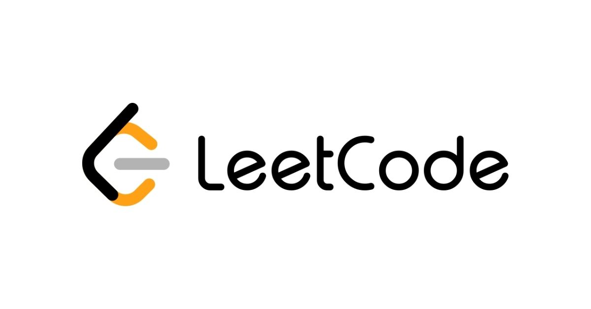

> 프로그래머스의 알고리즘 문제만 풀다 우연히 leetcode 사이트를 알게 되었습니다. 여기 있는 문제들을 타입스크립트로 풀면 좋을 거 같아 사람들이 많이 풀어본 문제들을 위주로 풀어보고 포스팅해 보도록 하겠습니다. 🥰



## 🤔 문제 설명

Given a signed 32-bit integer x, return x with its digits reversed. If reversing x causes the value to go outside the signed 32-bit integer range [-231, 231 - 1], then return 0. Assume the environment does not allow you to store 64-bit integers (signed or unsigned).

> 부호가 있는 정수가 주어질때 숫자를 뒤집어서 반환하고 만약 반환되는 값이 범위를 벗어나면 0을 반환하면 되는 문제입니다.

## 😲 참고

자세한 사항은 leetCode 공식사이트에서 확인할 수 있다.
[leetCode-7.Reverse Integer](https://leetcode.com/problems/reverse-integer/description/)

## 💡 코드

```typescript
function reverse(x: number): number {
  let compareX: number = 0;

  if (x < 0) {
    compareX = Number(x.toString().split('-')[1].split('').reverse().join('')) * -1;
  } else {
    compareX = Number(x.toString().split('').reverse().join(''));
  }

  // 예외처리
  if (compareX < Math.pow(-2, 31) || compareX > Math.pow(2, 31) - 1) return 0;

  return compareX;
}
```

## 📝 풀이

1. 먼저 음수일 때와 양수일 때를 구분하여 처리한다.
2. 음수일 때 맨 앞의 `-`를 없애준 다음에 나머지 숫자를 반대로 돌리고 마지막에 `* -1`을 하여 음수로 만들어 변수에 값을 넣어준다

```typescript
compareX = Number(x.toString().split('-')[1].split('').reverse().join('')) * -1;
```

3. 양수일 때는 오히려 더 간단하다. 문자열로 변환 후 반대로 돌리고 변수에 값을 넣어준다

```typescript
compareX = Number(x.toString().split('').reverse().join(''));
```

4. 최종값이 `-2^31 <= x <= 2^31 - 1` 안의 값이여야 하기 때문에 계산된 값이 벗어난다면 문제에서 정의한 대로 0값을 리턴한다.
5. 그렇지 않다면 변수에 담긴 값을 그대로 반환한다.

## 🧑🏻‍💻 소감

> 문제에 reverse라는 글을 보자마자 문자열로 처리해야 한다고 먼저 생각하였습니다. 평소 문자열 문제를 많이 다루어 보았기에 최대한 짧은 코드로 구현해보려고 노력하였습니다.😁
> <br/>

**궁금하신 점이 있다면 아래 `댓글`로 남겨주세요!👇**

```toc

```
