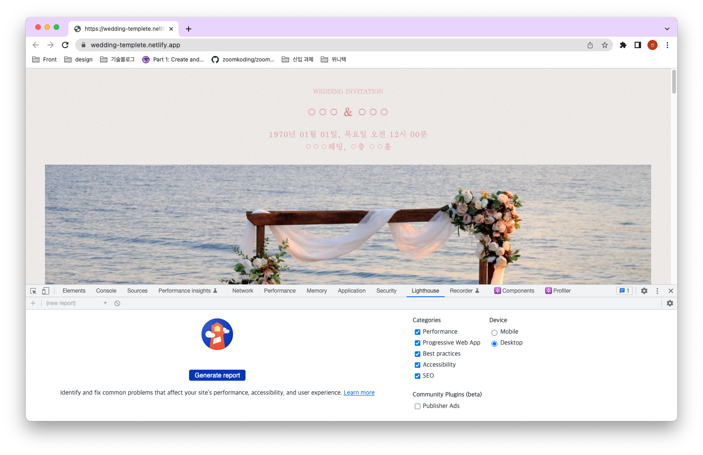
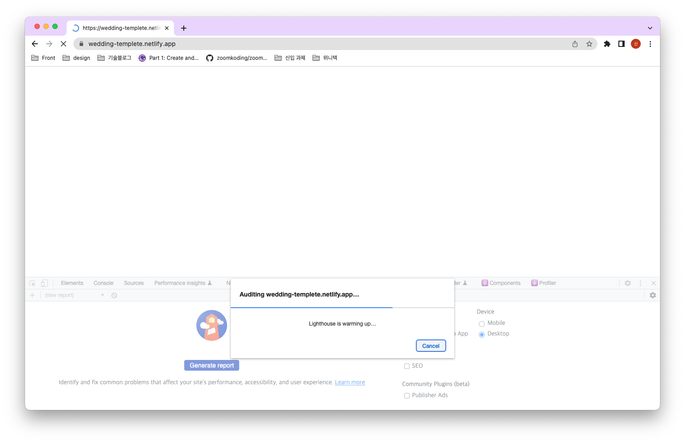
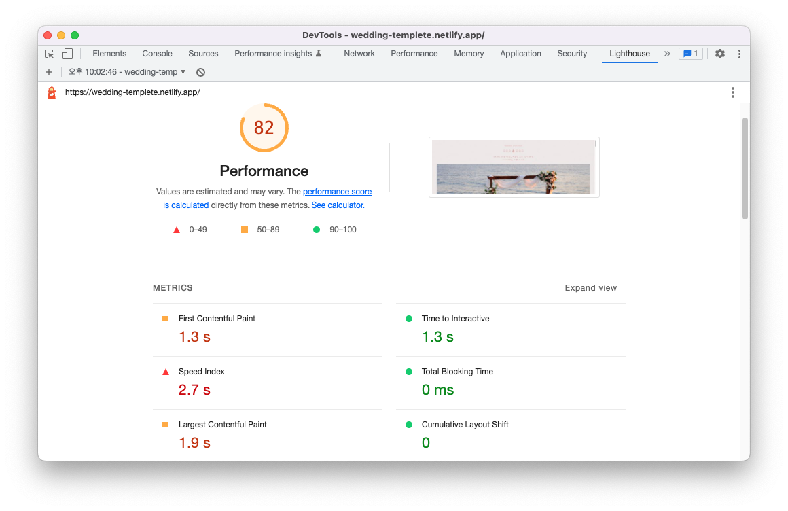
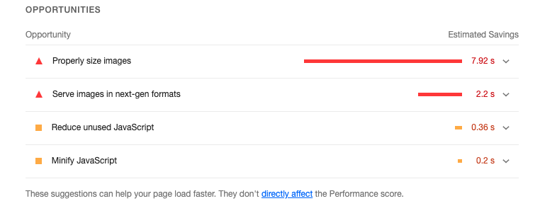
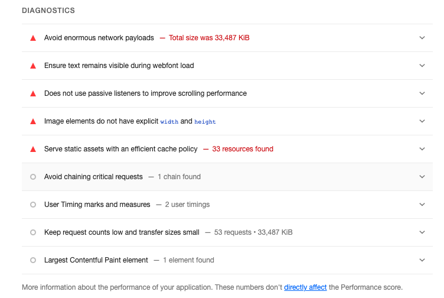

> 리액트 성능 최적화를 측정할 때 사용했던 도구를 한번 소개해보려고 합니다. 간단하게 라이트하우스란 어떤 것인지 라이트하우스에서 나오는 지표들은 어떤 의미를 가졌는지 설명하겠습니다.


## 🤔 lighthouse란 무엇인가?

크롬에서 제공하는 웹사이트의 성능을 측정하는 도구이다. 모바일, 데스크탑에서 모두 측정할 수 있으며, 카테고리에는 Performance, PWA, SEO 등 다양한 지표들을 확인할 수 있다. 이번 포스팅에는 성능(Performance)에 관련해서 설명하겠다.

## 🛠 어떻게 측정하는가?

방법은 되게 간단하다. 분석하고자 하는 사이트를 띄우고 크롬 개발자 도구를 띄운다.



그런 다음 카테고리의 Performance를 클릭 후, Generate report를 클릭하면 끝이다.



## 🔍 참고해야 할 점!

측정할 때의 점수는 컴퓨터 사양마다 같은 사이트라도 점수가 다르게 나올 수 있다. 크롬에 기본으로 있는 lighthouse는 결국 로컬 PC에서 검사하기 때문이다. 이점 인지하며 진행해야 한다. 검사 결과를 절대적인 지표로 삼기보다는 하나의 참고서? 정도로 생각하면 좋을 거 같다.
(실제로 코드 변경 없이 여러 번 검사하더라도 미세한 점수 차이가 있다.

## 📈 lighthouse 지표들 해석하기

밑의 화면은 최근에 진행했던 개인프로젝트 모바일 청첩장이다.



### OPPORTUNITIES

밑으로 조금 내리다 보면 OPPORTUNITIES 가 보일것이다. 리소스의 관점에서 가이드 해주는 것이며 로딩성능 해결책을 의미한다. 이 화면은 현재 과도한 크기의 이미지를 사용하였기에 이미지 크기를 적절하게 조정해야 할 것이다.



### DIAGNOSTICS

이번에는 DIAGNOSTICS이다. 페이지의 실행 관점에서 가이드 해주는 것으로 렌더링 성능 해결책을 의미한다. 이 화면에서 큰 네트워크 페이로드를 피하라고 적혀있다. 이 말은 페이지 크기가 Google에서 권장하는 크기보다 너무 큼을 의미한다. 무거운 페이지는 다운로드할 데이터가 훨씬 더 많기 때문에 콘텐츠를 렌더링하는 데 훨씬 느리다. 사이즈를 줄이도록 노력해야 할 것이다.



## 🕵🏻‍♂️ 마무리

일부로 해결책들을 하나하나 해석하면서 설명하지 않았다. 라이트하우스를 알아보기에 더 좋은 자료들이 너무나도 많기 때문이다. 이 글은 간단하게 이런 도구도 있구나 하면서 편안하게 봐줬으면 좋겠다. 다음 포스팅에는 예시로 들었던 사이트는 모바일 청첩장 사이트를 라이트 하우스가 알려준 해결책을 토대로 개선하는 것을 포스팅해 보도록 하겠다.✌️

`참고할만한 사이트`

[라이트하우스-깃허브](https://github.com/GoogleChrome/lighthouse)

[라이트하우스-공식문서](https://developer.chrome.com/docs/lighthouse/overview/)
<br/>

**궁금하신 점이 있다면 아래 `댓글`로 남겨주세요!👇**

```toc

```
