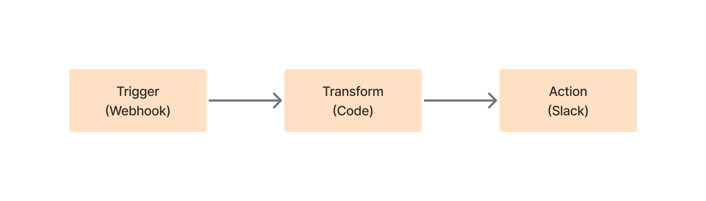
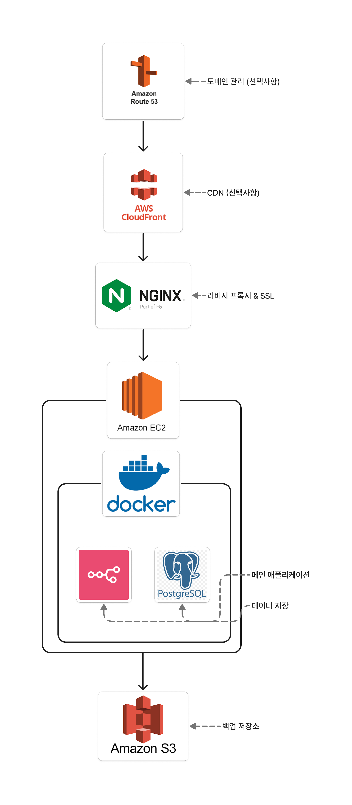

최근 회사에서 다양한 서비스 간 데이터 동기화와 반복 업무 자동화가 필요한 상황이 생겼습니다. Zapier나 Make 같은 SaaS 솔루션도 검토했지만, 데이터 주권과 비용 문제로 self-hosted 솔루션을 찾게 되었고, 그 과정에서 n8n을 발견했습니다.

> 💡 n8n 도입 배경과 비즈니스 케이스가 궁금하시다면 아래 글을 먼저 읽어보시는 것을 추천드려요!
>
> **[📖 예약 업무 자동화로 하루 5시간 절약한 이야기](https://joy.pe.kr/booking-email-automation-n8n-journey/)**

이번 포스트에서는 **실제 AWS EC2에 n8n을 구축하는 과정**과 운영하면서 겪었던 시행착오, 그리고 실무에서 바로 사용할 수 있는 팁들을 공유하려고 합니다. 그럼 바로 시작해보겠습니다!

## n8n이란?

n8n은 노드 기반의 워크플로우 자동화 플랫폼입니다. Zapier와 비슷한 UI/UX를 제공하면서도, 자체 서버에서 운영할 수 있다는 점이 가장 큰 차별점입니다.



### 주요 특징

- **200+ Integrations**: Slack, Google Sheets, GitHub, PostgreSQL 등 다양한 서비스 지원
- **Code Node**: JavaScript/Python으로 커스텀 로직 구현 가능
- **Fair-code License**: 상업적 사용 가능, SaaS로 재판매만 제한
- **Visual Workflow Editor**: 드래그 앤 드롭으로 워크플로우 구성

## 아키텍처 설계

n8n이 어떤 것인지 말씀드렸으니, 이제 본격적으로 어떻게 구축할 것인지 설계부터 시작해 보겠습니다.



### 왜 이렇게 복잡하게 구성했나요?

사실 처음에는 단순하게 생각했어요. EC2 하나에 n8n만 띄우면 되는 거 아닌가? 싶었거든요. 그런데 막상 운영을 시작해보니까 생각보다 신경 쓸 게 정말 많더라고요.

데이터베이스는 어떻게 관리하지? 처음엔 기본 SQLite 쓰다가 워크플로우가 늘어나니까 버벅거리기 시작했어요. 그리고 백업은 또 어떻게 하지? 실행 이력이 다 날아가면 정말 큰일이거든요. HTTPS도 적용해야 하고... 외부 API들이 HTTPS만 받아주니까 필수였어요.

IP로 매번 접속하는 것도 번거롭고, 보안도 신경 쓰이고. 이런저런 고민을 하다 보니 최종적으로 아래와 같은 구조로 정착하게 되었습니다. 각 선택지마다 왜 이렇게 했는지 설명해드릴게요!

### 1. **SQLite의 한계**

기본 SQLite는 동시성 문제가 있어서 PostgreSQL이 필요했습니다.

**실제 겪은 문제:**

```shell
09:00 - Slack 일일 리포트 워크플로우 실행

09:00 - Google Sheets 동기화 워크플로우 실행 (500개 행)

09:00 - 데이터베이스 백업 워크플로우 실행

결과: "SQLITE_BUSY: database is locked" 에러 다발 💥
```

SQLite는 한 번에 하나의 쓰기 작업만 가능해서, 여러 워크플로우가 동시에 실행되면 대부분 실패했어요. PostgreSQL로 전환 후:

- Database locked 에러: 하루 10-15회 → 0회
- 동시 실행 가능 워크플로우: 1개 → 무제한
- 평균 실행 시간: 2.3초 → 0.8초

### 2. **HTTPS 필수**

웹훅을 받으려면 HTTPS가 필수더라고요 (특히 Slack, GitHub 등).

**HTTP로 시도했을 때:**

```shell
Slack Webhook 설정: ❌ "SSL certificate required"

GitHub Webhook: ❌ "We couldn't deliver this payload: SSL required"

Stripe Webhook: ❌ "Webhook endpoints must use HTTPS"
```

대부분의 서비스가 보안상 HTTPS만 허용해서, Let's Encrypt로 무료 SSL 인증서를 적용했습니다.

### 3. **백업의 중요성**

실제 회사에서 사용하는 거라 백업 없이는 불안했습니다.

**실제 사고 가능 사례:**

- EC2 인스턴스 실수로 terminate
- Docker 볼륨 손상으로 데이터 유실 위험

지금은 매일 새벽 3시 자동 백업 + S3 업로드로 안심하고 있어요.

### 4. **성능 최적화**

워크플로우가 늘어나면서 성능 튜닝이 필요했습니다.

**최적화 전후 비교:**

```shell
처음: 단순 n8n + SQLite

- 워크플로우 50개 → 대시보드 로딩 5초
- 대량 데이터 처리 → 타임아웃 빈번
- 동시 실행 → 실패 다발

최적화 후: n8n + PostgreSQL + 메모리/CPU 튜닝

- 워크플로우 50개 → 대시보드 로딩 1초
- 대량 데이터 처리 → 안정적 처리
- 동시 실행 → 문제없음
```

특히 환경 변수 튜닝과 Docker 리소스 제한 설정으로 안정성이 크게 향상됐습니다.

### 최소 구성 vs 권장 구성

### 최소 구성 (테스트/개발용)

```shell
EC2 (t3.micro) + Docker + n8n + SQLite
- 비용: 월 $0~10 (프리티어)
- 적합: 개인 프로젝트, POC
```

### 권장 구성 (실제 운영용)

```shell
EC2 (t3.small) + Docker + n8n + PostgreSQL + Nginx + S3 백업
- 비용: 월 $20~30
- 적합: 소규모 팀, 스타트업
```

### 엔터프라이즈 구성

```shell
EC2 (t3.medium+) + Docker + n8n + PostgreSQL + ALB + CloudFront + S3
- 비용: 월 $50+
- 적합: 대규모 팀, 미션 크리티컬 운영
```

### 리소스 사양 결정

운영 경험을 바탕으로 한 권장 사양입니다:

| 환경        | CPU     | Memory | Storage | EC2 Type   | 예상 비용/월 |
| ----------- | ------- | ------ | ------- | ---------- | ------------ |
| 개발/테스트 | 1 vCPU  | 1GB    | 10GB    | t3.micro   | 무료~$10     |
| 소규모 운영 | 2 vCPU  | 2-4GB  | 20GB    | t3.small   | $15-20       |
| 대규모 운영 | 4+ vCPU | 8GB+   | 50GB+   | t3.medium+ | $40+         |

저희는 소규모로 실제 운영에 쓰일 예정이므로 t3.small로 충분했습니다.

### 주의사항

> 📌 참고: 이 포스트는 AWS와 Docker에 대한 기본적인 이해가 있다는 가정 하에 작성했습니다. EC2 인스턴스 생성, Security Group 설정, SSH 접속 등 AWS 기본 사용법이 익숙하지 않으시다면, 먼저 AWS 기초 가이드를 참고하시는 것을 추천드립니다.
>
> 각 단계별로 더 자세한 설명이 필요하신 부분은:
>
> - **EC2 설정**: [AWS EC2 시작하기 공식 문서](https://docs.aws.amazon.com/ko_kr/AWSEC2/latest/UserGuide/EC2_GetStarted.html)
> - **Docker 기초**: [Docker 공식 튜토리얼](https://docs.docker.com/get-started/)
> - **Nginx 설정**: [Nginx 리버스 프록시 가이드](https://docs.nginx.com/nginx/admin-guide/web-server/reverse-proxy/)
>
> 위 링크들을 참고하시면 더 자세한 정보를 얻으실 수 있습니다.

자, 이제 설계는 끝났으니 실제로 구축해보겠습니다. 저는 '권장 구성'으로 진행했는데요, 여러분의 상황에 맞게 선택하시면 됩니다.

## EC2 환경 구성

### 1. 인스턴스 생성 및 초기 설정

```bash
# Ubuntu 22.04 LTS 선택
# t3.small (2 vCPU, 2GB RAM)
# Security Group 설정
- SSH (22): My IP
- HTTP (80): 0.0.0.0/0
- HTTPS (443): 0.0.0.0/0
- Custom TCP (5678): My IP (초기 설정용)
```

### 2. Docker & Docker Compose 설치

EC2 인스턴스에 접속한 후 Docker 환경을 구성합니다.

```bash
#!/bin/bash
# Docker 설치 스크립트

# 시스템 업데이트
sudo apt-get update
sudo apt-get upgrade -y

# Docker 의존성 설치
sudo apt-get install -y \
    ca-certificates \
    curl \
    gnupg \
    lsb-release

# Docker GPG 키 추가
curl -fsSL https://download.docker.com/linux/ubuntu/gpg | \
    sudo gpg --dearmor -o /usr/share/keyrings/docker-archive-keyring.gpg

# Docker 저장소 추가
echo \
  "deb [arch=$(dpkg --print-architecture) signed-by=/usr/share/keyrings/docker-archive-keyring.gpg] \
  https://download.docker.com/linux/ubuntu \
  $(lsb_release -cs) stable" | sudo tee /etc/apt/sources.list.d/docker.list > /dev/null

# Docker 설치
sudo apt-get update
sudo apt-get install -y docker-ce docker-ce-cli containerd.io

# Docker Compose 설치
sudo curl -L "https://github.com/docker/compose/releases/latest/download/docker-compose-$(uname -s)-$(uname -m)" \
    -o /usr/local/bin/docker-compose
sudo chmod +x /usr/local/bin/docker-compose

# 현재 사용자를 docker 그룹에 추가
sudo usermod -aG docker $USER
newgrp docker

```

## n8n 배포

### 1. Docker Compose 구성

프로덕션 환경을 위한 `docker-compose.yml` 파일을 작성합니다.

```yaml
version: '3.8'

services:
  postgres:
    image: postgres:14-alpine
    container_name: n8n-postgres
    restart: unless-stopped
    environment:
      POSTGRES_DB: ${POSTGRES_DB}
      POSTGRES_USER: ${POSTGRES_USER}
      POSTGRES_PASSWORD: ${POSTGRES_PASSWORD}
      POSTGRES_NON_ROOT_USER: ${POSTGRES_NON_ROOT_USER}
      POSTGRES_NON_ROOT_PASSWORD: ${POSTGRES_NON_ROOT_PASSWORD}
    volumes:
      - postgres-data:/var/lib/postgresql/data
      - ./init-db.sh:/docker-entrypoint-initdb.d/init-db.sh
    healthcheck:
      test: ['CMD-SHELL', 'pg_isready -U ${POSTGRES_USER} -d ${POSTGRES_DB}']
      interval: 10s
      timeout: 5s
      retries: 5
    networks:
      - n8n-network

  n8n:
    image: n8nio/n8n:latest
    container_name: n8n
    restart: unless-stopped
    depends_on:
      postgres:
        condition: service_healthy
    ports:
      - '5678:5678'
    environment:
      # 기본 설정
      - NODE_ENV=production
      - N8N_HOST=${N8N_HOST}
      - N8N_PORT=5678
      - N8N_PROTOCOL=${N8N_PROTOCOL}
      - WEBHOOK_URL=${WEBHOOK_URL}

      # 데이터베이스 설정
      - DB_TYPE=postgresdb
      - DB_POSTGRESDB_HOST=postgres
      - DB_POSTGRESDB_PORT=5432
      - DB_POSTGRESDB_DATABASE=${POSTGRES_DB}
      - DB_POSTGRESDB_USER=${POSTGRES_NON_ROOT_USER}
      - DB_POSTGRESDB_PASSWORD=${POSTGRES_NON_ROOT_PASSWORD}

      # 인증 설정
      - N8N_BASIC_AUTH_ACTIVE=true
      - N8N_BASIC_AUTH_USER=${N8N_BASIC_AUTH_USER}
      - N8N_BASIC_AUTH_PASSWORD=${N8N_BASIC_AUTH_PASSWORD}

      # 실행 설정
      - EXECUTIONS_MODE=queue
      - QUEUE_BULL_REDIS_HOST=redis
      - N8N_METRICS=true

      # 보안 설정
      - N8N_ENCRYPTION_KEY=${N8N_ENCRYPTION_KEY}
    volumes:
      - n8n-data:/home/node/.n8n
      - ./local-files:/files
    networks:
      - n8n-network

  redis:
    image: redis:7-alpine
    container_name: n8n-redis
    restart: unless-stopped
    command: redis-server --appendonly yes
    volumes:
      - redis-data:/data
    healthcheck:
      test: ['CMD', 'redis-cli', 'ping']
      interval: 10s
      timeout: 5s
      retries: 5
    networks:
      - n8n-network

volumes:
  postgres-data:
  n8n-data:
  redis-data:

networks:
  n8n-network:
    driver: bridge
```

### 2. 환경 변수 설정

`.env` 파일을 생성하여 민감한 정보를 관리합니다.

```bash
# .env
# 도메인 설정
N8N_HOST=n8n.example.com
N8N_PROTOCOL=https
WEBHOOK_URL=https://n8n.example.com/

# 데이터베이스 설정
POSTGRES_DB=n8n
POSTGRES_USER=postgres
POSTGRES_PASSWORD=StrongPostgresPassword123!
POSTGRES_NON_ROOT_USER=n8n
POSTGRES_NON_ROOT_PASSWORD=StrongN8nPassword123!

# n8n 인증
N8N_BASIC_AUTH_USER=admin
N8N_BASIC_AUTH_PASSWORD=StrongAdminPassword123!

# 암호화 키 (openssl rand -hex 32)
N8N_ENCRYPTION_KEY=your-32-byte-hex-encryption-key

```

### 3. PostgreSQL 초기화 스크립트

`init-db.sh` 파일을 생성하여 non-root 사용자를 설정합니다.

```bash
#!/bin/bash
set -e

psql -v ON_ERROR_STOP=1 --username "$POSTGRES_USER" --dbname "$POSTGRES_DB" <<-EOSQL
    CREATE USER ${POSTGRES_NON_ROOT_USER} WITH PASSWORD '${POSTGRES_NON_ROOT_PASSWORD}';
    GRANT ALL PRIVILEGES ON DATABASE ${POSTGRES_DB} TO ${POSTGRES_NON_ROOT_USER};
    ALTER DATABASE ${POSTGRES_DB} OWNER TO ${POSTGRES_NON_ROOT_USER};
EOSQL

```

### 4. 실행 및 확인

```bash
# 권한 설정
chmod +x init-db.sh

# 컨테이너 실행
docker-compose up -d

# 로그 확인
docker-compose logs -f n8n

# 헬스체크
curl -I http://localhost:5678/healthz
```

## Nginx 리버스 프록시 설정

### 1. Nginx 설치 및 구성

```bash
sudo apt-get install -y nginx certbot python3-certbot-nginx
```

```bash
# /etc/nginx/sites-available/n8n
upstream n8n {
    server 127.0.0.1:5678;
    keepalive 32;
}

server {
    listen 80;
    server_name n8n.example.com;

    # 로그 설정
    access_log /var/log/nginx/n8n.access.log;
    error_log /var/log/nginx/n8n.error.log;

    # 기본 위치
    location / {
        proxy_pass http://n8n;
        proxy_http_version 1.1;

        # 헤더 설정
        proxy_set_header Connection '';
        proxy_set_header Host $host;
        proxy_set_header X-Real-IP $remote_addr;
        proxy_set_header X-Forwarded-For $proxy_add_x_forwarded_for;
        proxy_set_header X-Forwarded-Proto $scheme;

        # 웹소켓 지원
        proxy_set_header Upgrade $http_upgrade;
        proxy_set_header Connection $connection_upgrade;

        # 타임아웃 설정
        proxy_connect_timeout 300s;
        proxy_send_timeout 300s;
        proxy_read_timeout 300s;

        # 버퍼 설정
        proxy_buffering off;
        proxy_request_buffering off;

        # 파일 업로드 크기
        client_max_body_size 100M;
    }

    # 웹훅 전용 위치 (성능 최적화)
    location /webhook {
        proxy_pass http://n8n;
        proxy_http_version 1.1;
        proxy_set_header Host $host;
        proxy_set_header X-Real-IP $remote_addr;
        proxy_buffering off;
        access_log off;  # 웹훅은 로그 비활성화
    }
}

# 웹소켓 업그레이드 맵
map $http_upgrade $connection_upgrade {
    default upgrade;
    '' close;
}
```

### 2. SSL 인증서 설정

```bash
# Let's Encrypt SSL 인증서 발급
sudo certbot --nginx -d n8n.example.com \
    --non-interactive \
    --agree-tos \
    --email admin@example.com

# 자동 갱신 설정
sudo systemctl enable certbot.timer
sudo systemctl start certbot.timer
```

## 모니터링 및 백업

### 1. 모니터링 설정

Prometheus와 Grafana를 활용한 모니터링 스택을 구성합니다.

```yaml
# docker-compose.monitoring.yml
version: '3.8'

services:
  prometheus:
    image: prom/prometheus:latest
    container_name: prometheus
    volumes:
      - ./prometheus.yml:/etc/prometheus/prometheus.yml
      - prometheus-data:/prometheus
    command:
      - '--config.file=/etc/prometheus/prometheus.yml'
      - '--storage.tsdb.path=/prometheus'
    ports:
      - '9090:9090'
    networks:
      - n8n-network

  grafana:
    image: grafana/grafana:latest
    container_name: grafana
    volumes:
      - grafana-data:/var/lib/grafana
      - ./grafana/dashboards:/etc/grafana/provisioning/dashboards
      - ./grafana/datasources:/etc/grafana/provisioning/datasources
    environment:
      - GF_SECURITY_ADMIN_PASSWORD=${GRAFANA_PASSWORD}
      - GF_INSTALL_PLUGINS=redis-datasource
    ports:
      - '3000:3000'
    networks:
      - n8n-network

volumes:
  prometheus-data:
  grafana-data:
```

### 2. 자동 백업 스크립트

```bash
#!/bin/bash
# backup.sh

set -e

# 설정
BACKUP_DIR="/backup/n8n"
S3_BUCKET="s3://your-backup-bucket/n8n"
RETENTION_DAYS=30
DATE=$(date +%Y%m%d_%H%M%S)

# 백업 디렉토리 생성
mkdir -p ${BACKUP_DIR}

# 데이터베이스 백업
docker exec n8n-postgres pg_dump \
    -U ${POSTGRES_USER} \
    -d ${POSTGRES_DB} \
    --no-owner \
    --no-acl \
    | gzip > ${BACKUP_DIR}/postgres_${DATE}.sql.gz

# n8n 데이터 백업
docker run --rm \
    -v n8n-docker_n8n-data:/source:ro \
    -v ${BACKUP_DIR}:/backup \
    alpine tar czf /backup/n8n-data_${DATE}.tar.gz -C /source .

# S3 업로드
aws s3 cp ${BACKUP_DIR}/postgres_${DATE}.sql.gz ${S3_BUCKET}/
aws s3 cp ${BACKUP_DIR}/n8n-data_${DATE}.tar.gz ${S3_BUCKET}/

# 로컬 백업 정리
find ${BACKUP_DIR} -name "*.gz" -mtime +7 -delete

# S3 백업 정리
aws s3 ls ${S3_BUCKET}/ | \
    awk '{print $4}' | \
    while read -r file; do
        file_date=$(echo $file | grep -oP '\d{8}' || echo "0")
        if [ $(date -d "${file_date:0:4}-${file_date:4:2}-${file_date:6:2}" +%s 2>/dev/null || echo 0) \
            -lt $(date -d "${RETENTION_DAYS} days ago" +%s) ]; then
            aws s3 rm ${S3_BUCKET}/${file}
        fi
    done

echo "백업 완료: ${DATE}"
```

크론탭 설정:

```bash
# 매일 새벽 3시 백업
0 3 * * * /home/ubuntu/backup.sh >> /var/log/n8n-backup.log 2>&1
```

## 성능 최적화

운영하다 보니 워크플로우가 많아지면서 성능 이슈가 생겼어요. 몇 가지 튜닝으로 훨씬 안정적으로 운영할 수 있었습니다.

### 1. 시스템 튜닝

웹훅이 많이 들어오면 네트워크 처리 능력이 부족해져요. 시스템 레벨에서 최적화해줍시다.

```bash
# /etc/sysctl.conf
# 네트워크 성능 최적화
net.core.somaxconn = 65535
net.ipv4.tcp_max_syn_backlog = 8192
net.ipv4.tcp_tw_reuse = 1
net.ipv4.tcp_fin_timeout = 30
net.ipv4.ip_local_port_range = 1024 65535

# 메모리 관리
vm.swappiness = 10
vm.dirty_ratio = 15
vm.dirty_background_ratio = 5

# 적용
sudo sysctl -p
```

### 2. Docker 리소스 제한

n8n이 메모리나 CPU를 너무 많이 쓰면 서버 전체가 느려져요. 적절한 제한을 걸어줍시다.

```yaml
# docker-compose.yml 수정
services:
  n8n:
    # ... 기존 설정
    deploy:
      resources:
        limits:
          cpus: '1.5'
          memory: 1536M
        reservations:
          cpus: '0.5'
          memory: 512M
```

### 3. 로그 로테이션

Docker 로그가 계속 쌓이면 디스크가 가득 차요. 자동으로 정리되도록 설정합시다.

```json
# /etc/docker/daemon.json
{
  "log-driver": "json-file",
  "log-opts": {
    "max-size": "10m",
    "max-file": "5"
  }
}
```

**💡 이렇게 설정하는 이유:**

- **시스템 튜닝**: 웹훅 처리량이 많아져도 안정적으로 동작
- **리소스 제한**: n8n이 서버 리소스를 독점하지 않도록 방지
- **로그 로테이션**: 디스크 용량 부족으로 서버가 다운되는 것을 방지

이 설정들은 워크플로우가 10개 이상 돌아갈 때부터 적용하시는 걸 추천드립니다!

## 실제 워크플로우 구현 사례

실제로 사용해보기 좋은 두 가지 워크플로우를 소개해 드릴게요.

### 1. 이메일 첨부파일 자동 정리

매일 수십 개씩 오는 세금계산서, 계약서, 견적서를 자동으로 정리하는 워크플로우입니다. 이거 하나만 써도 n8n 설치한 보람을 느낄 수 있어요.

```jsx
// Gmail 새 메일 트리거 예시

// 1. 중요 발신자 필터링
const email = $input.item.json;
const importantSenders = {
  'invoice@*': '세금계산서',
  '*@accounting.com': '회계',
  '*@hr-team.com': '인사',
  'noreply@stripe.com': '결제',
};

// 발신자 확인
let category = '기타';
for (const [pattern, cat] of Object.entries(importantSenders)) {
  if (email.from.match(pattern.replace('*', '.*'))) {
    category = cat;
    break;
  }
}

// 2. 첨부파일 처리
const processedFiles = [];

for (const attachment of email.attachments) {
  // 파일명에서 문서 유형 자동 감지
  let documentType = '기타';
  let folderId = 'GENERAL_FOLDER_ID';

  const fileName = attachment.name.toLowerCase();
  if (fileName.includes('invoice') || fileName.includes('세금계산서')) {
    documentType = '세금계산서';
    folderId = 'INVOICE_FOLDER_ID';
  } else if (fileName.includes('contract') || fileName.includes('계약')) {
    documentType = '계약서';
    folderId = 'CONTRACT_FOLDER_ID';
  } else if (fileName.includes('estimate') || fileName.includes('견적')) {
    documentType = '견적서';
    folderId = 'ESTIMATE_FOLDER_ID';
  }

  // 날짜_발신자_파일명 형식으로 저장
  const date = new Date().toISOString().split('T')[0];
  const sender = email.from.split('@')[0];
  const newFileName = `${date}_${sender}_${attachment.name}`;

  // Google Drive에 자동 저장
  const uploaded = await $googleDrive.upload({
    name: newFileName,
    content: attachment.content,
    folderId: folderId,
  });

  processedFiles.push({
    original: attachment.name,
    saved: newFileName,
    type: documentType,
    size: (attachment.size / 1024).toFixed(1) + 'KB',
    link: uploaded.webViewLink,
  });
}

// 3. Gmail에 처리 완료 라벨 추가
await $gmail.addLabel({
  messageId: email.id,
  label: '자동처리완료',
});

// 4. Slack으로 처리 결과 알림
if (processedFiles.length > 0) {
  const fileList = processedFiles.map((f) => `• ${f.type}: ${f.original} (${f.size})`).join('\n');

  return {
    json: {
      channel: '#finance-notifications',
      text: `📎 첨부파일 ${processedFiles.length}개 자동 저장`,
      attachments: [
        {
          color: '#4285F4',
          author_name: email.from,
          title: email.subject,
          text: fileList,
          fields: [
            {
              title: '저장 위치',
              value: 'Google Drive > 문서 자동 정리',
              short: true,
            },
            {
              title: '처리 시간',
              value: new Date().toLocaleTimeString('ko-KR'),
              short: true,
            },
          ],
          actions: [
            {
              type: 'button',
              text: 'Drive에서 보기 📁',
              url: processedFiles[0].link,
            },
          ],
        },
      ],
    },
  };
}
```

**실제 효과:**

- 하루 평균 30분 → 0분 (완전 자동화)
- 문서 찾는 시간 90% 감소 (체계적 정리)
- 중요 문서 누락 0건 (자동 백업)

### 2. 경쟁사/키워드 모니터링

경쟁사 블로그나 특정 키워드가 언급되면 바로 알려주는 워크플로우입니다. 트렌드 파악에 정말 유용해요.

```jsx
// 1시간마다 실행

// 1. 모니터링할 대상 설정
const monitoringTargets = [
  {
    type: 'blog',
    name: '토스 기술블로그',
    url: 'https://toss.tech/rss.xml',
    keywords: ['결제', '송금', 'PG'],
  },
  {
    type: 'blog',
    name: '카카오 기술블로그',
    url: 'https://tech.kakao.com/blog/feed/',
    keywords: ['AI', '챗봇', 'React'],
  },
  {
    type: 'news',
    name: 'Google News - 핀테크',
    url: 'https://news.google.com/rss/search?q=핀테크',
    keywords: ['규제', '송금', '간편결제'],
  },
];

const newArticles = [];

// 2. RSS 피드 확인 및 필터링
for (const target of monitoringTargets) {
  const feed = await $rssFeed.read(target.url);

  // 최근 24시간 내 글만 필터링
  const yesterday = new Date(Date.now() - 24 * 60 * 60 * 1000);

  for (const item of feed.items) {
    const publishDate = new Date(item.pubDate);

    if (publishDate > yesterday) {
      // 키워드 체크
      const matchedKeywords = target.keywords.filter(
        (keyword) => item.title.includes(keyword) || item.description.includes(keyword),
      );

      // 키워드가 매칭되거나 중요 출처면 수집
      if (matchedKeywords.length > 0 || target.type === 'competitor') {
        newArticles.push({
          source: target.name,
          title: item.title,
          link: item.link,
          summary: item.description.substring(0, 200),
          keywords: matchedKeywords,
          publishDate: publishDate.toLocaleString('ko-KR'),
        });
      }
    }
  }
}

// 3. 중요도별 분류
const highPriority = [];
const normalPriority = [];

for (const article of newArticles) {
  // 경쟁사 또는 중요 키워드 포함 시 높은 우선순위
  if (
    article.source.includes('토스') ||
    article.keywords.includes('규제') ||
    article.keywords.includes('경쟁사')
  ) {
    highPriority.push(article);
  } else {
    normalPriority.push(article);
  }
}

// 4. Slack으로 분류해서 전송
if (highPriority.length > 0) {
  const urgentMessage = {
    channel: '#urgent-monitoring',
    text: `🚨 중요 모니터링 알림 (${highPriority.length}건)`,
    attachments: highPriority.map((article) => ({
      color: 'danger',
      author_name: article.source,
      title: article.title,
      title_link: article.link,
      text: article.summary + '...',
      fields: [
        {
          title: '매칭 키워드',
          value: article.keywords.join(', ') || '경쟁사 자동 수집',
          short: true,
        },
        {
          title: '발행 시간',
          value: article.publishDate,
          short: true,
        },
      ],
      footer: '긴급 확인 필요',
    })),
  };

  await $slack.send(urgentMessage);
}

if (normalPriority.length > 0) {
  const summaryMessage = {
    channel: '#daily-monitoring',
    text: `📰 일반 모니터링 (${normalPriority.length}건)`,
    attachments: [
      {
        color: 'good',
        text: normalPriority.map((a) => `• [${a.source}] ${a.title}\n  ${a.link}`).join('\n\n'),
        footer: '일일 트렌드 리포트',
      },
    ],
  };

  await $slack.send(summaryMessage);
}

// 5. 주요 글은 Notion에도 저장
for (const article of highPriority) {
  await $notion.createPage({
    parent: { database_id: 'COMPETITOR_DB_ID' },
    properties: {
      제목: { title: [{ text: { content: article.title } }] },
      출처: { select: { name: article.source } },
      링크: { url: article.link },
      키워드: {
        multi_select: article.keywords.map((k) => ({ name: k })),
      },
      수집일: { date: { start: new Date().toISOString() } },
      중요도: { select: { name: '높음' } },
    },
  });
}

return {
  json: {
    collected: newArticles.length,
    highPriority: highPriority.length,
    normalPriority: normalPriority.length,
  },
};
```

**실제 효과:**

- 경쟁사 동향 놓치지 않음
- 업계 트렌드 실시간 파악
- 중요 뉴스 자동 분류 및 저장
- 팀 전체가 같은 정보 공유

이 두 가지만 잘 활용해도 업무 시간을 크게 줄일 수 있어요. 특히 반복적인 문서 정리나 정보 수집 작업에서 해방되는 게 가장 큰 장점입니다!

## 트러블슈팅

n8n을 실제로 운영하면서 겪었던 문제들과 해결 방법을 공유드립니다. 아마 여러분도 비슷한 상황을 마주칠 가능성이 높아서, 미리 알아두시면 도움 될 거예요.

### 1. 메모리 부족 문제

증상: 워크플로우 실행 중 n8n 컨테이너가 재시작됨

```bash
# 스왑 메모리 추가
sudo fallocate -l 4G /swapfile
sudo chmod 600 /swapfile
sudo mkswap /swapfile
sudo swapon /swapfile

# 영구 적용
echo '/swapfile none swap sw 0 0' | sudo tee -a /etc/fstab

# 스왑 사용률 조정
sudo sysctl vm.swappiness=10
```

### 2. 웹훅 타임아웃 문제

증상: 긴 처리 시간이 필요한 웹훅이 타임아웃됨

해결: 비동기 처리 패턴 적용

```jsx
// Webhook 응답 즉시 반환
const webhookData = $input.item.json;

// Queue에 작업 추가
await $queue.add('long-process', webhookData);

// 즉시 응답
return {
  json: {
    status: 'accepted',
    message: 'Processing in background',
    jobId: generateJobId(),
  },
};
```

### 3. PostgreSQL 연결 끊김

증상: "connection terminated unexpectedly" 에러

```yaml
# docker-compose.yml 수정
services:
  n8n:
    environment:
      # 연결 풀 설정
      - DB_POSTGRESDB_CONNECTION_LIMIT=20
      - DATABASE_CONNECTION_TIMEOUT=60000
      - DATABASE_REQUEST_TIMEOUT=300000
```

## 운영 모범 사례

### 1. 워크플로우 버전 관리

```bash
# Git으로 워크플로우 백업
n8n export:workflow --all --output=./workflows/
git add workflows/
git commit -m "Backup workflows $(date +%Y%m%d)"
git push origin main

```

### 2. 환경별 분리

```bash
production/
├── docker-compose.yml
├── .env.production
└── workflows/

staging/
├── docker-compose.yml
├── .env.staging
└── workflows/

development/
├── docker-compose.yml
├── .env.development
└── workflows/

```

### 3. 에러 알림 설정

```jsx
// Error Workflow
const error = $input.item.json.error;
const workflow = $input.item.json.workflow;

// Slack 알림
await $slack.send({
  channel: '#n8n-alerts',
  text: `⚠️ Workflow Error`,
  attachments: [
    {
      color: 'danger',
      fields: [
        {
          title: 'Workflow',
          value: workflow.name,
          short: true,
        },
        {
          title: 'Error Message',
          value: error.message,
          short: false,
        },
        {
          title: 'Time',
          value: new Date().toISOString(),
          short: true,
        },
      ],
    },
  ],
});
```

## 비용 분석

실제 운영 비용을 Zapier와 비교해보면:

| 항목         | n8n (Self-hosted)                | Zapier (Team Plan) |
| ------------ | -------------------------------- | ------------------ |
| 월 기본 비용 | $20 (EC2 t3.small)               | $69                |
| 실행 횟수    | 무제한                           | 50,000/월          |
| 사용자 수    | 무제한                           | 3명                |
| 데이터 보관  | 자체 관리                        | 외부 서버          |
| 커스터마이징 | 완전 자유                        | 제한적             |
| 연간 총 비용 | $240 (t3.micro 사용 시 1년 무료) | $828               |

## 마치며

n8n을 도입한 지 3개월이 지났는데, 이제는 없어서는 안 될 핵심 인프라가 되었습니다. 특히 다음과 같은 장점이 있었습니다:

1. **비용 절감**: Zapier 대비 80% 비용 절감
2. **데이터 주권**: 모든 데이터가 우리 서버에서 처리
3. **무제한 실행**: 실행 횟수 제한 없음
4. **커스터마이징**: 필요한 기능을 자유롭게 구현

물론 self-hosted 특성상 운영 부담이 있지만, 적절한 모니터링과 백업 체계를 갖추면 충분히 안정적으로 운영할 수 있습니다.

이번 포스트에서는 전체적인 구축 과정과 실제 활용 사례를 중심으로 다뤘는데요. 한 번에 너무 많은 정보를 담으려다 보니 Docker Compose 세부 설정이나 Nginx 상세 구성 같은 부분은 깊게 다루지 못한 것 같아 아쉽네요. 그래도 이 정도 구성으로도 충분히 프로덕션 레벨에서 운영 가능하다는 것을 보여드리고 싶었습니다.

혹시 이 글을 보고 직접 구축하시다가 막히는 부분이 있다면 주저하지 마시고 댓글로 질문해주세요. 제가 겪었던 시행착오와 해결 방법을 최대한 자세히 공유드리겠습니다. 특히 AWS 설정이나 Docker 관련해서 어려움을 겪으신다면, 구체적인 에러 메시지와 함께 알려주시면 더 정확한 도움을 드릴 수 있을 것 같아요.

이 포스트가 n8n 도입을 고민하시는 분들께 작은 도움이라도 되었으면 좋겠습니다. 여러분도 n8n으로 반복 업무에서 해방되시길 바랍니다! 😊

**다음 편 예고**: 실제로 이 n8n 환경에서 **여행 예약 메일을 30분에서 5분으로 단축**시킨 워크플로우 구축 과정을 공개합니다.

## 참고 자료

- [n8n 공식 문서](https://docs.n8n.io/)
- [n8n 커뮤니티 포럼](https://community.n8n.io/)
- [n8n 워크플로우 템플릿](https://n8n.io/workflows)
- [Docker Compose 베스트 프랙티스](https://docs.docker.com/compose/production/)

<br/>

**궁금하신 점이 있다면 아래 `댓글`로 남겨주세요!👇**
