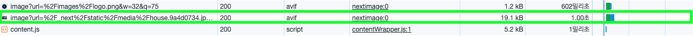

안녕하세요, 오랜만에 포스트를 올리게 되었습니다. 이번 포스트를 통해 웹 페이지를 개발하며 이미지 최적화를 공부하면서 알게된 내용을 다른 분들께 도움이 되고자 합니다.

이미지 최적화는 웹 페이지의 성능과 사용자 경험에 중요한 영향을 미치는 요소 중 하나입니다. 특히 별장 예약 서비스와 같이 고화질 이미지를 다량으로 다루는 프로젝트에서는 이미지 최적화가 더욱 중요해집니다. 그래서 이번 포스트에서는 이미지 최적화를 어떻게 효과적으로 수행할 수 있는지, 그리고 Next.js의 강력한 이미지 처리 기능을 어떻게 활용할 수 있는지에 대해 이야기해 보려고 합니다.

Next.js의 이미지 최적화 라이브러리인 `next/image` 컴포넌트를 중심으로, 이미지 최적화의 핵심 원리와 캐싱 전략, 그리고 몇 가지 실용적인 팁에 대해 다룰 예정입니다.

이번 글을 통해 이미지 최적화에 관심 있는 분들께 도움이 되기를 바랍니다.

## Next/image 컴포넌트 사용

웹 이미지 처리에 대해 이야기해보겠습니다. 이미지는 웹 페이지에서 중요한 역할을 합니다. 사용자 경험을 향상시키고 정보 전달을 돕는 데 도움을 주는 요소 중 하나입니다.

이 작업을 수행할 때 고려할 수 있는 두 가지 방법이 있습니다. 첫 번째로는 오랫동안 알려져 왔던 `` 태그를 사용하는 방법이 있습니다. 두 번째로는 Next.js의 `next/image` 컴포넌트를 사용하는 방법이 있습니다. 이 두 가지 방법을 비교해보겠습니다.

### 설명

1. `img` 태그: 이미지를 웹 페이지에 간단히 삽입할 수 있지만, 모든 처리를 직접 해야합니다. 이미지 최적화와 웹 접근성에 신경을 써야합니다.

   ```html
   
   ```

2.`Next/image` 컴포넌트: Next.js에서 제공하는 특별한 이미지 최적화 도구입니다. `next/image`를 사용하면 이미지 최적화, 레이아웃 최적화, 브라우저 최적화를 자동으로 처리해줍니다. 이미지 크기 조절할 때 생기는 레이아웃 이슈도 쉽게 해결가능합니다.

위에서 언급한 대로 `Next/image` 컴포넌트가 좋다는건 알겠는데, 실제로 이미지 최적화가 어느 정도 이루어지는지 비교해 보겠습니다.

### 성능

아래 스크린샷은 캐시 사용을 중지하고 ``와 Next/image 컴포넌트의 동작을 비교한 것입니다. 보시는 대로, ``보다 `Next/image` 컴포넌트를 사용한 이미지의 크기가 11.3배 더 빠르게 동작한 것을 확인할 수 있었습니다.

- `img`: Size -> 2.8MB, Time -> 113ms
- `Next/image`: Size -> 20kB, Time -> 10ms


## Squoosh 대신 Sharp 사용

Next.js 프레임워크는 이미지 최적화에 기본적으로 Squoosh 모듈을 사용합니다. 그러나 운영 환경에서는 Sharp 라이브러리를 사용하는 것을 적극 권장합니다. 이는 Sharp가 속도면에서 훨씬 빠르기 때문입니다. 그럼에도 불구하고, Next.js가 Squoosh를 개발 환경에서 기본으로 사용하는 이유가 있습니다. 그 이유는 Squoosh가 빠르게 설치되고 개발 환경에서 더 적합하다고 판단하기 때문입니다.

### 성능

동일한 환경에서 테스트한결과 Squoosh`48.8KB`, Sharp는`20.7KB`로 보여주었습니다. 크기 면에서 2배의 차이를 보여주었지만, 응답속도는 거의 차이가 없었습니다. 하지만 Next 공식 홈페이지에서도, 빌드 할때도 Sharp 사용을 적극 권장하기 때문에 사용하지 않을 이유는 없어 보입니다.

[Squuosh]


[Sharp]


## WebP 확장자 대신 AVIF 확장자 사용

Next/Image 컴포넌트를 사용하면 기본적으로 WebP 확장자로 최적화합니다. WebP는 Google에서 개발한 이미지 형식으로 웹에서 이미지를 효과적으로 저장하고 전송하기 위해 사용됩니다. WebP는 여전히 효율적인 이미지 포맷이지만, AVIF는 더 나은 압축률과 이미지 품질을 제공하여 미래 웹 이미지 포맷의 표준으로 자리잡을 가능성이 높습니다. 따라서 AVIF를 사용하여 웹 이미지를 최적화하는 것이 좋을 수 있습니다.

### 성능

보다 큰 차이를 보기위하여 이번에는 네트워크 환경을 빠른 3G로 설정하여 비교해 보았는데요. WebP는 `20.7KB`, AVIF는 `19.1KB`로 약간의 크기 감소를 확인할 수 있엇고 응답시간은 차이가 거의 없는걸 확인했습니다.

이미 이미지 사이즈가 충분히 줄어들어 그런거 같고 훨씬 더 큰 이미지를 가지고 비교한다면 그 차이는 보다 크게 날것으로 예상됩니다.

[WebP]


[AVIF]


### 주의점

현재 AVIF는 대부분의 브라우저에서 지원되지만, EDGE에서는 지원되지 않습니다. 따라서 AVIF를 지원하지 않는 브라우저에서는 WebP 형식을 사용하도록 설정해야 합니다. Next.js 프레임워크에서는 next.config.js 파일에서 간단하게 설정할 수 있습니다.

```javascript
module.exports = {
  images: {
    formats: ['image/avif', 'image/webp'],
  },
};
```

## 적절한 캐시 설정

적절하게 캐시 설정을 하면 이미지를 사용자의 브라우저에 저장하여 빠르게 로드할 수 있습니다. 이를 통해 페이지 로딩 시간을 단축하고 대역폭을 절약할 수 있어요. 적절한 캐시 설정을 위해서는 s-maxage와 max-age의 개념을 먼저 알아야 하는데, 이전에 포스트한
[HTTP 캐시 이해하기](https://joy.pe.kr/http-cash-understanding/) 에서 확인할 수 있습니다.

### 설명

캐시 전략을 구성할 때는 다양한 방법이 있지만, mutable과 immutable한 리소스를 분류하여 각각 다른 전략을 취하는 방법이 기본적입니다.

#### mutable 리소스

대표적으로 변경될 수 있는 리소스로는 HTML 파일이 있습니다. 새로운 배포가 이루어질 때마다 HTML 파일의 값은 변경될 수 있습니다. 그래서 브라우저는 HTML 파일을 불러올 때 항상 새로운 배포가 있는지 확인해야 합니다.

#### immutable 리소스

변경될 가능성이 없는 리소스로 JS, CSS, IMAGE 파일이 있습니다. "JS, CSS, IMAGE 파일 다 바뀔 수 있는데요?"라고 물으실 수도 있는데, JS 파일과 CSS 파일은 빌드할 때마다 새로 생기고 새로 생기는 과정에서 임의의 번호를 붙여 빌드 결과물마다 고유한 URL을 가지도록 설정합니다. 이렇게 되면 같은 URL에 대해 내용이 바뀔 수 없기 때문에 변경될 가능성이 없는 것으로 분류합니다. 이 방법을 [Cache Busting](https://www.keycdn.com/support/what-is-cache-busting)라고 부릅니다.

이미지 최적화에 관한 내용을 포스팅 중이기 때문에 다른 캐시 전략은 추후에 다시 언급하도록 하고, 이미지로 돌아가겠습니다. 이미지 파일은 이미 내부적으로 변경되지 않기 때문에 immutable한 데이터로 간주됩니다. 따라서 max-age를 31536000초(1년)로 설정하여 사용자가 처음에 한 번만 다운로드하고 그 이후에는 다시 다운로드하지 않도록 합니다.

```
public, max-age=315360000, immutable
```

> max-age는 유저 브라우저의 캐시를 설정하는 옵션이므로 한번 브라우저에 캐시가 저장되면 만료될때까지 바꿀 수 없습니다. 때문에 mutable한 리소스에 잘못 max-age를 설정하게 되면 곤란할 수 있으니 적절하게 사용하셔야 합니다.

### NEXT.JS는 어떻게 이미지를 캐싱할까?

여러분들이 따로 설정하지 않아도 Next.js는 이미지 캐싱을 자동으로 지원합니다. `.next` 폴더의 `cache/images` 디렉터리에 이미지를 동적으로 생성하고 저장하고, 나중에 동일한 이미지 요청이 들어오면 이미 생성된 이미지를 재사용해줍니다. 그런데, 캐시 설정을 잘못하면 이미지를 매번 최적화하고 제공해야 하는 번거로움이 생길 수 있어요.

Next.js의 `next/image` 모듈은 이미지 최적화를 자동으로 수행합니다. 이 모듈은 주어진 이미지 파일을 (예를 들면 jpg 또는 png) WebP 또는 AVIF와 같이 최적화된 형식으로 자동 변환하고, 이미지 크기도 적절하게 조절해줘요. 하지만 이미지 최적화는 시간이 좀 걸릴 수 있어서, 이런 작업을 매번 반복하는 것은 효율적이지 않아요.

따라서 제대로 구성된 이미지 캐싱은 Next.js의 성능을 향상시켜주고 이미지 처리 시간을 단축시켜줍니다. 캐시가 올바르게 설정되어 있다면, 초기 요청에서 최적화 작업이 이루어지고, 그 이후에는 캐시된 이미지를 재사용해 페이지 로딩 시간을 최소화해주죠.

아래 이미지를 보면, 이미지 요청전에는 `cache/images` 디렉터리에 해당 이미지가 없었지만, 이미지 요청 후에는 최적화된 이미지가 `cache/images` 디렉터리에 생성된 것을 확인할 수 있습니다.


### 성능

아래 이미지를 보시면, 처음 이미지 요청 시에는 `24ms`가 걸렸지만 그 이후에는 이미지가 캐시되어 있기 때문에 `0ms`로 빠르게 처리되는 것을 확인할 수 있습니다.

[첫 요청]


[이미지 캐시 후 요청]


## 3줄 요약

- Next.js의 `next/image` 컴포넌트를 사용하여 이미지 최적화 하자.
- Squoosh 대신 Sharp 라이브러리를 사용하고, AVIF 형식을 사용하자.
- 이미지 캐싱을 올바르게 설정하여 페이지 로딩 시간을 최소화하고 성능을 향상시키자.

## 마무리

지금까지 별장 예약 서비스를 운영하면서 많은 이미지 처리를 겪으며 배운 이미지 최적화 방법에 대해 공유하고자 포스팅 해보았는데요. Next.js 프레임워크를 잘 활용하면 이미지 최적화를 간편하게 수행할 수 있습니다. 이번 포스트를 통해 이러한 최적화 기법을 적용하여 웹 프로젝트를 개선하고 사용자에게 탁월한 웹 경험을 제공하는 데 도움이 되기를 바랍니다.

<br/>

**궁금하신 점이 있다면 아래 `댓글`로 남겨주세요!👇**
