> 프론트엔드 개발자들과 인사이트를 나누는 "월간 로그" 3기를 마치며, "또 망한 사이드 프로젝트? 청첩장 서비스로 MAU 10K 달성한 방법"이라는 주제로 발표를 하게 되었습니다.
>
> 회사 밖에서도 성장하고 싶은 것들을 마음껏 해보고자 약 3년간 꾸준히 진행해온 사이드 프로젝트가 있었는데요. 발표를 준비하며 그동안 혼자 고민했던 내용들과 회고를 돌아보니, 실패와 성공을 오가며 배운 것들이 생각보다 많았습니다. 그래서 이 이야기를 나누고 싶었습니다.
>
> 발표 시간에 미처 다 전하지 못했던 이야기들과 더 자세한 경험들을 이 글을 통해 정리해보려고 합니다. 혹시라도 사이드 프로젝트를 준비하고 계시거나, 지금 막 시작하셨거나, 실패를 경험하신 분들께 제 부족한 경험이 조금이나마 도움이 되길 바랍니다.

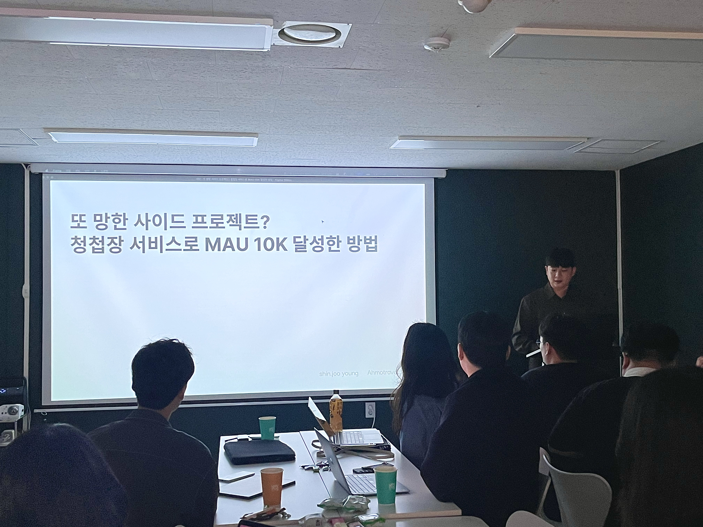

---

## 개발자와 사이드 프로젝트

이 글을 읽고 계신 분들 모두 저마다 사이드 프로젝트를 하나씩 가지고 계시거나 생각해보신 적이 있으실 거예요. 사이드 프로젝트는 개발자에게 떼려야 뗄 수 없는 존재인 것 같습니다.

신입일 때는 포트폴리오용으로, 회사에 다닐 때는 당장 적용하기 어려운 기술을 시도해보거나 개인적인 성장을 위해 꾸준히 하게 되죠. 저 역시 그래왔고요.

사이드 프로젝트를 할 때 세웠던 저의 제 1원칙이 있는데요. "이왕 만드는 거, 정말로 필요한 사람이 쓸 수 있고 그로 인해 편리한 경험을 제공하자"였습니다.

그런 마음가짐으로 시작했던 프로젝트들의 이야기를 지금부터 풀어보려고 합니다.

---

## 호기롭게 시작한 나의 첫 번째 사이드 프로젝트

### 시작 배경

2022년경 시작했던 프로젝트였어요. 당시 회사 일을 하던 중 교사인 형과 이야기를 나누다가 흥미로운 얘기를 들었습니다.

"요즘 학생들이 수시철만 되면 수시 경쟁률을 정말 많이 본대. 아무래도 대학교에 갈 인원들이 줄기도 하고, 학생들에게는 그것만큼 중요한 게 없으니 그렇겠지? 그런데 지금 학생들이 각 학교 사이트에 일일이 들어가서 경쟁률을 확인하는데, 이걸 한곳에서 보게 하는 게 어려울까?"

그 순간 생각했습니다. "어? 이거 별로 어려워 보이지 않는데?"

당장 생각했을 때는 별로 어려울 게 없었거든요. 그래서 시작한 게 첫 번째 프로젝트인 **"대학나와"**라는 웹사이트였습니다.

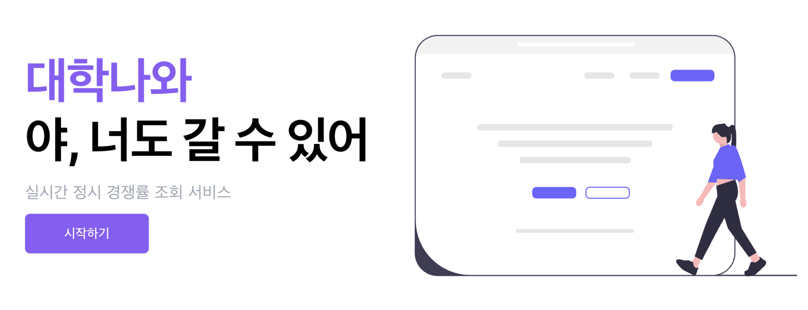

### 프로젝트 진행 과정

PMF, 즉 시장 검증은 확실해 보였습니다. 그래서 먼저 시작한 건 우리나라에 있는 대학교를 모두 수집하는 거였어요.

수집 후 각 사이트에 게재된 경쟁률 페이지를 크롤링하는 스크립트를 만들어 정기적으로 데이터를 수집했습니다. 그리고 제 사이트에서 테이블 형태로 한눈에 보여주는 거였죠.

로그인도 없고 페이지도 딱 하나였어요. 그 하나의 페이지에서 경쟁률별로, 대학별로, 과별로 한눈에 볼 수 있게 하는 프로젝트였습니다.

지금 돌이켜보면 정말 단순한 구조였지만, 당시에는 각 대학교 사이트마다 HTML 구조가 달라서 수십 개의 커스텀 크롤링 스크립트를 만드느라 2주를 밤새웠던 기억이 납니다.

### 홍보 전략

프로젝트를 시작한 후 별다른 마케팅 비용이 없었기 때문에, 많은 고등학생들이 이용하는 네이버 카페 '수만휘'에서 홍보했습니다. "경쟁률 어떻게 되나요?"라는 게시글이 올라오면 제 사이트 링크와 함께 경쟁률 정보를 알려주는 식이었어요.

그때는 몰랐는데, 이 경험이 나중에 세 번째 프로젝트에서 큰 도움이 됩니다.

### 놀라운 성과

운이 좋게도 니즈가 확실했는지, 하루 사용자가 4,000명에서 많게는 8,000명까지 들어오는 사이트가 되었습니다. "사용자에게 쓰일 수 있는 프로젝트를 만들자"는 목표를 성공한 첫 케이스였던 것 같습니다.

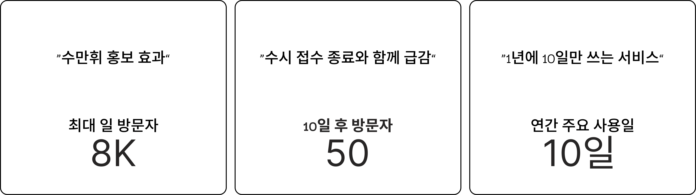

첫날 4,000명이 들어왔을 때의 그 짜릿함은 지금도 생생합니다. "아, 정말로 사람들이 필요로 하는 서비스를 만들었구나"라는 생각에 정말 뿌듯했거든요.

### 예상치 못한 문제들

하지만 이 프로젝트는 오래가지 못했습니다. 몇 가지 문제점이 있었는데요.

**첫 번째 문제: 계절성**

수시 기간 동안에만 폭발적으로 사용자가 몰리고, 수시 접수 기간인 7~10일이 지나면 사용할 일이 거의 없는 짧은 기간용 사이트였다는 점이었습니다. 8,000명이 들어오던 사이트가 수시 접수가 끝나자마자 50명으로 줄어드는 걸 보면서, 1년 중 350일은 거의 활용되지 않는 서비스라는 생각이 들었어요.

**두 번째 문제: 법적 리스크**

사용자가 폭발적으로 늘면서 주변 개발자 동료들이 "무단으로 크롤링 하는 게 법적으로 문제 없을까?"라는 우려를 제기했어요. 확인 결과, 야놀자와 여기어때 간 숙박 정보 크롤링으로 인한 법적 분쟁 사례가 있더라고요. 법적 문제에 휘말릴 수 있겠구나 싶었습니다. (2018년 시작된 이 법적 공방은 2022년에 무죄 판결이 나긴 했지만요.)

**세 번째 문제: 지속 가능성**

각 사이트별 크롤링 작업과 사이드 프로젝트에 들어간 시간을 고려했을 때, 1년 중 1~2주밖에 쓸 수 없다는 생각에 의욕을 잃은 게 가장 큰 서비스 종료 이유였습니다.

### 첫 번째 실패에서 배운 것

이 경험을 통해 배운 건 **니즈가 확실해도 지속 가능하지 않으면 사이드 프로젝트로는 한계가 있다**는 것이었습니다.

아무리 많은 사용자가 몰려도, 그게 1년에 10일밖에 안 된다면 사이드 프로젝트를 지속하기 어렵습니다. 무언가를 꾸준히 하려면 즐거워야 하는데, 지속성이 떨어지다 보니 동기부여가 잘 안 됐어요. 특히 혼자 운영하는 프로젝트라 더욱 그랬던 것 같습니다.

---

## 첫 번째에서 배운 것을 토대로! 두 번째 사이드 프로젝트 시작

### 새로운 원칙: 지속 가능성

첫 번째 프로젝트의 경험을 바탕으로 원칙을 세웠습니다. **"지속 가능한 사이드 프로젝트를 만들자."** 단기간의 서비스가 아닌 365일 사용자가 이용할 수 있는 서비스를 만들어 보자는 목표였고, 첫 번째 프로젝트는 혼자였기에 이번에는 함께할 사람들을 모아 더 완성도 있게, 더 꾸준하게 진행해보자는 마음으로 시작했습니다.

팀원들과 함께 고민한 끝에 간단하게 이용할 수 있는 **"서로 알아가고 싶은 상대가 있는 사람들을 위한 서비스"** 인 **위픽(WEPIK)** 을 시작하게 되었습니다.

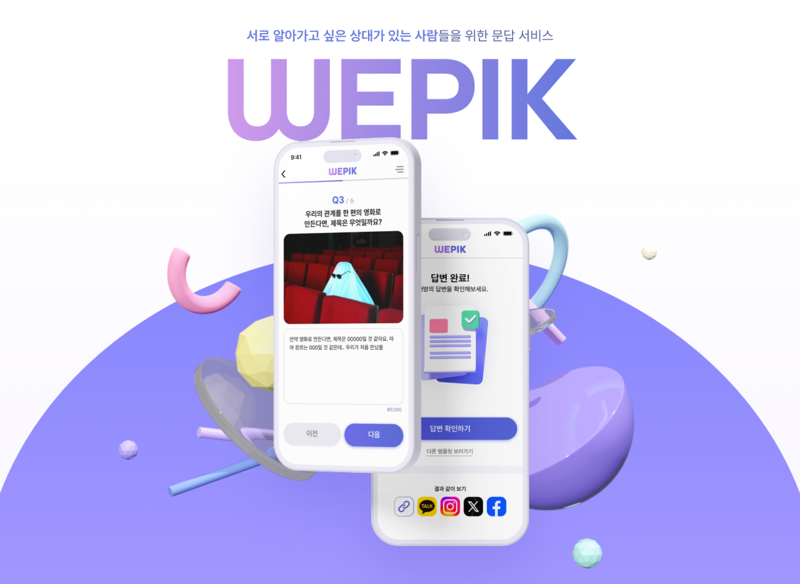

### 서비스 콘셉트

간단하고 재미있는 질문들을 친구들과 주고받으며, 서로의 답변을 확인하고 성향을 알아가는 서비스였어요. 연인들과 친구들이 재미있게 놀 수 있게 하는 서비스였죠. 프론트엔드 2명, 백엔드 2명, 디자이너 1명, 총 5명으로 시작했습니다.

### 역시 혼자보다는 여러 명이서 최고인가?

이번에는 팀원들이 있어서 빠르게 프로젝트를 만들 수 있었습니다. 각자 전문 분야가 있다 보니 퀄리티도 첫 번째 프로젝트보다 훨씬 높았고요. 4주 만에 MVP를 런칭했고, 주변 분들에게 홍보해서 첫 주에 2,100명 정도가 사용해주셨습니다.

### 예상치 못한 문제들

하지만 결과적으로 이 프로젝트도 종료하게 되었습니다.

**첫 번째 문제: 레드오션**

이런 서비스는 너무 많아서 사용자를 모으는 게 쉽지 않았습니다. 타깃이 명확하지 않았기 때문에 홍보도 어려웠어요. "재밌긴 한데 굳이?" 하는 반응이 대부분이었죠. 2주 차 리텐션이 5%밖에 되지 않았습니다.

**두 번째 문제: 팀 운영의 어려움**

각자 회사 생활과 개인 사정이 있다 보니 지속적으로 프로젝트를 하기 어려웠습니다. 사용자가 계속 늘었다면 팀원들도 의욕을 가지고 진행했겠지만, 그렇지 못했으니까요. 결국 3개월 후 하나둘씩 팀원들이 이탈하면서 서비스를 종료하게 되었습니다.

### 두 번째 실패에서 배운 것

두 번째 사이드 프로젝트를 마치며 개인적인 회고를 통해 배운 것은 아래와 같았습니다.

1. **"지속 가능하다고 해서 다가 아니다. 사용자가 정말로 필요로 하는 뾰족한 서비스여야 한다."**
2. **"팀 프로젝트는 빠른 개발이 가능하지만, 지속성을 담보하기 어렵다."**

---

## 두 번의 실패에서 얻은 3가지 원칙

첫 번째, 두 번째 시행착오를 겪으며 사이드 프로젝트를 위한 원칙이 명확해졌습니다.

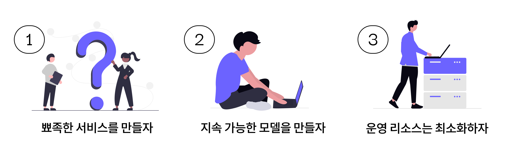

### 1원칙: 정말로 필요한 사람이 쓸 뾰족한 프로젝트를 만들자

단순히 "있으면 좋을 것 같은" 서비스가 아니라, "이게 없어서 정말 불편했다"는 명확한 페인 포인트를 해결하는 서비스를 만들자. 대학나와는 이 부분에서 성공했지만, 위픽은 그렇지 못해 사용자의 선택을 받을 수 없었습니다.

### 2원칙: 지속 가능한 사이드 프로젝트를 만들자

단기간만 쓸 수 있는 서비스가 아니라, 365일 언제나 사용할 수 있는 서비스여야 한다. 대학나와는 이 부분에서 실패했고, 위픽은 이 부분에서는 성공했습니다.

### 3원칙: 운영 리소스는 최소화하자

팀 의존성을 줄이고 개인의 실행력에 집중하자. 사이드 프로젝트의 특성상 각자의 삶이 있기 때문에 지속성을 담보하기 어렵다는 걸 깨달았어요. 저는 프론트엔드 개발자지만, 사이드 프로젝트에서 백엔드를 경험해보는 것도 실무에 도움이 될 거라고 판단했습니다.

---

## 이번에야말로!! 세 번째 사이드 프로젝트 시작

### 우연한 발견

2023년, 회사 업무로 바쁜 날을 보내던 어느 날, 제 GitHub에 star와 fork 알림이 계속 떴습니다. 확인해보니 3년 전에 만든 모바일 청첩장 오픈소스에 별이 92개나 있더라고요. 학생 시절에 올렸던 프로젝트라 코드 퀄리티나 UX/UI도 많이 부족했는데, 이렇게 많은 관심을 받고 있다는 게 신기했습니다.

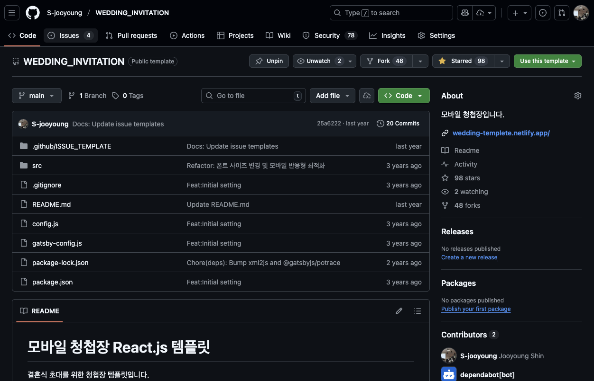

"개발자든 비개발자든 직접 모바일 청첩장을 만들고 싶어 하는 분들이 꽤 있구나"라는 걸 알게 되었어요.

### 시장 조사

그러다 이런 생각이 들었습니다. "정말 하나부터 열까지 만들고 싶어 하는 니즈가 있다면, 서비스 안에서 필요한 항목만 입력하면 청첩장을 만들어주는 건 없을까?"

자료 조사를 해본 결과, 이미 너무 많은 모바일 청첩장 서비스 업체가 있었어요. 많게는 20,000원에서 가장 저렴한 건 9,900원까지 비용을 받고 서비스를 제공하고 있었습니다.

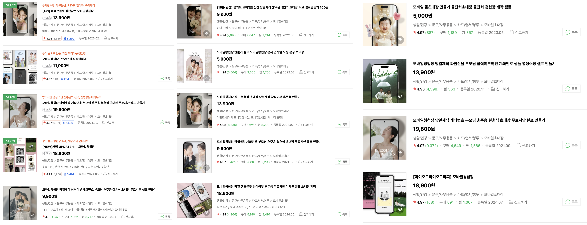

"특정 폼을 통해 필요한 값을 입력하고 생성 버튼을 누르면 청첩장이 나오는, 블로그 발행과 같은 원리일 것 같은데... 왜 이렇게 비쌀까?"

특히 자료 조사 중에 결혼 시장만 관련되면 과도한 비용을 요구하는 문화에 대해 기사가 나올 만큼 예비 신혼부부들이 겪는 경제적 부담이 사회적 문제로 대두되고 있더라고요.

해당 사이트들을 거의 다 둘러본 것 같은데, 충분히 혼자서도 이 정도의 퀄리티 혹은 그 이상으로 만들 수 있겠다는 생각이 들었습니다. 그리고 무엇보다, 앞서 말씀드렸던 **1원칙, 2원칙, 3원칙에도 모두 충족한다**고 생각해 진행하게 되었습니다.

### 3원칙 검증

- **1원칙(뾰족한 니즈)**: 청첩장은 결혼 준비의 필수이고, 무료 서비스에 대한 니즈가 명확함
- **2원칙(지속 가능성)**: 365일 언제나 결혼하는 분들이 있고, 계절성이 없음
- **3원칙(최소 인원)**: 혼자서도 충분히 개발 및 운영 가능

### 경쟁사 분석 및 기능 정리

모바일 청첩장을 무료로 배포하겠다고 생각하고 시작했지만 그걸로 끝이 아니었어요. 결혼 특성상 무료라고 퀄리티가 좋지 않으면 쓰지 않을 거라고 생각했습니다. 제가 결혼할 때 쓴다면 20,000원이라도 무료보다 유료가 퀄리티가 더 좋다면 유료를 구매했을 테니까요.

그래서 먼저 시작한 건 운영 중인 모바일 청첩장 사이트들의 기능 조사였습니다. 각 사이트들마다 공통된 기능은 무엇인지, 다른 기능은 무엇인지 정리했어요. 정리를 완료한 뒤 아름 서비스에는 어떤 기능들을 넣을지 정한 후 간단히 PRD를 작성했습니다.

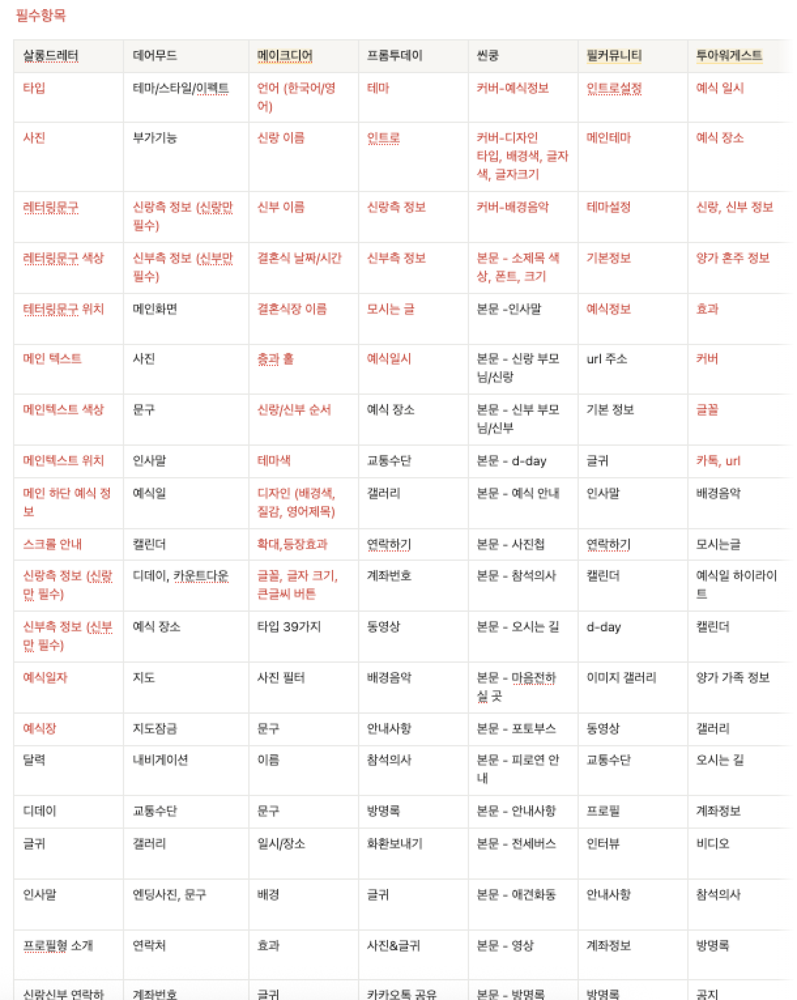

PRD를 작성하고 나니 어떤 기능들을 넣어야 하는지 명확해졌습니다. 이 과정이 정말 중요했던 것 같아요. 개발하면서 "이 기능도 넣을까? 저 기능도 넣을까?" 하는 기능 크리프를 방지할 수 있었거든요.

### 디자인 시스템 구축

그다음 디자인 작업을 진행했습니다. `shadcn/ui`라는 라이브러리를 토대로 디자인 작업을 했고(사이드 프로젝트 하시는 분들에게는 빛과 같은 존재... 감사합니다), 기본적인 컴포넌트들이 다 있었기 때문에 디자인하는 데 큰 어려움은 없었습니다.

로우파이 스타일로 완성한 후 메인 컬러들을 설정하고, 해당 컬러들로만 작업했어요. 다크 모드나 컴포넌트에 적용되어 있는 그림자 중 안 어울린다고 생각한 것들만 Figma 컴포넌트와 코드 베이스의 CSS를 제거했습니다.

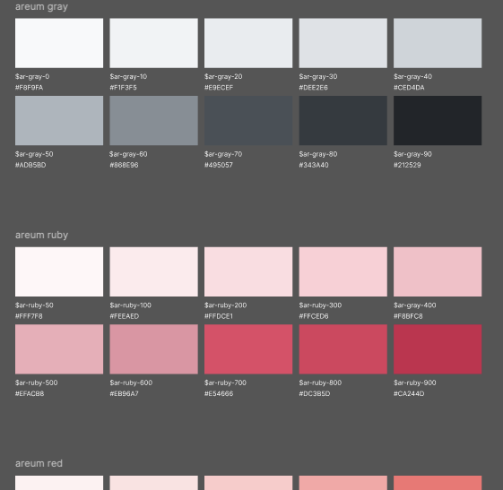

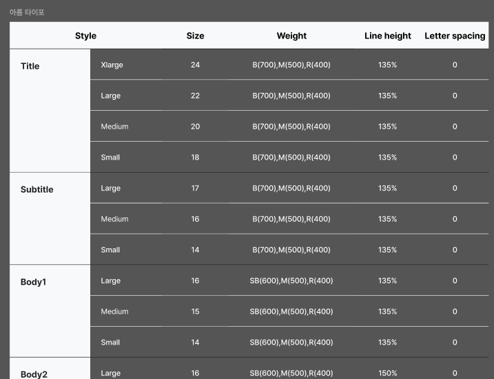

이렇게 간단히 디자인 시스템까지 연동이 완료되면, 화면 적용은 큰 어려움이 없습니다. 디자이너가 아니어도 `shadcn/ui` 덕분에 괜찮은 퀄리티의 UI를 만들 수 있었어요.

### 기술 스택 선택

디자인을 토대로 퍼블리싱을 완료한 후, 프론트엔드 개발자로서 가장 큰 복병이 찾아왔습니다. 바로 백엔드 API입니다. Node 기반으로 Nest 등의 프레임워크나 Next.js의 API 라우트를 사용하는 방법도 있지만, 최대한 간단하게 처리하고 싶었어요. 지속 가능해야 하니까요.

회사 퇴근이 늦어져 못할 때도 있고, 퇴근 후 한다고 해도 1~2시간 정도이기에 최대한 집중할 수 있는 부분에 집중하고 나머지는 간소화하려 했습니다. 그래서 발견한 게 대표적인 BaaS인 Firebase와 Supabase입니다.

Supabase에서 DB를 PostgreSQL로 쓸 수 있다는 것과, 요즘 핫하다는 것, 문서를 봤을 때 쉽게 사용할 수 있을 것 같다는 생각이 들어 Supabase를 선택했습니다.

**이 선택이 두고두고 좋았던 것 같아요.** Supabase의 자동 API 생성, 실시간 구독, Row Level Security 같은 기능들이 정말 편했거든요.

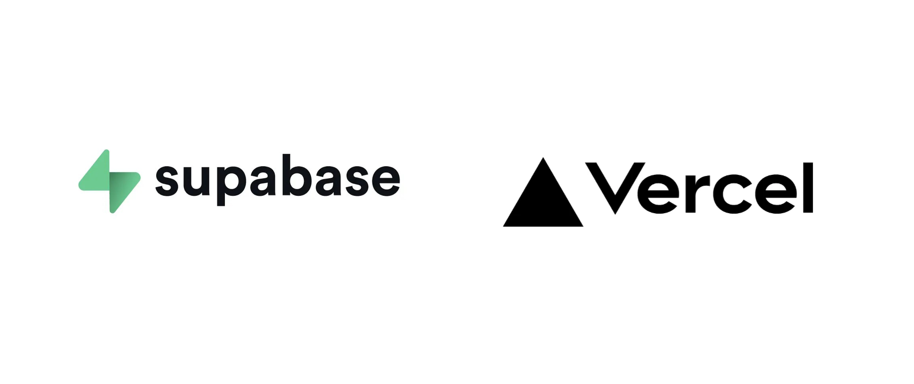

**기술 스택 정리:**

- **프론트엔드**: Next.js + TypeScript
- **UI 라이브러리**: shadcn/ui + Tailwind CSS
- **백엔드**: Supabase (PostgreSQL, Storage, Auth)
- **배포**: Vercel

새로운 기술을 배우고 싶은 유혹이 있었지만 참았습니다. 가장 익숙한 조합을 선택해서 개발 속도를 최대한 높이는 데 집중했어요.

### 개발 과정

퇴근 후 조금씩 꾸준히 개발했습니다. PRD가 명확하니까 기능 크리프도 없었고, 목업이 있으니까 UI 고민 시간도 줄었어요. 그렇게 2개월 정도 작업하며 완성 후 배포했습니다.

이 과정에서 복병도 있었는데요. shadcn/ui를 기반으로 한다고 해도 고객에게 보여질 청첩장 템플릿은 어떻게 예쁘게 만들지 너무 고민되고 잘 만들지도 못하더라고요. 그래서 함께 일하시는 쏘야 디자이너님께 해당 상황을 말씀드렸고, 감사하게도 제가 그리던 방향에 깊게 공감해주시며 디자인을 도와주셨습니다. 그 덕분에 더 완성도 높은 화면이 나올 수 있었습니다. Shout out 쏘야, 감사해요!

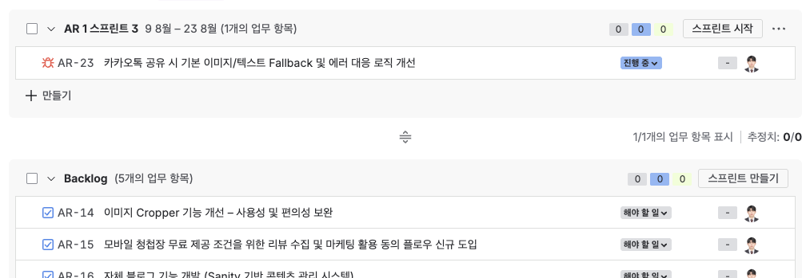

### 사이드 프로젝트에서 배우는 것들

사이드 프로젝트를 하면서 가장 많이 배우는 건 개발 외의 것들이었습니다. 회사에서는 유능한 PM, PO, 디자이너, 마케터 분들이 계셔서 개발에만 집중할 수 있죠. 기획에 개발자로서 참여하기는 하지만 메인은 아닙니다.

반면 사이드 프로젝트는 하나부터 열까지 모든 걸 스스로 해야 합니다. 실무 수준까지는 아니더라도, 작업하다 보면 각 포지션에 대한 이해도가 자연스럽게 높아지는 게 큰 장점이라고 느꼇습니다.

실제로 개발만 할 때는 '이렇게 해주는 게 더 좋을 것 같은데 왜 이렇게 하지?'라는 의문이 들 때가 있었는데요. 사이드 프로젝트를 하면서 다른 포지션의 관점을 이해하게 되니 그런 의문들이 자연스럽게 풀렸습니다. 이렇게 얻은 인사이트를 실무 회의에서 공유하면서 팀 전체에도 도움이 되었고요.

---

## 런칭 그리고 홍보

### 드디어 런칭

2024년 10월, 드디어 가장 나다움을 의미하는 순 우리말인 **'아름(Areum)'** 이라는 서비스를 런칭했습니다.

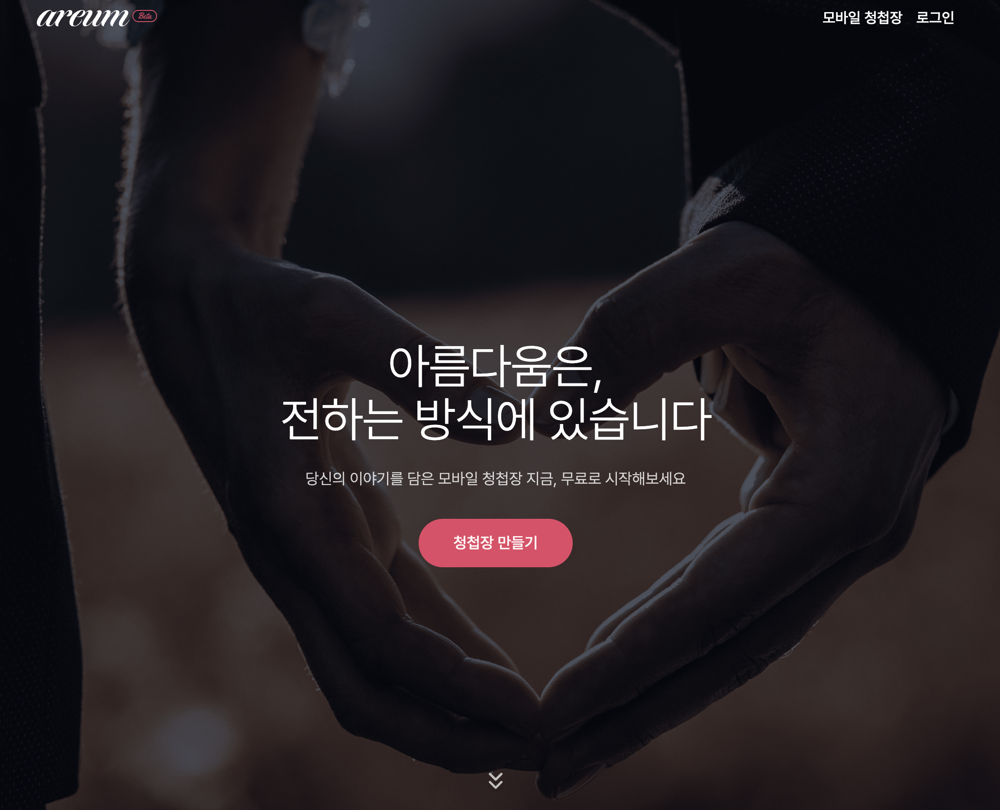

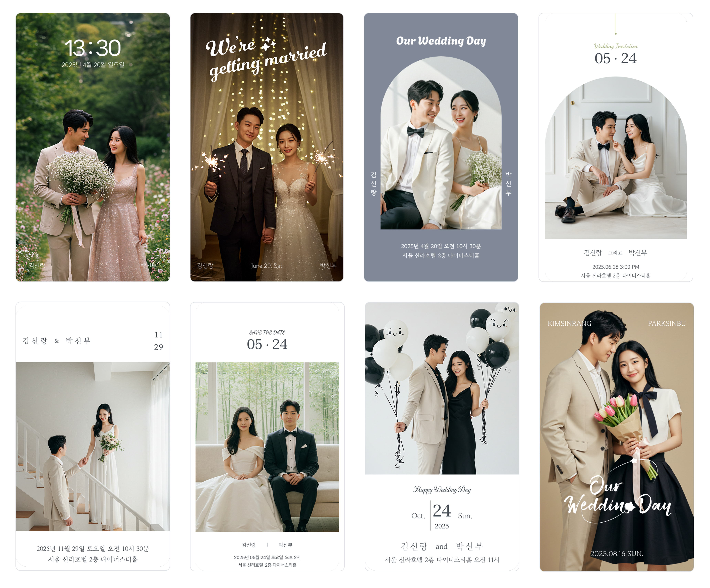

### 무료 홍보 전략

사이드 프로젝트를 열심히 만들었다고 해도 아무도 사람들이 알 수 없습니다. 사이드 프로젝트 홍보가 필요하죠. 또 사이드 프로젝트이기 때문에 홍보에 쓸 수 있는 돈은 거의 없습니다.

그보다는 초기에 첫 번째 홍보 방법이 성공했기에, 또 각 네이버 카페와 블로그를 통해 결혼 관련 카페들을 다 가입하여 댓글과 게시글을 쓰며 알렸습니다.

**타깃 카페:**

- 다이렉트 결혼 준비
- 짠순이 웨딩
- 웨딩킹
- 기타 결혼 준비 관련 커뮤니티들
- etc

### 효과적인 커뮤니티 홍보 방법

단순 홍보는 안 된다고 생각했어요. 먼저 커뮤니티에 도움이 되는 멤버가 되어야 한다고 생각했습니다. 다른 분들의 질문에 성실히 답변하고 유용한 정보를 공유하면서, 자연스럽게 제 서비스를 소개했죠.

"모바일 청첩장 어디가 좋아요?"라는 질문이 올라오면:

> "저는 최근에 아름이라는 무료 서비스 써봤는데 괜찮았어요. 샘플도 있으니 한번 확인해보시면 좋을 것 같아요!"

이런 식으로 절대 과장하지 않고, 솔직한 사용 후기처럼 작성했습니다.

지금까지 해본 방법 중 가장 비용 대비 효과가 좋았던 것 같아요. 실제로 내 서비스를 필요로 하는 사람들이 모여 있는 곳이니까요.

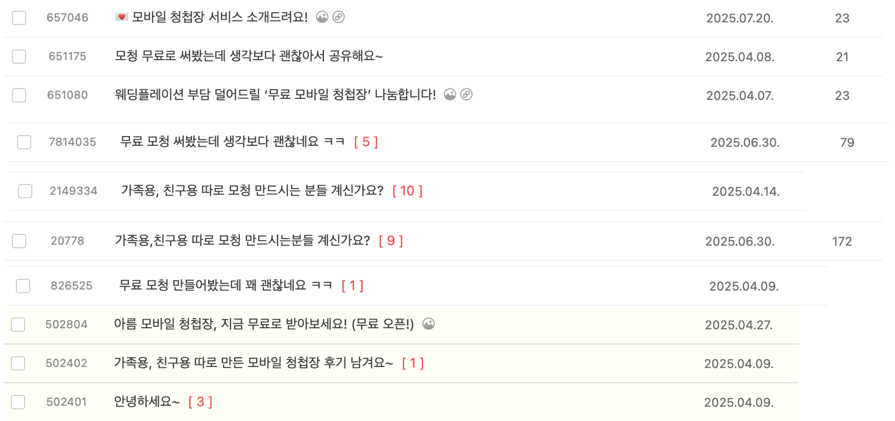

### SNS 활용

그렇게 카페에서 열심히 활동하다 보니 "무료인데도 너무 좋다"라는 댓글들과 함께 호응을 얻었습니다. 이후 LinkedIn, Instagram 등 다른 SNS에서도 홍보를 이어갔고요.

비용 없이 스스로 홍보하기에는 이런 SNS 플랫폼을 강력 추천합니다.

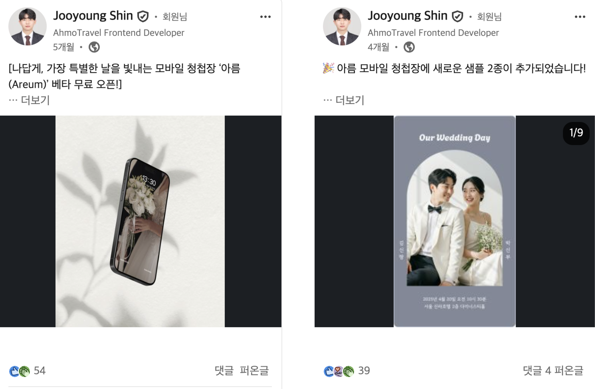

### 초기 반응

출시 직후 300~400명 정도가 유입되었습니다. 하지만 게시글과 SNS에 올린 날만 반짝 사용자가 늘어날 뿐, 홍보하지 않는 날에는 100명, 50명으로 급격히 줄어들더라고요. 그래도 시간 날 때마다 홍보하려고 노력했습니다. 홍보한 날에는 300명 정도의 방문자가 있었으니까요.

---

## 갑작스럽게 마주친 도전들

### 버그와 이슈 대응

배포 후 사용자가 늘어나면서 버그 제보가 쏟아지기 시작했습니다. 그냥 "동작이 안 되네" 하고 나가실 수도 있는데, 너무나 감사하게도 많은 분들이 직접 메일로 문제를 제보해주셨습니다.

Sentry를 통한 에러 모니터링, 사용자 제보, 그리고 제가 직접 찾은 문제들까지... 충분한 QA를 거치지 못해 생긴 단순 버그부터 아예 고려하지 못했던 이슈들까지, 1달 넘게 버그 수정에만 매달렸던 것 같습니다.

**예를 들면:**

- 특정 폰트에서 한글이 깨지는 문제
- 이미지 최적화 문제
- 다양한 해상도에서의 레이아웃 깨짐 현상
- 특정 브라우저에서의 호환성 문제
- etc × 100

이런 문제들을 하나하나 해결해가는 과정이 힘들기도 했지만, 동시에 많이 배울 수 있었습니다.

### 보람을 느낀 순간들

그렇게 꾸준히 서비스를 운영하면서 "좋은 서비스를 무료로 제공해주셔서 감사하다"는 메시지를 받을 때마다 큰 보람을 느꼈습니다. 지속적으로 기능을 추가할 아이디어도 떠올랐고, 힘들지만 즐겁게 서비스를 이어갈 수 있겠다는 확신도 생겼습니다.

특히 기억에 남는 피드백 중 하나는:

> "다른 곳은 15,000원이나 받는데 무료로 이렇게 좋은 서비스 만들어주셔서 정말 감사합니다. 덕분에 부담 없이 청첩장 만들었어요!"

이런 메시지를 받을 때마다 '아, 내가 작지만 의미 있는 일을 하고 있구나' 싶었습니다. 제가 해결하고자 했던 문제를 고객들도 정말로 체감하고 계시다는 걸 느낄 수 있었거든요.

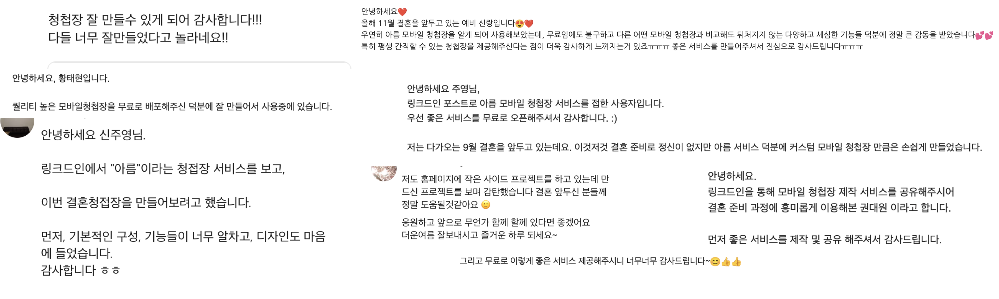

---

## 예상치 못한 비용 문제

### 인프라 비용 발생

어느 정도 시간이 지나고 나서는 따로 홍보를 하지 않았습니다. 그런데도 입소문을 통해서인지 사용자가 조금씩 계속 증가했어요. 너무나 감사한 일이었지만, 사이드 프로젝트를 하며 처음 마주하는 문제가 발생했습니다.

바로 인프라 비용이었습니다. Vercel 무료 티어와 Supabase를 사용하고 있었는데, 모바일 청첩장 서비스 특성상 한 사람당 최대 40장의 고화질 이미지가 등록되다 보니 문제가 생긴 거죠.

**발생한 비용:**

- Supabase 무료 DB 용량 초과 → Pro 플랜 전환 ($25/월)
- Vercel Image Optimization 사용량 초과 → Pro 플랜 전환 ($20/월)
- 총 월 $45-60 정도의 비용 발생

엄청 큰 금액은 아니었지만, 무료 서비스를 운영하면서 매달 고정 비용이 나가기 시작했습니다. 특히 Vercel은 Pro 플랜 외에도 이미지 최적화마다 추가 요금이 붙어서, 사용자가 늘어날수록 비용도 계속 증가하는 구조였어요.

사용량이 더 많아지면 서버 비용도 더 늘어날 게 뻔했고, 이 비용이 점점 부담으로 다가왔습니다.

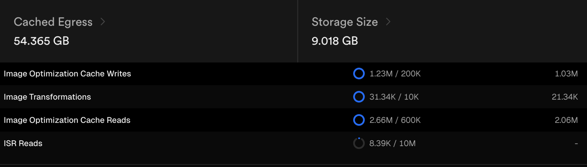

### 비용 최적화 시도

Supabase는 너무 편해서 유지하기로 했고, Vercel은 Image Optimization 초과로 인한 비용이 가장 문제였습니다. 그래서 CloudFront CDN 같은 서비스로 이미지 최적화만 따로 처리하면 어느 정도 비용을 줄일 수 있을 거라 생각했죠.

하지만 결론적으로 Vercel과 Supabase를 그대로 유지하기로 했습니다. 해당 방법으로 비용을 어느 정도 줄일 수는 있겠지만, 어차피 Pro 요금제를 써야 하는 건 마찬가지였고, Vercel이 너무 편했거든요.

이미지 최적화도 Pro 할당량을 넘어서 추가 요금이 나오고 있었지만 그 금액은 크지 않았습니다. 다행히 그즈음 Vercel에서 기본 최적화 할당량을 늘려주어 문제가 어느 정도 해소되기도 했고요.

### 수익 모델 고민

무료로 서비스하기로 했지만, 지속적으로 서버 비용을 사비로만 충당하기에는 부담이 되었습니다. 그래서 자연스럽게 수익 모델을 고민하게 되었어요. 물론 무료 서비스라는 원칙은 지키는 선에서요.

**고민했던 옵션들:**

1. 광고 삽입 → ❌ 사용자 경험 저해
2. 유료 전환 → ❌ 프로젝트 취지에 어긋남
3. 프리미엄 기능 → ❌ 결혼 특성상 차별화 부적절

가장 먼저 생각한 건 광고였습니다. 하지만 결국 포기했어요. 광고가 신혼부부의 사용자 경험을 해칠 거라고 판단했기 때문입니다.

무엇보다 청첩장 서비스 특성상, 신혼부부가 편집하면서 생기는 조회수보다는 청첩장을 받아보는 하객들의 조회수가 훨씬 많습니다. 광고 수익을 제대로 내려면 하객들에게도 광고를 노출해야 하는데, 그렇게 되면 서비스에 큰 타격이 있을 거라 판단했죠. 제가 사용자라도 가장 예쁘게 보여야 할 청첩장에 광고가 뜨면 쓰고 싶지 않을 테니까요.

---

## 돌파구: 화환 서비스

### 아이디어의 시작

좋은 방법이 없을까 고민하다 생각해낸 것이 **화환 서비스**였습니다. 청첩장을 받은 하객 중에 화환을 보내고 싶은 분들이 분명 있을 테니까요. 저 또한 친구들 결혼식에 화환을 보낸 경험이 있었고요.

실제로 화환을 보내려면 업체에 연락해서 언제, 어디로, 어떤 화환을 보낼지 알려주고 결제하는 과정이 꽤 번거로웠던 기억이 있었습니다.

### 서비스 통합의 이점

그런데 이 서비스를 청첩장 안에 통합하면 어떨까요? 청첩장에는 이미 **일시와 장소** 정보가 있으니, 하객은 **어떤 화환을 보낼지만 선택**하고 **결제**만 하면 됩니다. 자동으로 화환이 배송되는 거죠.

사용자 입장에서는 편리한 기능이고, 저는 화환 결제 시 일부 수수료를 받을 수 있으니 양쪽 모두에게 좋은 구조라고 판단했습니다.

### 실행 과정

부랴부랴 화환 서비스를 운영하는 업체들을 찾아 비교하고, 적합한 곳과 계약해 배포했습니다. 큰 금액은 아니지만 서버 비용을 어느 정도 감당할 수 있게 되었고, 이로써 비용 문제가 해결되어 안정적으로 서비스를 운영할 수 있게 되었습니다.

간단하게 적었지만 이때 정말 고민이 많았습니다. '그냥 조금이라도 유료로 전환할까... 광고를 조금만 넣어볼까...' 사용자 경험을 해치지 않으면서 서버비를 충당할 방법을 찾기 위해 수십 번 고민하고 포기하기를 반복했던 것 같아요.

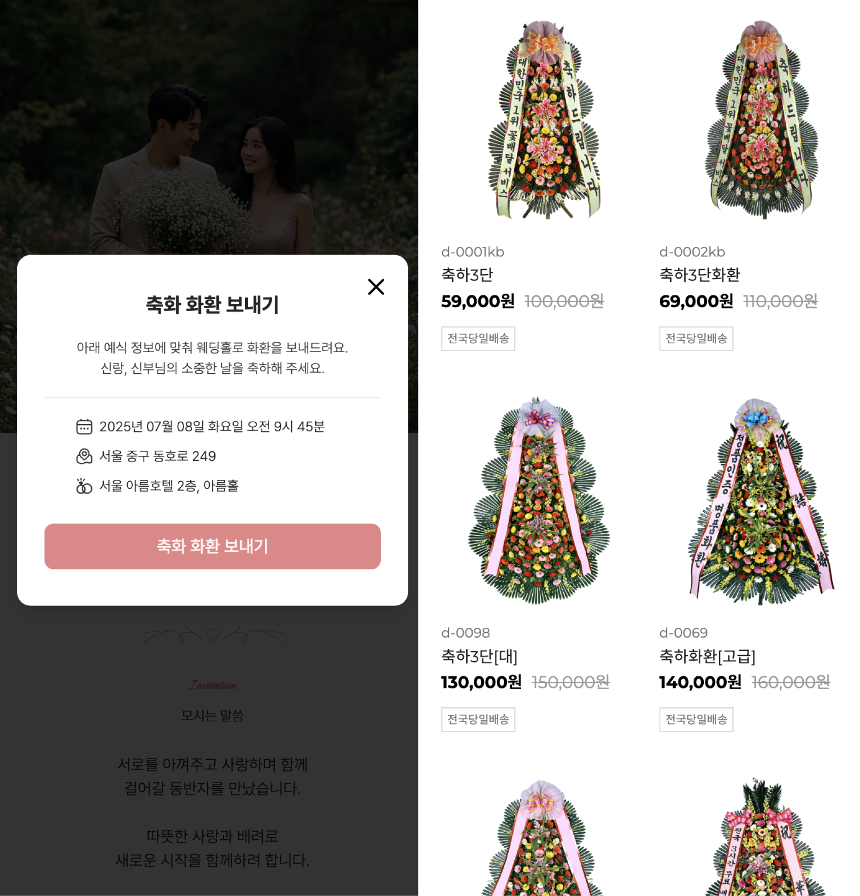

---

## 현재의 성과

이렇게 하다 보니 스냅샷 전문 업체인 "에하 스냅"에서 협업 제안이 왔고, 지금까지 쌓인 입소문과 함께 많은 날에는 **하루 1,000명 이상**이 이용하는 서비스가 되었습니다.

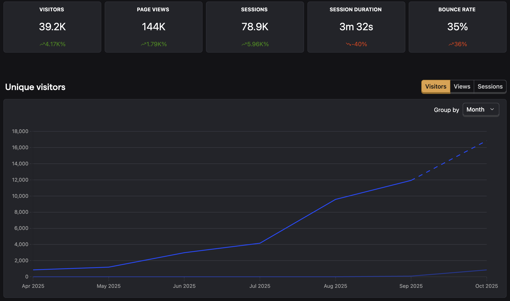

아직 초기 프로젝트이고 해결해야 할 문제도, 추가해야 할 기능도 많지만, 제 기준에서는 **성공한 사이드 프로젝트**가 되었다고 생각합니다.

**현재 계획 중인 기능들:**

- 방명록 기능 고도화
- 축의금 계좌 관리 기능
- 다양한 템플릿 추가

---

## 돌아보며: 실패는 실패가 아니었다

지금까지 제가 사이드 프로젝트를 운영했던 경험들을 나눠드렸는데요. 돌이켜 보면 **첫 번째, 두 번째 프로젝트 모두 실패가 아닌 하나의 과정이었다**고 생각합니다.

### 각 프로젝트에서 배운 것

**대학나와에서 배운 것:**

- 타깃 커뮤니티 공략법
- 뾰족한 니즈의 중요성
- 계절성 위험 인식
- 크롤링과 법적 이슈

**위픽에서 배운 것:**

- PMF의 중요성
- 최소 인원 운영의 필요성
- 레드오션 회피 전략

**아름에서 적용한 것:**

- 앞선 두 프로젝트의 모든 교훈
- 체계적인 접근 (PRD, 경쟁사 분석)
- 효율적인 기술 스택 선택
- 지속 가능한 수익 모델

이전 프로젝트의 좋았던 점과 개선할 점을 생각하며 다음 프로젝트를 기획하고 개발했기 때문에, 매번 더 나은 결과를 만들 수 있었습니다.

---

## 사이드 프로젝트를 하며 배운 것들

### 1. 기술이 전부가 아니다

아름 모바일 청첩장 서비스는 사실 기술적으로 대단한 것도, 혁신적인 아이디어도 아니었어요. 그저 무료로 배포할 수 있다고 생각한 걸 실천으로 옮겼을 뿐입니다. 하지만 그게 누군가에게는 정말 필요한 서비스였던 거죠.

### 2. 체계적 접근이 속도를 높인다

체계적으로 접근한 것도 큰 도움이 됐어요. 회사에서 배운 방식이지만 사이드 프로젝트에도 똑같이 적용됩니다. 사이드 프로젝트라고 바로 개발하기보다는 완벽하지 않더라도 간단한 PRD를 작성하고, 경쟁사를 분석하고, 디자인 시스템을 만들고... 이런 과정이 오히려 개발 시간을 단축시켰습니다. 개발 중에 "이거 어떻게 하지?" 하는 고민이 줄어드는 것만으로도 생산성이 크게 달라지더라고요.

특히 혼자 작업할 때도 Jira를 사용해 PRD 내용을 티켓으로 만들어 처리했어요. 그러니 시각적으로 진행 상황을 확인할 수 있었고, 의욕이 떨어질 때도 완료한 티켓들을 보며 계속 나아갈 수 있었습니다.

### 3. 개발자도 PM이 되어야 한다

요즘은 AI 도구들이 코딩을 많이 도와주잖아요. Cursor나 Claude Code 같은 도구 덕분에 개발 속도가 정말 빨라졌죠. 그래서 이제는 개발자도 **'어떻게 코딩할까'**보다 **'무엇을 만들까, 왜 만들까'**를 고민하는 PM의 역할을 해야 하는 시대가 된 것 같아요.

아름 서비스를 만들 때만 해도 이 정도는 아니었는데, 지금은 너무 발전했고 앞으로 얼마나 더 발전할지 궁금하네요. 현재 다니는 회사에서도 이제는 개발보다 기획과 설계에 더 많은 시간을 쓰고 있습니다.

### 4. 지속 가능성이 핵심이다

사이드 프로젝트는 결국 혼자서, 퇴근 후에, 주말에 하는 거잖아요. 그래서 지속 가능하지 않으면 금방 포기하게 됩니다. 기술 스택 선택부터 기능 범위 설정까지 모든 것을 지속 가능성 관점에서 봐야 해요. 꾸준함의 힘이 정말 크더라고요. 정신 차리고 보니 거의 다 완성되어 있었습니다.

### 5. 사용자 피드백이 성장의 원동력이다

가끔 사용자분들이 감사 메일을 보내주실 때, "덕분에 부담 없이 청첩장 만들었다"는 메시지를 받으면 정말 뭉클해요. 이런 피드백이 새벽까지 버그를 잡고 주말에 새 기능을 개발하는 원동력이 됐습니다. 제 서비스를 지금 이 순간에도 누군가 사용하고 있다는 생각이 들면, '오늘은 조금 쉴까' 싶을 때도 '조금이라도 하자'며 컴퓨터를 켰던 것 같아요.

---

## 마치며

사이드 프로젝트를 하면서 배운 가장 좋은 점은 실패해도 괜찮다는 거예요. 회사에서는 기획과 개발을 완료하고 KPI가 안 나오면 그게 바로 팀의 성과로 이어지고 뼈아프지만, 사이드 프로젝트는 부담 없이 시작해볼 수 있다는 점이 큰 매력입니다.

그리고 모든 프로젝트에서의 성과는 좋든 나쁘든 개인의 성장으로 이어진다고 느꼈습니다. 저 또한 첫 번째 프로젝트의 경험으로 두 번째를 더 깊이 고민하게 되었고, 두 번째 경험이 세 번째인 아름 서비스로 이어졌습니다. 앞의 서비스들이 있었기에 세 번째는 다르게 접근할 수 있었어요. 실패는 실패가 아니라 다음을 위한 준비 과정이었던 거죠.

아름 서비스를 운영하면서도 계속 배우고 있습니다. 사용자가 많아지니 예상 못한 문제들이 나타나고, 하루에도 몇 건씩 문의를 처리하는 것도 일이 되더라고요. 이런 '행복한 고민'을 할 수 있다는 것 자체가 감사한 일입니다.

여러분도 만들고 싶은 게 있다면, **일단 시작해보세요**. 완벽하지 않아도 괜찮습니다. 거창하지 않아도 됩니다. 그저 누군가에게 도움이 되는, 작지만 확실한 가치를 제공하는 것. 그것만으로도 충분합니다.

여러분의 사이드 프로젝트는 어떤가요? 서로의 경험을 나누며 좋은 인사이트를 얻을 수 있으면 좋겠습니다. 아름 서비스도 한번 경험해보시고 피드백 주시면 큰 힘이 될 것 같습니다.

제 부족한 경험이 여러분께 조금이나마 도움이 되었으면 좋겠습니다. 긴 글 읽어주셔서 감사합니다! 🙏

---

## 아름 서비스 경험해보기

🔗 서비스 링크: [https://www.areum.co.kr/](https://www.areum.co.kr/)

여러분의 소중한 피드백을 기다립니다. 문의 사항이나 개선 제안이 있으시다면 언제든 [jooyoung.dev@gmail.com](mailto:jooyoung.dev@gmail.com)로 연락 주세요!

 

**위 글을 읽으시면서 궁금하신 점이 있다면 아래 `댓글`로 남겨주세요!👇**
