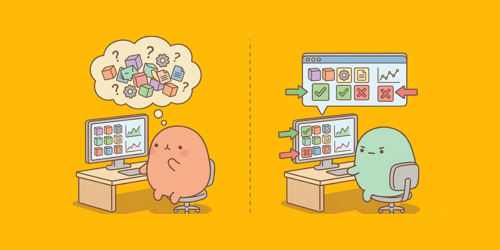

> 16개의 Claude 에이전트가 2,000번의 세션을 거쳐 10만 줄의 C 컴파일러를 만들었다는 이야기, 들어보셨나요? 저도 처음엔 "와, AI가 컴파일러까지 만드네"에서 멈췄었거든요. 그런데 원문을 읽어보니 진짜 놀라운 건 결과물이 아니었습니다. **개발자가 한 일이 "코드 작성"이 아니라 "환경 설계"였다**는 거예요.
>
> 이번 글에서는 이 프로젝트가 보여준 핵심 교훈 — 테스트, CI/CD, 문서를 AI 에이전트 관점에서 재설계해야 한다는 이야기를 정리하고, 여러분의 프로젝트에 바로 적용할 수 있는 실전 설정까지 공유해보려 합니다.

<!-- 🎨 Gemini 이미지 생성 프롬프트:
Cute kawaii illustration, soft pastel colors, wide aspect ratio 1200x630. A round peach blob character wearing a tiny hard hat, standing proudly next to a tall tower of colorful building blocks labeled with tiny symbols (gears, checkmarks, documents). Several smaller mint and cream blob characters working together around the tower, carrying tiny tools. Solid warm amber (#FFBA07) background. Simple, clean, minimal details, soft drop shadows. Molang/Sumikko Gurashi inspired style. No text.
→ 파일명: thumbnail.png -->

---

## 먼저, 이 프로젝트가 뭐였는지

2026년 2월, Anthropic이 [Building a C Compiler with Agent Teams](https://www.anthropic.com/engineering/building-c-compiler)라는 엔지니어링 블로그를 공개했습니다. 요약하면 이래요.

| 항목                | 수치                     |
| ------------------- | ------------------------ |
| **투입된 에이전트** | Claude 16개 (동시 실행)  |
| **총 세션 수**      | 약 2,000회               |
| **비용**            | 약 $20,000               |
| **코드 규모**       | 10만 줄+                 |
| **결과**            | Linux 6.9 커널 빌드 성공 |

Claude 에이전트들이 C11 표준의 상당 부분을 구현한 컴파일러를 만들었고, 실제로 Linux 커널을 컴파일하는 데 성공했습니다. [GitHub에 코드도 공개](https://github.com/anthropics/claudes-c-compiler)되어 있어요.

하지만 이 글에서 제가 주목한 건 "컴파일러를 만들었다"가 아니에요. **사람이 한 일이 뭐였는지**가 더 흥미로웠거든요.

## "노력의 대부분이 Claude 주변의 환경 설계에 들어갔다"

원문에서 가장 인상적이었던 문장이 있어요.

> "Much of the effort went into designing the scaffolding around Claude — tests, environment, and feedback — so Claude could orient itself without human help."

**스캐폴딩이 루프를 돌리지만, Claude가 스스로 진전 방법을 판단할 수 있어야 유용하다.** 사람이 매번 방향을 잡아주는 게 아니라, AI가 테스트 결과를 보고 "이건 성공이니 다음으로", "이건 실패니 이렇게 수정"을 스스로 판단할 수 있는 환경을 만드는 게 핵심이었다는 거예요.

구체적으로 뭘 바꿨는지 하나씩 살펴볼게요.

### 테스트 출력을 최소화했다

기존 테스트 하네스는 수천 바이트의 로그를 stdout에 뿜어내고 있었어요. 사람이 디버깅할 때는 유용하지만, AI 에이전트한테는 **컨텍스트 윈도우 오염**이거든요. 128K 토큰짜리 컨텍스트에 쓸모없는 로그가 수천 줄 들어가면, 정작 중요한 에러 메시지를 놓치게 돼요.

그래서 Anthropic 팀은 **stdout에는 핵심 정보만 출력하고, 상세 로그는 파일에 기록**하는 방식으로 바꿨다고 해요.

### 매 세션의 브리핑 문서를 유지했다

이 프로젝트에서는 16개 에이전트가 각각 독립된 컨테이너에서 실행됐어요. 에이전트 A가 만든 코드를 에이전트 B가 이어서 작업하는 구조인데, B는 A가 뭘 했는지 전혀 모르는 상태로 투입돼요.

그래서 에이전트에게 **README와 progress 파일을 자주 업데이트하라**는 지시를 포함시켰다고 해요. "이 프로젝트가 지금 어떤 상태이고, 다음에 뭘 해야 하는지"를 매번 기록해두면, 새로 투입되는 에이전트가 컨텍스트 없이도 바로 작업을 시작할 수 있으니까요.

### CI에서 기존 코드를 깨는 커밋을 차단했다

새 기능을 구현하면 기존 기능이 자주 깨졌다고 해요. 사람이라면 "아, 이거 내가 방금 건드린 부분이 영향을 줬구나" 하고 직감적으로 알 수 있지만, AI 에이전트는 그런 맥락이 없거든요. 자기가 맡은 기능만 통과하면 커밋해버리는 거죠.

그래서 Anthropic 팀은 **CI에 엄격한 가드레일**을 설치했어요. 커밋할 때마다 기존 테스트 전체를 실행해서, 하나라도 깨지면 커밋 자체를 차단하는 방식이에요.

### 테스트 검증기의 정확도가 거의 완벽해야 했다

이건 당연한 것 같으면서도 중요한 포인트예요. 테스트가 거짓 양성(false positive)을 내면 — 실제로는 맞는 코드인데 실패로 뜨면 — Claude는 **잘못된 문제를 풀기 시작해요**. 정상인 코드를 "고치려고" 이리저리 수정하다가 오히려 망가뜨리는 거죠. 테스트가 정확해야 AI가 올바른 방향으로 움직일 수 있어요.

<!-- 🎨 Gemini 이미지 생성 프롬프트:
Cute kawaii illustration, soft pastel colors. A cream blob character wearing tiny glasses, carefully building a fence (guardrail) around a group of smaller mint blob characters who are coding on tiny laptops. The fence has checkmarks on each post. A peach blob character watches from a hill, holding a clipboard. Solid warm amber (#FFBA07) background. Simple, clean, minimal details, soft drop shadows. Molang/Sumikko Gurashi inspired style. No text.
→ 파일명: guardrail-design.png -->


## 패러다임 전환 — "인프라의 소비자가 AI가 되었다"

이 프로젝트에서 제가 읽어낸 핵심은 이거예요. **개발 인프라를 소비하는 주체가 사람에서 AI로 바뀌었다**는 것.

| 인프라          | 기존 (소비자 = 사람)                   | 지금 (소비자 = AI 에이전트)                            |
| --------------- | -------------------------------------- | ------------------------------------------------------ |
| **테스트**      | 코드가 맞는지 사람이 확인하는 도구     | AI가 성공/실패를 판단하는 **시그널**                   |
| **CI/CD**       | 사람이 안심하고 배포하기 위한 안전장치 | AI가 기존 기능을 깨지 못하게 하는 **가드레일**         |
| **README**      | 프로젝트 소개 문서                     | 컨텍스트 없이 들어오는 에이전트를 위한 **브리핑 문서** |
| **커밋 메시지** | 팀원이 히스토리를 추적하는 기록        | 다음 에이전트가 변경 의도를 파악하는 **인수인계서**    |

이 관점에서 보면 시니어 엔지니어의 역할이 좀 더 선명해져요. **에이전트가 안전하게 무거운 일을 할 수 있는 "하네스"를 설계하는 것** — 아키텍처 경계, 테스트 스위트, 성공 기준을 정의하는 거죠.

Claude Code 제작자 Boris Cherny도 비슷한 이야기를 했어요. "가장 중요한 팁은 Claude에게 피드백 루프를 통해 작업을 검증할 수 있는 방법을 주는 것"이라고요. 이것만으로 최종 결과의 품질이 **2~3배 향상**됐다고 해요. Anthropic 내부에서도 PR 리뷰 중 Claude가 실수하면 CLAUDE.md에 규칙을 추가해서 같은 실수가 반복되지 않게 하는데, 말하자면 **모든 실수가 규칙이 된다**는 접근이에요.

<!-- 🎨 Gemini 이미지 생성 프롬프트:
Cute kawaii illustration, soft pastel colors. Two side-by-side scenes. Left: a peach blob character (human) looking at a monitor showing test results, with a thinking bubble. Right: a mint blob character (AI agent) looking at the same monitor but with arrows pointing to specific pass/fail signals, looking determined. A soft dotted line divides the two scenes. Solid warm amber (#FFBA07) background. Simple, clean, minimal details, soft drop shadows. Molang/Sumikko Gurashi inspired style. No text.
→ 파일명: paradigm-shift.png -->



## 실전에서 어떻게 적용하나

여기서부터는 여러분의 프로젝트에 바로 적용할 수 있는 설정과 프롬프트를 공유할게요. 단순 팁이 아니라 **AI가 스스로 검증하고 방향을 잡을 수 있는 환경**을 만드는 데 초점을 맞췄어요.

### 1. CLAUDE.md — AI가 자기 작업을 검증하는 워크플로우

`CLAUDE.md`는 Claude Code가 프로젝트에서 작업할 때 읽는 설명서예요. 여기에 **검증 워크플로우를 명시**하면, Claude가 코드를 변경할 때마다 스스로 테스트를 돌리고, 실패하면 수정하고, 통과할 때까지 반복해요.

```markdown
# CLAUDE.md

## Verification Workflow

모든 코드 변경 후 반드시 아래 순서로 검증하라:

1. `npm test` 실행 — 실패하면 수정 후 재실행, 통과할 때까지 반복
2. `npm run typecheck` 실행 — 타입 에러 0개 확인
3. `npm run lint` 실행 — 린트 에러 0개 확인
4. 위 3개가 모두 통과하면 변경 사항을 요약하고 완료 보고

## Test Output Rules

- 테스트 실패 시 stdout에는 실패한 테스트명과 에러 메시지만 출력
- 전체 스택트레이스는 `test-output.log`에 기록
- "Expected X, got Y" 수준의 구체적 assertion 메시지를 작성할 것
- "Tests failed" 같은 모호한 메시지 금지

## CI Guard

- 기존 테스트를 깨뜨리는 변경은 절대 커밋하지 않는다
- 새 기능 추가 시 반드시 관련 테스트를 먼저 작성한다
```

여기서 핵심은 "실패하면 수정 후 재실행, 통과할 때까지 반복"이라는 한 줄이에요. 이게 있고 없고의 차이가 큽니다. 이 한 줄이 없으면 Claude는 테스트가 실패해도 "실패했습니다"라고 보고만 하거든요. 있으면 스스로 피드백 루프를 돌립니다.

### 2. STATUS.md — 에이전트를 위한 브리핑 문서

C 컴파일러 프로젝트에서 각 에이전트가 컨텍스트 없이 새 컨테이너에 투입됐던 것처럼, Claude Code도 매 세션이 새로 시작돼요. 이전 세션에서 뭘 했는지 기억하지 못하거든요.

`STATUS.md`를 프로젝트 루트에 두고, 작업이 끝날 때마다 업데이트하면 다음 세션이 바로 이어서 작업할 수 있어요.

```markdown
# STATUS.md

## 프로젝트 현재 상태

- 마지막 업데이트: 2026-03-14
- 현재 작업 브랜치: feature/payment-refactor

## 완료된 작업

- [x] 결제 API 엔드포인트 마이그레이션

## 진행 중

- [ ] 결제 실패 시 재시도 로직 (src/payments/retry.ts)
  - 현재 상태: 기본 구조 작성됨, 테스트 3개 중 1개 실패
  - 실패 원인: timeout 케이스 미처리

## 건드리면 안 되는 것

- src/payments/legacy/ — 마이그레이션 전까지 수정 금지
- .env.production — 절대 수정하지 말 것
```

`CLAUDE.md`에 아래 한 줄을 추가하면 매 세션마다 자동으로 이 파일을 읽고, 작업 후 업데이트해요.

```markdown
## Context for New Sessions

- 새 세션 시작 시 반드시 `STATUS.md`를 먼저 읽어라
- 작업 완료 후 `STATUS.md`를 업데이트하라
```

사람을 위한 README가 아니라, **매 세션 시작마다 "지금 뭘 해야 하는지" 즉시 파악할 수 있는 에이전트용 브리핑 문서**인 거죠.

### 3. 테스트 출력을 AI 친화적으로 바꾸는 프롬프트

기존 테스트가 사람용으로 verbose한 출력을 하고 있다면, Claude Code에게 이렇게 요청해보세요.

```
현재 테스트 스위트의 출력 형식을 AI 친화적으로 개선해줘:
1. 성공한 테스트는 카운트만 (예: "42 passed")
2. 실패한 테스트만 상세 출력 — 테스트명, expected vs actual, 해당 파일:라인
3. 전체 로그는 test-output.log에 기록
4. 요약을 stdout 마지막에 한 줄로: "PASS: 42/45, FAIL: 3 (details in test-output.log)"
```

C 컴파일러 프로젝트에서 배운 교훈 그대로예요. 테스트 하네스가 수천 줄의 로그를 뿜으면 컨텍스트 윈도우가 오염되거든요. **stdout에는 AI가 판단에 필요한 최소한의 시그널만, 나머지는 파일에 로깅하는 것**이 핵심이에요.

### 4. CI를 에이전트 가드레일로 설정하기

이 CI는 사람이 "잘 배포됐나" 확인하는 게 아니에요. **에이전트가 기존 기능을 깨뜨리는 커밋을 물리적으로 차단**하는 용도예요.

```yaml
# .github/workflows/agent-guard.yml
name: Agent Guard

on: [push, pull_request]

jobs:
  guard:
    runs-on: ubuntu-latest
    steps:
      - uses: actions/checkout@v4

      - name: Install dependencies
        run: npm ci

      - name: Type check
        run: npm run typecheck

      - name: Lint
        run: npm run lint

      - name: Run ALL existing tests
        run: npm test -- --reporter=dot
        # dot reporter = 최소 출력, AI가 파싱하기 쉬움
```

`--reporter=dot`이 포인트예요. 성공한 테스트는 `.`으로, 실패한 테스트만 상세 출력하니까 CI 로그가 깔끔해집니다. AI가 CI 결과를 읽을 때 불필요한 노이즈 없이 핵심만 파악할 수 있어요.

### 5. 커스텀 슬래시 커맨드 — 검증 후 커밋

Claude Code에서는 커스텀 명령어를 만들 수 있어요. `.claude/commands/` 폴더에 마크다운 파일을 넣으면 돼요.

```markdown
<!-- .claude/commands/verified-commit.md -->

현재 변경 사항을 검증하고 커밋해줘.

먼저 아래를 모두 확인:

1. `npm test` 통과 확인
2. `npm run typecheck` 통과 확인
3. `npm run lint` 통과 확인

3개 모두 통과하면:

- git diff --stat으로 변경 파일 목록 확인
- conventional commits 형식으로 커밋 메시지 작성
- 커밋 실행

하나라도 실패하면:

- 실패 원인을 수정하고 다시 검증
- 모두 통과할 때까지 반복
```

이렇게 만들어두면 `/verified-commit`이라고 입력하는 것만으로 **검증 → 수정 → 재검증 → 커밋** 루프가 자동으로 돌아가요. Claude Code 제작자 Boris Cherny도 이런 커스텀 커맨드를 하루에 수십 번 사용한다고 해요.

<!-- 🎨 Gemini 이미지 생성 프롬프트:
Cute kawaii illustration, soft pastel colors. A mint blob character sitting at a tiny desk with a laptop, surrounded by floating code blocks and checkmark bubbles. A peach blob character next to it holding a wrench and giving a thumbs up. Small sparkle effects around the checkmarks. Solid warm amber (#FFBA07) background. Simple, clean, minimal details, soft drop shadows. Molang/Sumikko Gurashi inspired style. No text.
→ 파일명: practical-setup.png -->


## 한계와 균형

여기까지 읽으면 "그럼 AI한테 다 맡기면 되겠네?"라고 생각하실 수도 있는데, 그건 좀 위험한 생각이에요. 원문에서도 이런 말이 나옵니다.

> "완전 자율 개발이 가능하다는 건 흥분되지만 불안하기도 하다. 전 침투 테스트 업무를 했었는데, 프로그래머가 직접 검증하지 않은 소프트웨어를 배포한다는 생각은 진짜 우려스럽다."

비판적 시각도 분명히 존재해요. The Register의 리뷰에서는 이런 지적이 있었어요.

- C는 **53년 된 언어**고, 완벽한 테스트 스위트와 레퍼런스 컴파일러가 이미 존재한다
- 오픈소스 C 컴파일러가 학습 데이터에 이미 포함되어 있었을 가능성이 높다
- 즉, "가장 잘 정의된 문제"를 풀었다는 점에서 일반화에 한계가 있다

맞는 말이에요. C 컴파일러는 **정답이 명확하고, 검증 도구가 완벽하고, 참고할 기존 구현이 풍부한** 거의 이상적인 조건이었습니다. 현실의 소프트웨어 프로젝트는 이렇게 깔끔하지 않잖아요. 요구사항이 모호하고, 테스트로 커버할 수 없는 영역이 있고, 정답 자체가 불분명한 경우가 대부분이에요.

테스트가 커버하지 못하는 영역도 있어요.

| 영역              | 테스트로 검증 가능? | 여전히 사람이 필요한 이유                                            |
| ----------------- | :-----------------: | -------------------------------------------------------------------- |
| **기능 정확성**   |         ✅          | 테스트가 잘 설계되었다면 자동 검증 가능                              |
| **보안**          |         ⚠️          | 알려진 취약점은 검출 가능하지만, 새로운 공격 벡터는 사람의 판단 필요 |
| **코드 품질**     |         ⚠️          | 린트로 스타일은 잡히지만, 설계 품질은 리뷰 필요                      |
| **아키텍처**      |         ❌          | 장기적 유지보수성, 확장성은 테스트로 측정 불가                       |
| **비즈니스 로직** |         ❌          | "이게 사용자가 원하는 게 맞나?"는 사람만 판단 가능                   |

그래서 이 글의 결론은 "AI한테 다 맡기자"가 아니에요. **AI가 잘할 수 있는 영역(반복적 구현, 테스트 기반 검증)에서 최대한 효과를 내려면, 인프라를 AI 관점에서 재설계해야 한다**는 거죠. 나머지 영역에서는 여전히 사람이 필수예요.

<!-- 🎨 Gemini 이미지 생성 프롬프트:
Cute kawaii illustration, soft pastel colors. A peach blob character and a mint blob character (AI) standing side by side, looking at a horizon together. The peach character holds a small flag, the mint character holds a small wrench. Between them, a soft dotted line on the ground suggests a boundary/balance. Tiny sparkles in the sky. Solid warm amber (#FFBA07) background. Simple, clean, minimal details, soft drop shadows. Molang/Sumikko Gurashi inspired style. No text.
→ 파일명: balance.png -->


## 정리하며

C 컴파일러 프로젝트가 보여준 건 "AI가 컴파일러를 만들 수 있다"가 아니라, **AI가 효과적으로 일하려면 개발 인프라의 설계 관점이 달라져야 한다**는 거였어요.

테스트는 사람이 확인하는 도구에서 **AI가 방향을 잡는 시그널**로, CI는 사람의 안전장치에서 **AI의 가드레일**로, README는 프로젝트 소개에서 **에이전트 브리핑 문서**로. 인프라의 소비자가 바뀌면 인프라의 설계도 바뀌어야 하는 게 자연스럽다고 느꼈어요.

아직 완전 자율 개발이 보편화되려면 멀었고, 보안이나 아키텍처 같은 영역에서는 사람의 판단이 여전히 필수예요. 하지만 **테스트 출력을 AI 친화적으로 바꾸고, CLAUDE.md에 검증 워크플로우를 명시하고, STATUS.md로 세션 간 컨텍스트를 이어주는 것** — 이 정도는 지금 당장 해볼 수 있는 일이에요.

AI 에이전트 시대에 시니어 엔지니어의 역할은 "코드를 직접 작성하는 것"에서 "에이전트가 안전하게 일할 수 있는 환경을 설계하는 것"으로 확장되고 있다고 느꼈어요. 이 글에서 공유한 설정들이 그 첫걸음에 도움이 되었으면 좋겠습니다.

<br/>

**궁금하신 점이 있다면 아래 `댓글`로 남겨주세요!👇**
