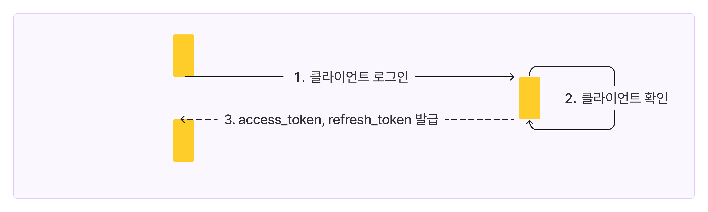
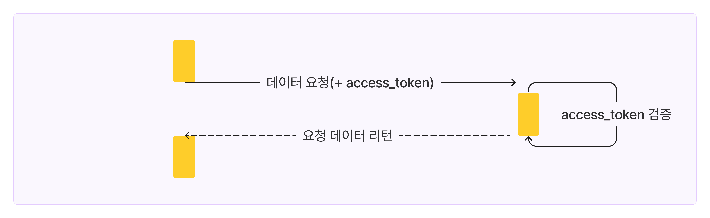
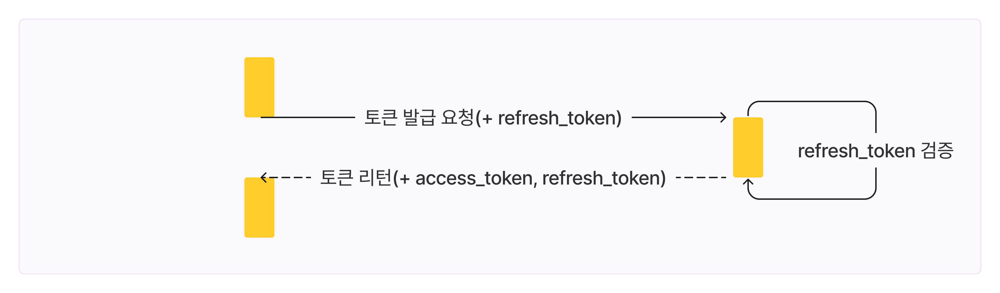
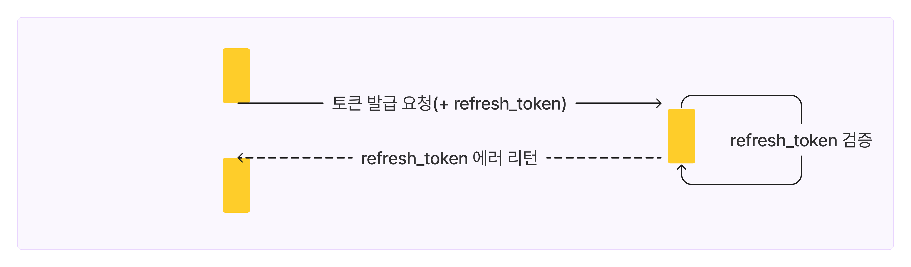
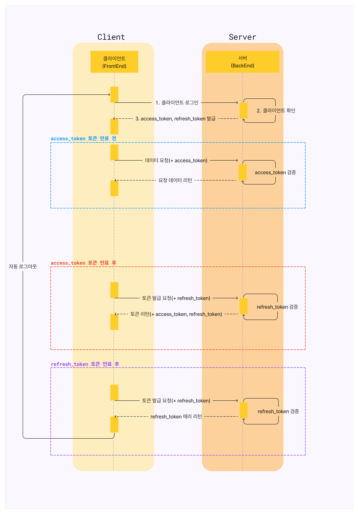

이번 포스트에서는 웹과 모바일 애플리케이션에서 널리 사용되는 토큰 기반 인증 방식에 대해 자세히 알아보려합니다. 특히 액세스 토큰(access token)과 리프레시 토큰(refresh token)이라는 두 가지 주요 요소에 초점을 맞추어 설명해보려 하는데요. 클라이언트와 서버 간의 인증 및 권한 관리를 보다 간편하고 안전하게 수행시켜줄수 있는 토큰 기반 인증 바로 시작하겠습니다!

## 액세스 토큰과 리프레시 토큰

액세스 토큰은 사용자의 인증 및 권한을 가진 토큰입니다. 이 토큰은 사용자가 서비스에 요청을 할 때마다 전송되어, 서버가 요청을 인증하고 처리하는 데 사용됩니다.

리프레시 토큰은 액세스 토큰의 유효 기간이 만료된 경우, 새로운 액세스 토큰을 발급받기 위한 토큰입니다. 사용자가 매번 로그인할 필요 없이 지속적인 인증을 제공하는 역할을 합니다.

## 유효 기간

액세스 토큰과 리프레시 토큰은 각각 다른 목적과 역할을 가지고 있기 때문에, 그들의 유효 기간은 다르게 설정되어야 합니다. 그렇다면 어떻게 유효기간을 설정하는 것이 바람직한 방법일까요?

앞서 말했듯이 액세스 토큰은 사용자의 인증 정보와 권한을 나타내는 토큰이라고 전해드렸습니다. API 호출이나 서비스 요청 시 마다 사용되는 토큰입니다. 만약 액세스 토큰이 해커에게 탈취된다면 토큰이 만료되기 전 까지, 무분별한 API 호출과 서비스 요청이 가능해지게 되므로 보안에 취약해지게 됩니다.

그렇기에 액세스 토큰이 탈취되더라도 피해를 최소화할 수 있도록 짧은 유효 기간을 설정하여 공격자가 이를 악용하는 시간이 짧아지도록 해야합니다. 또한 짧은 유효 기간은 사용자의 권한 변경이나 계정 비활성화와 같은 상황에서 빠르게 접근 제어를 갱신할 수 있게 해줍니다. 이를 통해 서비스 관리자는 사용자에 대한 권한 관리를 효율적으로 수행할 수 있게 됩니다.

리프레시 토큰은 액세스 토큰보다 유효 기간을 길게 설정하는 것이 좋습니다. 긴 유효 기간의 리프레시 토큰은 사용자가 자주 로그인해야 하는 번거로움을 줄여줍니다. 사용자가 리프레시 토큰이 유효한 동안까지는 계속해서 새로운 액세스 토큰을 발급받아 서비스를 이용할 수 있기 때문입니다. 또한 긴 유효 기간으로 인하여 발급 받는 횟수가 줄어들어 서버 부하 감소의 효과도 볼 수 있습니다.

아래는 링크드인 인증 API와 카카오 로그인 API 토큰 유효 기간입니다. 이처럼 보통 리프레시 토큰은 액세스 토큰보다 유효 기간을 길게 설정하고 있는 것을 확인할 수 있습니다.

 

[링크드인]
| 구분 | 설명 | 만료 시간 |
| --- | ---| ---|
| 액세스 토큰(access token) | 사용자 인증 | 60일 |
| 리프레시 토큰(refresh token) | 액세스 토큰 재발급에 이용 | 1년 |

\[참조]: https://learn.microsoft.com/en-us/linkedin/shared/authentication/programmatic-refresh-tokens

 

[카카오]
| 구분 | 설명 | 만료 시간 |
| --- | --- | --- |
| 액세스 토큰(access token) | 사용자 인증 | 12시간 |
| 리프레시 토큰(refresh token) | 액세스 토큰 재발급에 이용 | 2달 |

\[참조]: https://developers.kakao.com/docs/latest/ko/kakaologin/common#token

## 인증 프로세스

위의 글에서 액세스 토큰과 리프레시 토큰이 무엇인지, 유효기간은 어떻게 설정해야 하는지 알아보았습니다. 그렇다면 본격적으로 해당 토큰들을 이용한 인증 프로세스를 살펴보도록 하겠습니다.

 

1. 사용자가 로그인 정보(아이디, 비밀번호 등)를 제공합니다.
2. 서버는 제공된 정보가 올바른지 확인하고, 액세스 토큰과 리프레시 토큰을 생성합니다.
3. 서버는 생성된 액세스 토큰과 리프레시 토큰을 사용자에게 전달합니다.

 

4. 사용자는 데이터 요청에 액세스 토큰을 포함하여 서버와 통신합니다.
5. 서버는 액세스 토큰을 검증하여 사용자의 권한을 확인하고 요청된 데이터를 전달합니다.

 

6. 액세스 토큰이 만료되면, 클라이언트는 리프레시 토큰을 사용하여 새로운 액세스 토큰을 요청합니다.
7. 서버는 리프레시 토큰을 검증한 후, 새로운 액세스 토큰을 생성하여 클라이언트에게 전달합니다.

 

8. 리프레시 토큰의 유효기간이 만료되거나 서버에서 사용자의 인증을 폐기할 경우, 클라이언트는 오류를 받게 됩니다. 오류를 받은 클라이언트는 다시 로그인하여 새로운 액세스 토큰과 리프레시 토큰을 발급받아야 합니다.

 

아래는 인증 프로세스 전체 로직입니다.

## 마무리

인증 방식에는 다양한 방법이 있지만, 그 중 토큰 기반 인증은 보안성과 사용자 경험을 개선하면서 클라이언트와 서버 간의 교류를 효율적으로 만들어 줍니다. 이번 포스트에서는 액세스 토큰과 리프레시 토큰의 개념과 사용법, 그리고 유효기간 설정을 어떻게 하는지, 그리고 토큰 기반 인증의 프로세스에 대해서도 자세히 살펴보았습니다.

이번 포스트가 토큰 기반 인증 방식의 이론 편이라면, 다음 포스트에서는 Next.js에서 어떻게 구현할 수 있는지 직접 구현해 보는 실전 편을 작성해 보도록 하겠습니다. 항상 사용자들에게 안전하고 편리한 서비스를 제공하는 것이 중요하다는 것을 잊지 않는 개발자가 되어 봅시다.

 
