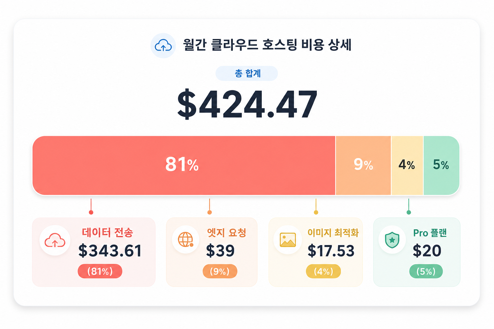
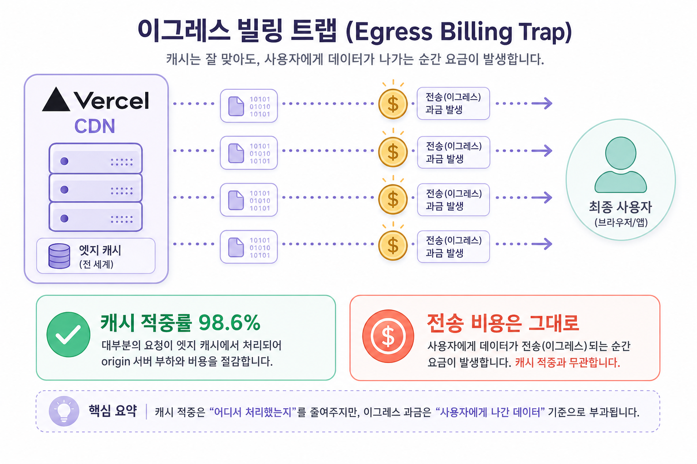
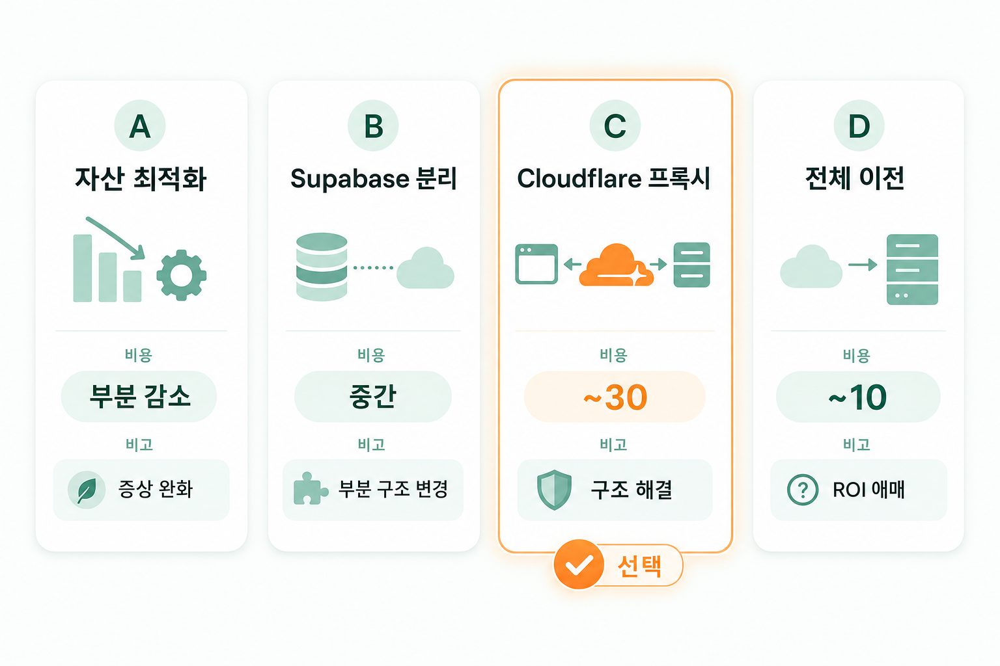
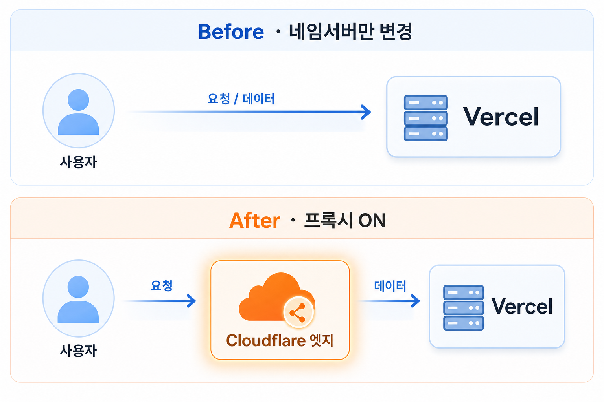
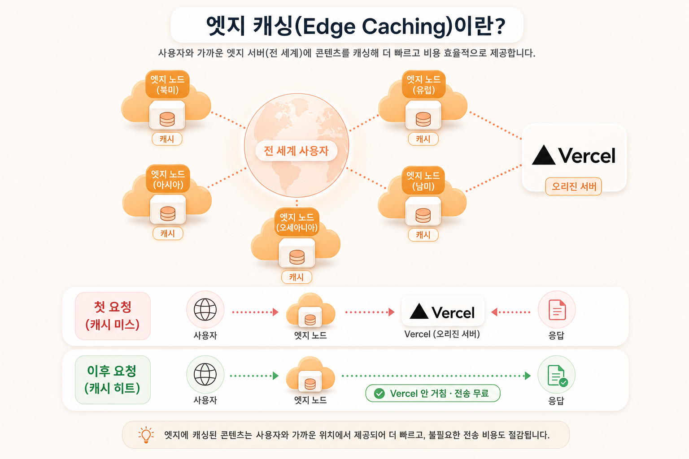
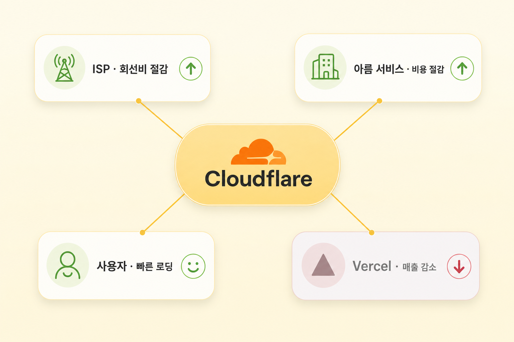
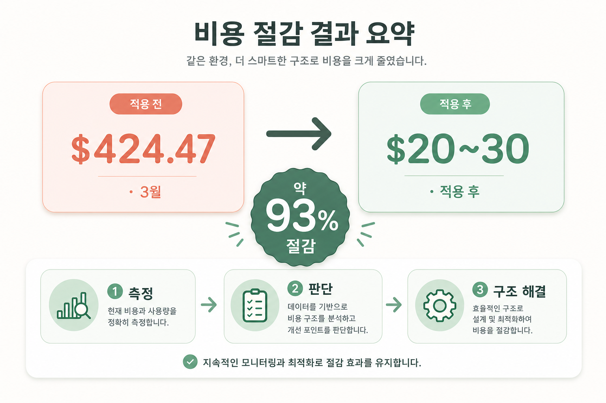

> Vercel 청구서를 열어보고 깜짝 놀란 적 있으신가요? 저는 제가 운영하는 모바일 청첩장 서비스 아름(areum.co.kr)의 MAU가 6만을 넘어가면서 3월 청구서가 **$424.47**까지 찍히는 걸 봤거든요. 처음엔 "트래픽이 늘었으니 어쩔 수 없지"라고 생각했는데, 뜯어보니 비용의 90%가 한 곳, 데이터 전송(data transfer)에서 나오고 있더라고요.
>
> 해당 문제를 Cloudflare 프록시를 사용하여, **코드 한 줄 건드리지 않고 DNS 설정만으로 전송 비용의 84%를 줄였습니다.** 이번 글에서는 비용의 정체를 측정으로 확인한 과정부터, Cloudflare 프록시가 어떻게 이걸 가능하게 하는지, Vercel은 왜 안 되는지, 그리고 실제 이전 방법까지 공유해보려 합니다.

---

## $424 청구서, 비용의 90%가 어디서 나왔나

대부분의 비용 **81%가 Fast Data Transfer 하나**였습니다. Edge Requests까지 합치면 90%가 "데이터를 내보내고, 요청을 처리하는" 비용이었습니다.

4월은 더 심각했어요. 20일 시점에 이미 Pro 플랜에 포함된 **1TB 전송 한도를 다 써버렸고**, 30일 기준 Outgoing 총 전송량이 **2.21TB**(일평균 약 75GB)에 달했거든요.

해당 상황을 보고 이건 이미지 한두 개 줄이거나 번들 사이즈를 조금 깎는 식의 최적화로 해결될 문제가 아니라고 느꼇습니다. 비용의 90%가 전송량 자체에서 나오는, **구조적인 문제**라고 느꼇거든요.

## Data Transfer가 뭐길래 — egress 과금의 함정

본격적인 추적에 들어가기 전에, 왜 이게 이렇게 비싼지 개념부터 짚고 갈게요.

Data Transfer, 정확히는 egress(이그레스)는 서버에서 사용자 쪽으로 나가는 데이터를 말해요. 반대로 사용자가 서버로 보내는 데이터는 ingress(인그레스)라고 하고요. 대부분의 클라우드는 **egress만 과금**합니다. 데이터를 넣는 건 공짜인데, 빼갈 때 돈을 받는 구조예요.

Vercel의 "Fast Data Transfer"는 바로 이 egress, 즉 Vercel CDN에서 사용자에게 내보낸 모든 데이터량을 의미합니다.

여기에 많은 분들이 모르는 함정이 하나 있어요.

> 캐시 적중률이 100%여도 전송 비용은 그대로 발생한다.

처음엔 저도 "캐시만 잘 되면 비용이 줄겠지"라고 생각했거든요. 그런데 Cache Hit/Miss는 어디까지나 **Vercel이 원본(origin)에서 데이터를 다시 가져왔는지**를 따지는 개념이에요. 사용자에게 최종적으로 데이터를 내보내는 전송은 캐시 여부와 무관하게 **무조건** 발생하고 거기에 GB당 약 $0.15가 붙습니다.

즉 캐시가 아무리 잘 돼도, 사용자에게 보내는 전송량 자체에는 계속 돈을 내야 한다는 거예요. 그래서 전송량을 줄이거나, 전송 경로 자체를 Vercel 밖으로 빼지 않는 한 비용은 안 줄어듭니다.

## 네 가지 선택지를 저울질하다

**옵션 A**(자산 최적화)는 가장 먼저 떠오르는 방법이였습니다. 하지만 캐시율이 이미 98.6%였으니 더 짜낼 여지가 적었고, 무엇보다 Vercel은 전송량 자체에 과금하니 자산을 줄여도 트래픽이 늘면 비용은 다시 늘어나요. 증상 완화일 뿐이었죠.

**옵션 B**(Supabase Storage + CDN)는 자산을 아예 분리하는 방법인데, 함정이 있었어요. Supabase Storage의 egress도 무료가 아니거든요(Pro 250GB 이후 GB당 $0.09). 다만 앞에 CDN을 두면 캐시 히트율이 99%까지 올라가서 Supabase egress도 거의 안 나오긴 해요. 그래도 자산 경로를 들어내고 코드를 고쳐야 해서 손이 많이 갔습니다.

**옵션 C**(Cloudflare 프록시)는 도메인을 Cloudflare 뒤에 두고 정적 자산을 엣지에서 캐싱하는 방법이에요. 전송 경로 자체를 Vercel 밖으로 빼기 때문에, 폰트든 이미지든 JS든 **전송량이 얼마가 됐든 그 대부분이 Vercel 청구서에서 사라져요.** 트래픽이 더 늘어도 방어가 되는, 증상이 아니라 구조를 때리는 해결이죠. 게다가 코드 수정 없이 DNS만 바꾸면 되니 당장의 출혈도 즉시 멈출 수 있고요.

**옵션 D**(전체 Cloudflare Pages 이전)는 OpenNext로 통째로 옮기면 egress가 완전히 무료라 비용이 $5~10까지 떨어져요. 가장 저렴하긴 해요. 그런데 저는 Vercel의 개발자 경험(DX)이 너무 좋았거든요. `git push` 한 번이면 배포되고, PR마다 프리뷰 환경이 자동으로 뜨고, 설정도 거의 손댈 게 없고요. 이 편의를 포기하고 마이그레이션 리스크까지 떠안기엔, 웬만하면 Vercel을 계속 쓰고 싶다는 마음이 더 컸어요.

네 가지를 놓고 보니 답은 분명했어요. A는 증상 완화일 뿐이고, B는 손이 많이 가고, D는 아까운 Vercel DX를 포기해야 하죠. 그래서 **코드도 안 건드리고 Vercel의 DX도 그대로 누리면서 비싼 전송만 빼내는 옵션 C**를 최종 선택했습니다.

## 네임서버 변경 ≠ 프록시 — 가장 헷갈렸던 핵심

Cloudflare를 붙이기로 하고 나서, 처음에 크게 헷갈린 부분이 있어요. 바로 **네임서버 변경과 프록시는 다른 개념**이라는 거예요.

네임서버만 Cloudflare로 옮기면, DNS 관리만 Cloudflare에서 할 뿐 실제 트래픽은 여전히 Vercel로 직접 갑니다. 비용 절감 효과가 전혀 없어요. 트래픽이 Cloudflare 엣지를 거치게 하려면, DNS 레코드의 **프록시(주황색 구름 아이콘)를 ON**으로 켜야 해요.

핵심은 After에서 사용자가 받는 IP가 **Vercel IP가 아니라 Cloudflare의 Anycast IP**라는 점이에요. 그래서 사용자는 Vercel이 아니라 Cloudflare 엣지에 먼저 접속하게 됩니다. 그리고 이 프록시 기능은 Cloudflare 네임서버를 쓸 때만 가능해요(hosting.kr 같은 일반 DNS에서는 불가).

<!-- 🎨 OpenAI 이미지 생성 프롬프트:
Clean modern flat infographic comparing two DNS routing flows, stacked top and bottom. Top row labeled "Before · 네임서버만 변경": a user icon → arrow → a rounded server box "Vercel", data flowing directly. Bottom row labeled "After · 프록시 ON": a user icon → arrow → an orange cloud box "Cloudflare 엣지" → arrow → "Vercel", with the cloud box highlighted by a glowing orange proxy icon. Accurate Korean text labels. Soft pastel sky-blue accents, rounded boxes, clean arrows, subtle soft shadows. No characters, no clutter.
→ 파일명: dns-flow.png -->

## hosting.kr에서 Cloudflare로

말로만 하면 막막하니, 제가 실제로 밟은 순서를 정리해볼게요. 아름은 `.kr` 도메인을 hosting.kr에서 관리하고 있었는데, 네임서버를 Cloudflare로 옮기는 흐름이에요.

**1. Cloudflare에 사이트 추가**

Cloudflare에 가입하고 "Add a site"에 도메인(예: `areum.co.kr`)을 입력해요. 플랜은 **Free**로 충분합니다.

**2. 기존 DNS 레코드 확인**

Cloudflare가 기존 DNS 레코드를 자동으로 스캔해서 가져와요. 이때 Vercel을 가리키는 레코드가 그대로 있는지 꼭 확인하세요. 보통 apex 도메인은 A 레코드 `76.76.21.21`, 서브도메인(www 등)은 CNAME `cname.vercel-dns.com`이에요. (Vercel 프로젝트의 Domains 설정에서 정확한 값을 알려줘요.)

**3. Cloudflare 네임서버 확인**

Cloudflare가 할당해준 네임서버 2개(예: `xxx.ns.cloudflare.com`)를 보여줘요. 이걸 복사해둡니다.

**4. hosting.kr에서 네임서버 변경**

hosting.kr 관리 콘솔에 로그인 → 도메인 관리 → 네임서버 설정에서, 기존 네임서버를 방금 복사한 Cloudflare 네임서버 2개로 교체해요. `.kr` 도메인은 반영에 보통 수십 분에서 수 시간(최대 24~48시간) 걸려요. Cloudflare 대시보드가 "Active"로 바뀌면 완료된 거예요.

**5. 프록시(주황 구름) ON**

여기가 핵심이에요. DNS 레코드 목록에서 Vercel을 가리키는 레코드의 **프록시 상태를 "Proxied"(주황 구름)로 켜요.** 이게 꺼져 있으면(회색 구름) 트래픽이 Cloudflare를 안 거쳐서 비용 절감 효과가 전혀 없어요. 앞에서 말한 "네임서버 변경 ≠ 프록시"가 바로 이 지점이에요.

**6. SSL/TLS 모드를 Full (strict)로**

SSL/TLS 설정에서 암호화 방식을 반드시 **Full** (strict) 모드로 바꿔주세요. 이걸 안 하면 Cloudflare와 Vercel이 서로 HTTPS 리다이렉트를 핑퐁하면서 무한 리다이렉트(redirect loop)에 빠질 수 있어요. Vercel은 유효한 인증서를 제공하니 Full (strict)로 문제없이 동작합니다.

> ⚠️ 알아두실 점: Vercel은 공식적으로는 자기 앞에 리버스 프록시(=Cloudflare 프록시)를 두는 걸 권장하지 않아요. 프록시가 끼면 Vercel 입장에서 방문자 IP·트래픽 가시성이 줄고, 자체 봇 탐지·방화벽 신호가 약해지거든요. 그래서 도메인 설정에 "reverse proxy" 경고가 뜰 수 있어요. 저는 비용 절감 효과가 이 트레이드오프보다 훨씬 크다고 판단해서 감수했고, 필요하면 `True-Client-IP` 헤더를 켜서 실제 방문자 IP를 Vercel로 넘길 수 있어요.

이게 전부예요. 코드 배포도, 서버 설정도 없어요. 네임서버를 바꾸고 구름을 켜는 것만으로 트래픽이 Cloudflare 엣지를 거치기 시작합니다.

## Cloudflare는 어떻게 이게 가능한가 — Anycast와 엣지

그럼 Cloudflare 엣지를 거치면 왜 비용이 줄어드는 걸까요? 구조를 이해하려면 Anycast IP를 알아야 해요.

**Anycast IP**는 하나의 IP 주소를 전 세계 여러 엣지 서버가 동시에 사용하는 방식이에요. BGP라는 라우팅 프로토콜로 같은 IP를 여러 곳에서 광고하면, 사용자의 요청은 **가장 가까운 엣지로 자동 라우팅**됩니다. 한국 사용자라면 서울 엣지로 연결돼서 지연 시간이 10ms 안팎으로 짧아요.

그리고 각 엣지는 독립된 서버이면서 **자체 캐시 저장소**를 가지고 있어요. 한 번 캐시된 자산은 이후 요청부터 **Vercel을 아예 거치지 않고** Cloudflare 엣지에서 바로 응답합니다. 그러면 Vercel의 Fast Data Transfer로 잡히지 않으니, 그만큼 비용이 안 나가는 거예요. 폰트 같은 정적 자산은 한 번 캐시되면 계속 엣지에서 나가니까 효과가 컸습니다.

## Vercel은 왜 egress 비용 경쟁이 안 되나

여기서 자연스럽게 궁금해져요. 같은 전송인데 왜 Cloudflare는 무료고 Vercel은 GB당 돈을 받을까요? 이건 두 회사의 인프라 구조 차이 때문이에요.

| 항목          | Cloudflare                   | Vercel                              |
| ------------- | ---------------------------- | ----------------------------------- |
| 엣지 네트워크 | 330개+ 도시 자체 보유        | 자체 CDN 보유, 컴퓨트는 AWS 의존    |
| 대역폭 원가   | ISP·IX 직접 피어링 → 거의 $0 | AWS 원가에서 자유롭긴 어려움 (추정) |
| 단가 책정     | 공개 (GB당 명시)             | 비공개                              |
| egress 과금   | 무료                         | GB당 약 $0.15                       |

Cloudflare는 전 세계 330개가 넘는 도시에 자체 엣지 네트워크를 가지고 있어요. 그리고 국내 ISP(LG U+, SKT, KT)나 IX(KINX 같은 인터넷 익스체인지)와 **직접 피어링**을 맺고 있어서 대역폭을 추가로 쓰는 데 드는 한계비용이 거의 0에 가깝습니다. 그러니 egress를 무료로 줘도 손해가 안 나는 거예요.

반면 Vercel은 자체 CDN을 두긴 하지만 핵심 인프라를 AWS 위에서 돌려요. 그러다 보니 AWS의 대역폭 원가 구조에서 완전히 자유롭긴 어렵고, 이게 전송 단가에 반영되는 것으로 보여요. (Vercel이 단가를 어떻게 책정하는지는 공개돼 있지 않아서 여기까지는 제 추정이에요. 순수 마진 정책일 수도 있고요.) 다만 이유가 무엇이든, 사용자 입장에서 전송 비용이 Cloudflare보다 비싼 건 분명했습니다.

## DNS 한 줄로 84% — 실제 적용 결과

그래서 실제로 얼마나 줄었을까요? Cloudflare 프록시를 켜고(즉, DNS 변경만 하고) 측정한 결과예요.

| 지표             | 수치    | 비율       |
| ---------------- | ------- | ---------- |
| Cached Requests  | 444.26K | **86.37%** |
| Cached Bandwidth | 34.93GB | **84.15%** |

대역폭의 **84%가 Vercel을 거치지 않고** Cloudflare 엣지에서 직접 응답으로 처리됐어요. 다시 강조하면, 이건 **코드를 단 한 줄도 안 고친 상태**에서 나온 결과예요. 그냥 도메인을 Cloudflare 프록시 뒤로 옮긴 것만으로요.

비용으로 환산하면 효과가 더 확 와닿아요.

| 구분      | Before (3월) | After (예상) | 변화         |
| --------- | ------------ | ------------ | ------------ |
| 월 청구서 | $424.47      | $20~30       | **약 93% ↓** |

월 $424였던 청구서가 $30 수준으로, **약 93% 절감**이에요. 비용의 81%를 차지하던 Fast Data Transfer($343.61)가 대역폭 84% 캐시로 대부분 사라진 덕분이고요. 코드 수정 없이 **DNS 설정 하나로 얻은 결과**치고는 엄청난 거였어요.

## 공짜로 딸려오는 Cloudflare 무료 최적화

Cloudflare 프록시를 붙이고 나니, 무료로 쓸 수 있는 최적화 기능들이 줄줄이 딸려오더라고요. 청첩장 서비스에 도움이 되는 것들을 정리해봤어요.

**캐시 관련**

- **Cache Rules**: `/_next/static/*`, `.woff2`, 이미지 경로는 Edge TTL을 길게 잡고, `/api/*`나 `/invitation/*` 같은 동적 경로는 Bypass로 설정해 캐시를 세밀하게 제어
- **Tiered Cache (Smart Topology)**: 엣지끼리 캐시를 공유해서 원본(Vercel) 호출 횟수를 더 줄여줘요. 무료고요. (참고로 Regional Tiered Cache는 글로벌 서비스용이라, 한국 단일 서비스인 아름엔 불필요했어요)

**성능 관련**

- **Auto Minify**: HTML/CSS/JS 압축
- **Brotli Compression**: gzip보다 압축률이 20~30% 높음
- **Early Hints**: 폰트·CSS를 미리 로딩하라는 힌트를 브라우저에 전달
- **HTTP/3 (QUIC)**: 모바일 환경에서 특히 유리 — 청첩장은 대부분 모바일로 열리니까요

**보안 관련**

- **Always Use HTTPS**, **Minimum TLS 1.2**
- **Bot Fight Mode**: 악성 봇 차단으로 불필요한 요청 자체를 줄임
- **Turnstile**: reCAPTCHA 대체재로, 방명록·RSVP 스팸을 막는 데 유용

## 왜 Cloudflare는 이걸 다 공짜로 줄까

여기까지 오니 한 가지 의문이 들었어요. 이 많은 걸 왜 공짜로 주는 걸까? 손해 보는 장사 아닌가? 알아보니 꽤 영리한 비즈니스 모델이 있더라고요.

- **네트워크 효과**: 트래픽이 많아질수록 공격 패턴과 라우팅 데이터가 정확해져요. 무료 사용자도 데이터 측면에서 자산인 거죠.
- **대역폭 한계비용 $0**: 앞서 본 ISP 피어링과 자체 백본 덕분에, 무료로 줘도 추가 비용이 거의 안 들어요.
- **Freemium 유입 통로**: 무료 사용자가 Pro → Business → 엔터프라이즈로 자연스럽게 넘어가는 깔때기예요.
- **DNS는 인터넷의 입구**: DNS를 잡으면 그 위에 CDN, WAF, Workers 같은 모든 제품을 얹을 수 있어요.

재밌는 건 이 구조가 거의 모두에게 이득이라는 점이에요.

## 마치며

가장 크게 배운 건, **비용 문제를 막연히 트래픽 탓으로 단정하지 말자**는 거예요. 청구서가 비싸게 나오면 "사용자가 늘어서 그렇겠지" 하고 넘어가기 쉽잖아요. 그런데 실측해보니 비용의 정체는 정적 자산을 사용자에게 내보내는 전송이었고, 이미지 캐시율이 98.6%인데도 전송 비용은 그대로였어요. 추측("이미지가 80%")으로 움직였다면 엉뚱한 곳에 돈을 썼을 거예요. **측정 → 판단 → 재측정** 루프가 항상 옳았습니다.

두 번째는, **자산을 더 최적화하는 것만으로는 한계가 있다**는 거예요. 압축하고 캐시를 조여도 Vercel이 전송량 자체에 과금하는 구조는 그대로니까요. 트래픽이 늘면 또 터졌을 거예요. 진짜 해결은 그 전송을 애초에 Vercel로 안 내보내는 것, 즉 전송 경로를 Cloudflare 엣지로 빼는 거였어요. 증상이 아니라 구조를 봐야 했던 거죠.

그리고 그 해결이 **놀랄 만큼 간단했다**는 게 이 글의 핵심이에요. 코드 배포도, 마이그레이션도 없이 네임서버를 바꾸고 프록시를 켜는 것만으로 전송 비용의 84%, 청구서로는 약 93%가 사라졌거든요. Vercel의 좋은 개발 경험(DX)은 그대로 누리면서 비싼 전송만 Cloudflare로 빼는 조합이 가장 현실적인 최적해였습니다.

물론 이 방식이 모든 상황에 정답은 아니에요. 앞서 말했듯 Vercel은 프록시를 공식 권장하지 않으니 가시성·봇 탐지 같은 트레이드오프가 있고 서비스 성격에 따라 효과가 다를 수 있어요. 그래도 Vercel을 쓰면서 전송 비용이 부담된다면, Cloudflare 프록시는 리스크 대비 효과가 워낙 좋아서 한 번쯤 꼭 검토해보시길 권하고 싶어요.

긴 글 읽어주셔서 감사합니다! 🙏

 

**궁금하신 점이 있다면 아래 `댓글`로 남겨주세요!👇**
