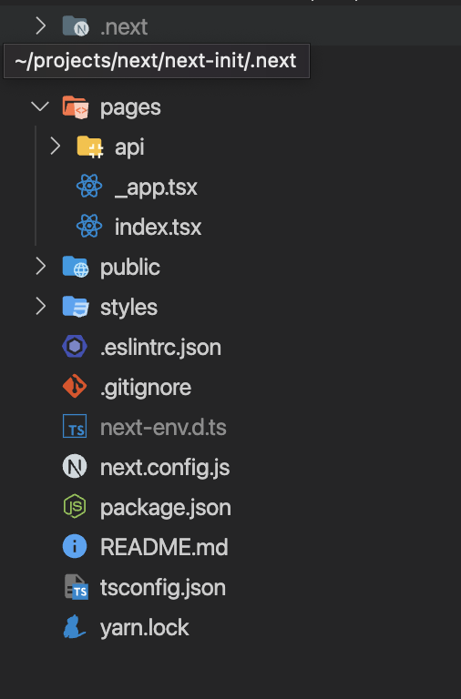
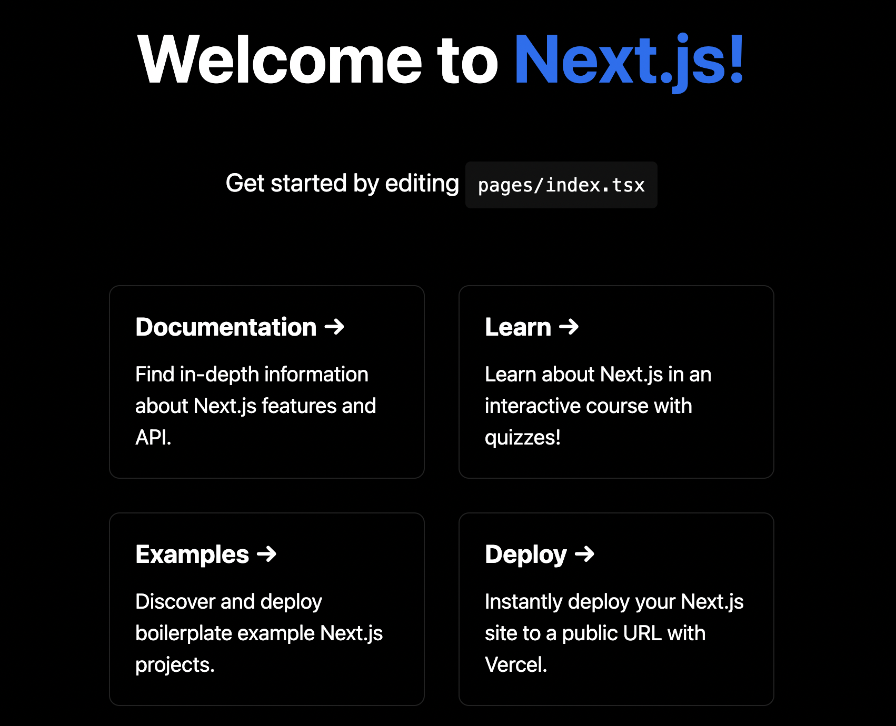

> 짧은 시간 동안 집중하여 코딩 공부를 하고자 원티드에서 주최한 프리온보딩 프론트엔드 챌린지를 참가하게 되었습니다. 이번에는 프리온보딩 사전과제를 포스팅하며 CSR/SSR이 정확히 어떤 것인지 Next.js 파일구조는 어떻게 되는지 알려드리도록 하겠습니다.🥰

## 🤔 CSR(Client-side Rendering)이란 무엇이며, 그것의 장단점에 대하여 설명해주세요.

CSR이란 말 그대로 클라이언트 측에서 렌더링, 최초에 1번 서버에서 전체 페이지를 로딩하여 보여준 다음 그다음부터는 리소스만 서버가 클라이언트에 제공하고 해석하고 렌더링은 클라이언트 측에서 하는 것을 의미한다.

### CSR의 장점 👍🏻

- 처음 전체 페이지를 로딩할 때의 시간만 기다린다면, 그다음부터는 빠르게 렌더링이 되기 때문에 UX가 좋다.
- 처음 페이지를 전체 로드하였기 때문에 서버에 요청하는 횟수가 적어져 서버 부담이 적어진다.

### CSR의 단점 👎🏻

- 장점이 곧 단점이 될 수 있다. 처음 로딩 시 모든 파일을 불러오기 때문에 모두 로딩될 때까지 기다려야 합니다.
- 개인적으로는 이 부분이 치명적이라고 생각되는데 크롤링을 할 수 있는 요소가 없기 때문에 검색 엔진 최적화(SEO) 측면에서 불리하다.

## 🤔 SPA(Single Page Application)로 구성된 웹 앱에서 SSR(Server-side Rendering)이 필요한 이유에 대하여 설명해주세요.

SPA이란 말 그대로 단일 페이지, 단일 페이지를 사용하며 사용자가 필요한 부분만 업데이트해서 보여주는 웹 애플리케이션을 의미한다.

`SPA`로 구성된 웹 앱이 필요한 이유는 `CSR`의 단점을 보면 바로 알 수 있다. 어떤 프로젝트를 하냐에 따라 다르겠지만 `SEO`를 해야 하는 프로젝트라면 `SSR`을 사용해야 한다. 하지만 `SPA`는 기본적으로 `CSR`이기 때문에 나의 프로젝트를 크롤러(봇) 들이 인식할 수가 없다. 이를 해결하기 위하여 `SSR with Hydration` 기법이라는 것이 나오게 되었는데 대표적으로 여러분들이 아는 `Next.js` 와 `Nuxt.js`이다. 이 기법은 처음에 `SSR`을 하여 `SEO`를 가능하게 하고, 그 후 다른 페이지들에선 `CSR`을 이용하는 방식으로 `SPA`의 단점을 보완하였다.

## 🤔 Next.js 프로젝트를 세팅한 뒤 yarn start 스크립트를 실행했을 때 실행되는 코드를 nextjs github 레포지토리에서 찾은 뒤, 해당 파일에 대한 간단한 설명을 첨부해주세요.

> 위에 설명으로 SPA로 구성된 웹 앱에서 SSR이 필요한 이유를 설명해 드렸습니다. 위에 글에서 언급해 드렸듯이, 이를 도와줄 수 있는 Next.js의 초기세팅과 초기 세팅된 파일에 대해 간단한 설명을 하도록 하겠습니다.

### 🛠 실행방법

1. 간단하게 `create-next-app`을 사용하여 `next.js`앱을 만들 것이다.

- [Mac] yarn create next-app --typescript (yarn이 설치되어 있지 않다면 설치해줘야 하고 나는 타입스크립트로 만들 거기 때문에 뒤에 `--typescript`를 붙여주었다.)



2. 정상적으로 설치되었다면 위에 폴더가 생성되었을 것이다 이동한 뒤 및에 명령어를 실행시킨다.
   - yarn build
   - yarn start
   - `http://localhost:3000/`에 접속한다.



정상적으로 앱이 실행되었다.

### 📝 폴더설명

#### pages

- 파일 이름에 따라 라우팅을 제공한다. 예를 들어 `pages/test.tsx` 파일은 브라우저에서 `/test`으로 접근 할 수 있다.
- `/`루트 경로는 기본적으로 `pages/index.tsx` 파일이다.
- `pages/_app.tsx`는 Next.js에서 가장 먼저 실행되는 파일이다. 모든 페이지에서 공통으로 사용되는 것들을 `pages/_app.tsx`에서 한 번에 적용할 수 있다. 안의 코드 중 ``는 현재 선택된 페이지를 나타낸다.

#### public

- 이미지나 폰트와 같은 정적 자원을 저장한다. public 내부의 파일은 기본적 `URL(/)`에서 시작하는 코드로 참조할 수 있다.

 <br/>

**궁금하신 점이 있다면 아래 `댓글`로 남겨주세요!👇**

```toc

```
