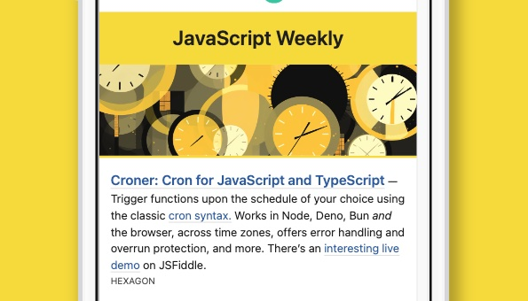
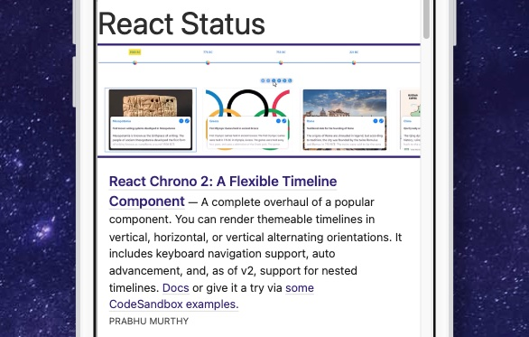
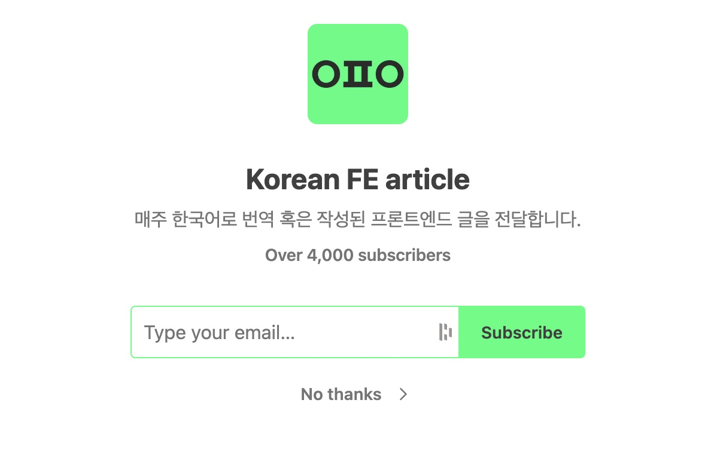
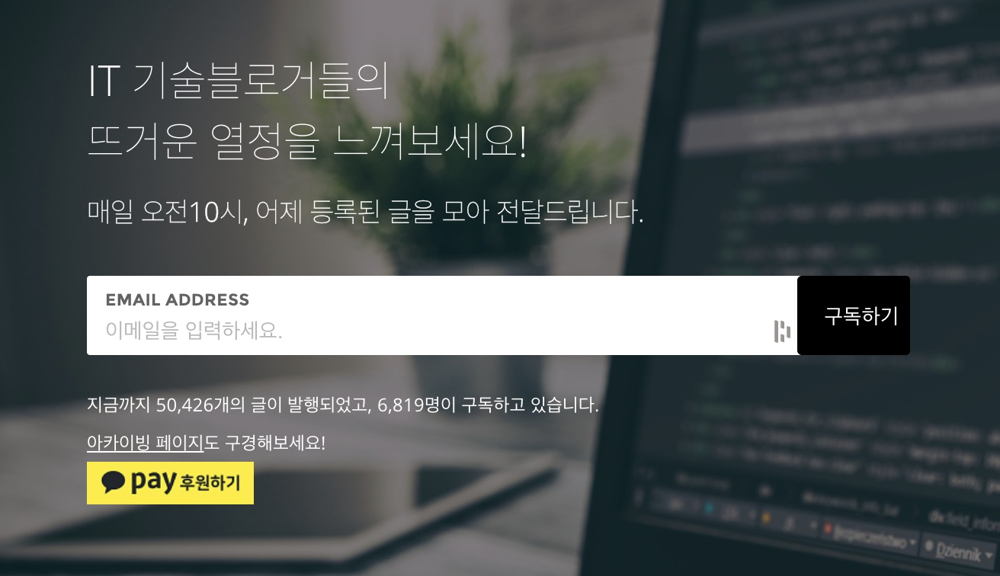
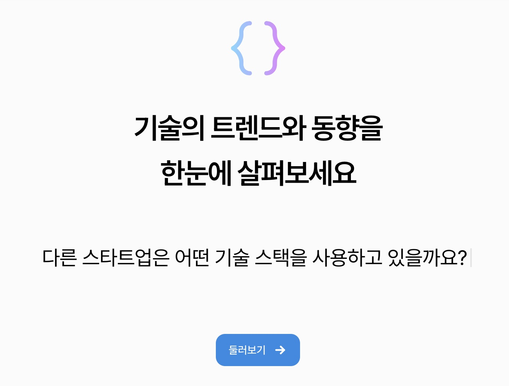
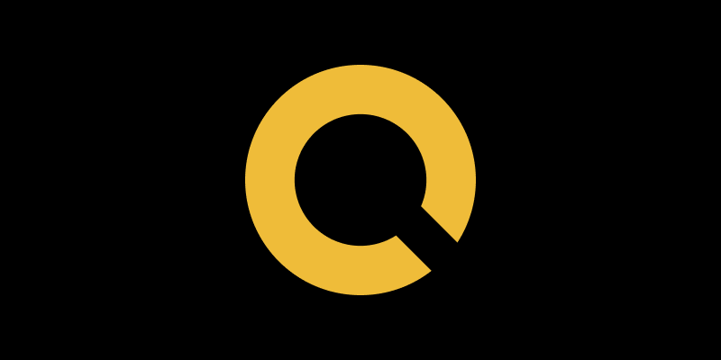
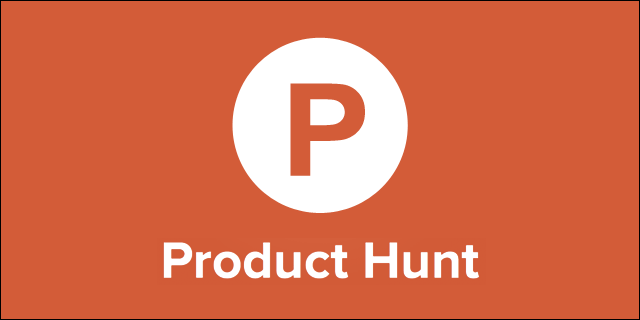

여러분들은 구독하고 있는 뉴스레터가 있으신가요? 뉴스레터는 구독하게 되면 정기적으로 해당 메일에 글을 보내주는 서비스를 의미합니다. 최신 기술 동향과 트렌드 파악이 중요한 FE 개발자분들이 뉴스레터를 구독한다면 보다 편하게 소식을 접할 수 있게 된다는 장점이 있습니다.

이번 포스트에서는 FE 개발자로 일하고 있는 제가 구독하고 있는 뉴스레터를 소개하고자 합니다.

## 뉴스레터

### 1. [JavaScript Weekly](https://javascriptweekly.com/)



자바스크립트 관련 정보를 정기적으로 제공해주는 뉴스레터입니다. 자바스크립트 관련하여 좋은 자료들을 많이 담고있고 영어로 제공되어 있어 영어 공부에도 도움된다고 생각합니다.

### 2. [React Status](https://react.statuscode.com/)



위의 뉴스테러와 같이 COOPERPRESS 라는 곳에서 제공하는 리액트 관련 뉴스레터입니다. FE 개발자들에게 JavaScript, React는 빼놓을수없는 기술 스택이므로 추천드립니다.

### 3. [Korean FE article](https://kofearticle.substack.com/)



몇몇 개발자 분들이 모여 영어로 작성된 프론트엔드 아티클를 번역하고 공유해주는 뉴스레터입니다. 영어로 작성된 글중에 좋다고 생각되는 글들을 번역하여 제공해주기에 양질의 글들을 확인 할 수 있습니다. 영어로된 글을 읽기 힘든 분들에게는 정말 추천해주고 싶은 뉴스레터 입니다.

### 4. [데일리 기술블로그](http://daily-devblog.com/)



해당 뉴스레터는 어썸데브블로그에 등록된 글들을 메일로 전달해주는 뉴스레터입니다. 어썸데브블로그는 개발자 분들이 [어썸데브블로그 깃허브](https://github.com/awesome-devblog/awesome-devblog)에 등록하여 자신들의 블로그를 공유하는 서비스인데요. 평소 개발 블로그들을 자주 보시는 분들이 보다 편하게 보실수 있을 것 같습니다.

위 깃허브 주소를 통하여 자신의 블로그도 등록할 수 있으니 희망하시는 분들은 등록하여 많은 분들이 자신이 작성한 글들을 볼 수 있도록 공유하는것은 어떨까요?

## 그 외 추천 링크

### 1. [요즘IT](https://yozm.wishket.com/magazine/)


위시켓에서 서비스하고있는 서비스로 개발, 디자인, 기획 등 다양한 IT 컨텐츠를 제공하고 있는 서비스입니다. 요즘IT는 구독하고 메일로 받아보는 뉴스레터는 아닌데요. 제가 개인적으로 즐겨보고있고 좋은 컨텐츠들이 정말 많아 항목에 넣게 되었습니다. 개발에 한정적인게 아니라 IT관련 다양한 컨텐츠 들을 제공하고있으니 기호에 맞게 찾아보시면 좋을 것 같습니다.

### 2. [코드너리](https://www.codenary.co.kr/)



해당 서비스는 네이버, 카카오, 토스, 당근마켓 등 다양한 회사 기술 블로그 글들을 한눈에 볼 수 있도록 만든 서비스입니다. UI/UX도 깔끔하게 되어있어 사용하기 편하고 기술 블로그 뿐만 아니라 앞으로 있을 컨퍼런스 일정같은것도 제공하고 있어 즐겨찾기 해놓고 한번씩 보기 좋은 사이트인거 같아 공유드립니다.

### 3. [ONEONEONE](https://oneoneone.kr/)



개발 관련 뿐만 아니라 다양한 컨텐츠를 제공하고 있는 서비스입니다. 정말 많은 곳의 글들을 가져와서 제공해주는 서비스인데 위에 첨부 드렸던 글들도 올라온곤 합니다. 웹에서 뿐만 아니라 슬랙을 통해서도 연결하여 컨텐츠를 받아 볼수 있어 간편하다고 생각됩니다.

### 4. [Product Hunt](https://www.producthunt.com/)



기술 관련하여 새로운 제품을 공유하고 발견하는 서비스입니다. 요즘 핫한 AI를 사용하여 만든 서비스도 많고 다양한 서비스들을 파악할 수 있어 추천하는 서비스입니다.

## 마치며

지금까지 FE 개발자분들에게 유용한 뉴스레터를 몇 가지 소개해 드렸습니다. 최신 기술 동향과 트렌드를 파악하는 것이 매우 중요한데요. 이러한 뉴스레터를 구독하면 새로운 정보를 쉽게 얻을 수 있으며, 업계의 변화에 대해 더 잘 대처할 수 있습니다. 이외에도 여러 가지 좋은 서비스들이 있을 텐데요. 여러분이 알고 있는 유용한 정보를 댓글로 공유해 주세요!

<br/>

```toc

```
