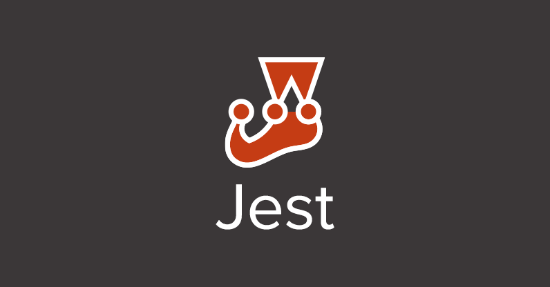

> JavaScript, React 등의 테스트 코드를 작성할 때 사용하는 Jest 프레임워크가 어떤 것인지 알아보고 사용법을 알아보자.



## Jest란?🧐

Jest는 페이스북에서 개발, 관리하는 js 테스트 프레임워크로써 `단순함`에 집중한 테스트 프레임워크이다.

> [Jest 공식홈페이지](https://jestjs.io/)에서도 "Jest is a delightful JavaScript Testing Framework with a focus on `simplicity`" 라고 설명하네요.

## Jest를 왜 많은 사람들이 사용할까? 🤔

`Jest`를 사용하기 이전에는 여러 테스트 라이브러리르 섞어서 사용했다고 한다. 유닛 테스트에서 `Test Runner`는 "Mocha" 를 `Assertion`에서는 "Chai"를 사용하는 것이 그 예다. `Jest`를 사용하면 거의 모든 기능을 한 번에 지원하기 때문에 많은 사람들이 사용하는 거 같다. 그 외에도 Jest에는 개발자들이 간단하게 테스트를 할 수 있도록 많은 기능이 있다.

> `Test Runner` : 테스트를 실행 후 결과를 생성하는 것
> `Assertion`: 테스트 코드 안에서 예상하는 값과 맞는지 아닌지 비교하는 것

## Jest를 어떻게 시작할까? 🪄

Jest를 설치하기 이전에 새로운 패키지를 추가하고 외부 라이브러리를 관리하기 위해서는 `패키지 매니저`가 필요하다.

```cmd
npm init --yes
```

Jest를 설치할 준비가 되었으니 설치해 보자.

```cmd
npm install jest --global
```

설치가 완료되었으니 Jest를 사용할 수 있도록 설정하자.

```cmd
jest --init
```

위에 명령어를 입력하면 설정을 쉽게 할 수 있도록 문구가 나온다. 원하는 설정대로 yes 또는 no를 입력하면서 진행하면 된다. 잘 진행하셨다면 `jest.config.js`파일이 만들어졌을 것이다.👍🏻

## Jest를 어떻게 사용할까? 🧑🏻‍💻

> 사실 간단하게 사용법 정도를 정리해놓을까 하다가 사용법은 뭐니 뭐니 해도 [Jest공식문서](https://jestjs.io/docs/getting-started)를 이용하는게 좋다고 생각하여 공식 문서 링크를 안내합니다.👍


`위의 목록을 보면` 간단하게 Jest를 사용할 수 있는 방법과 비동기코드, Mock 함수를 만드는 법 등 상세하게 확인할 수 있다. 우리모두 공식문서를 이용하여 공부하는 방법을 길러보자.

<br/>

**궁금하신 점이 있다면 아래 `댓글`로 남겨주세요!👇**

```toc

```
