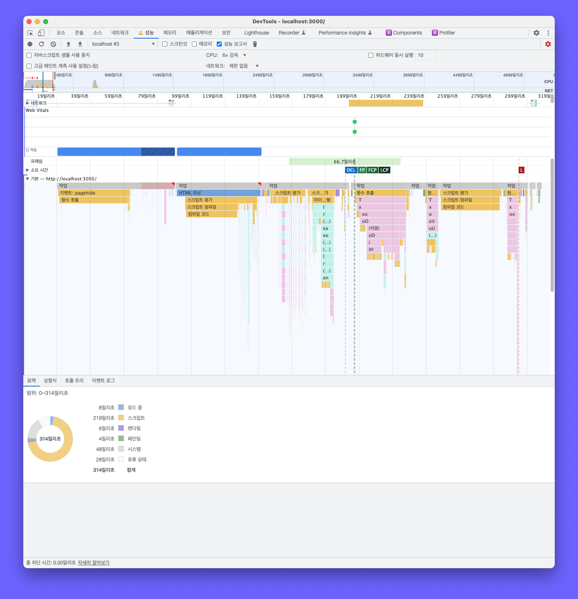
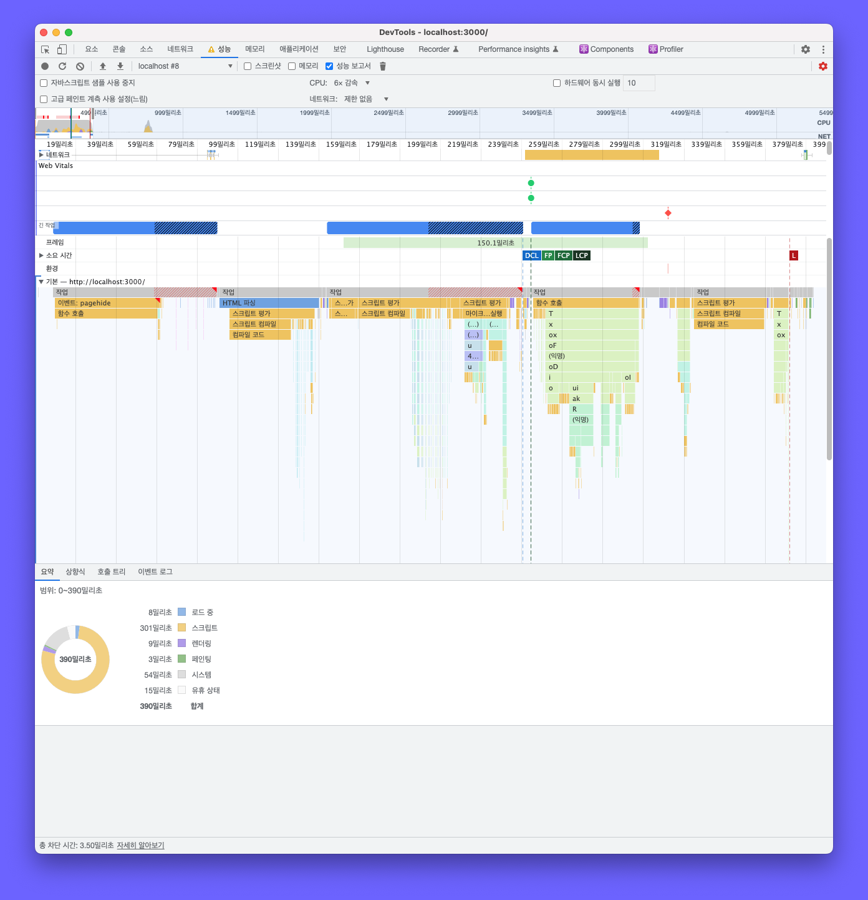
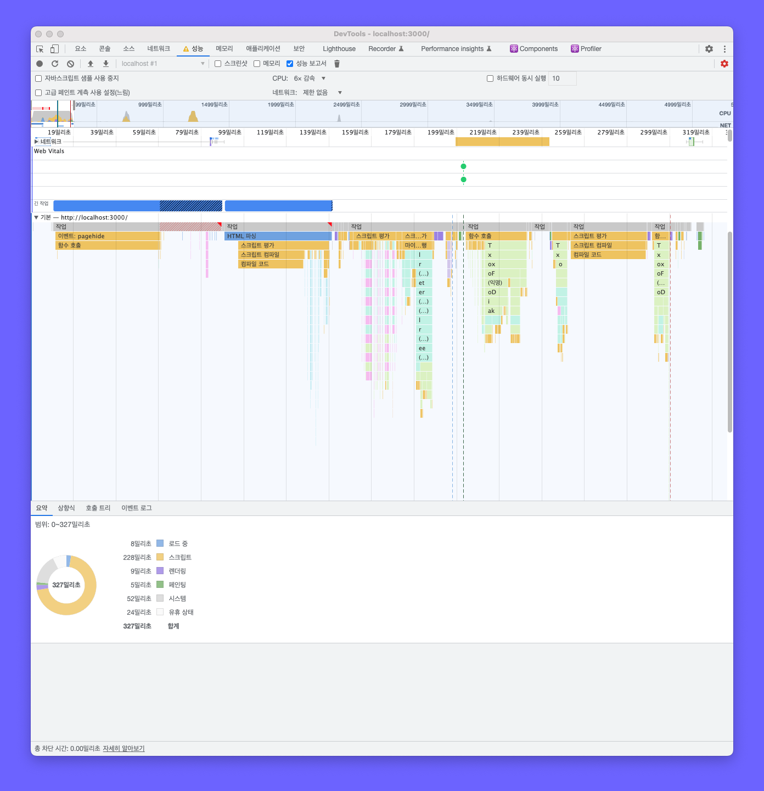
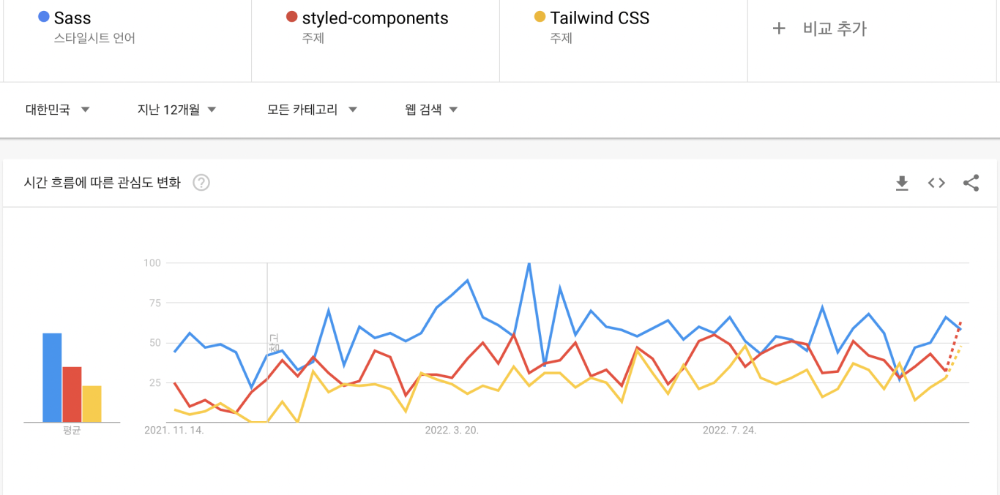
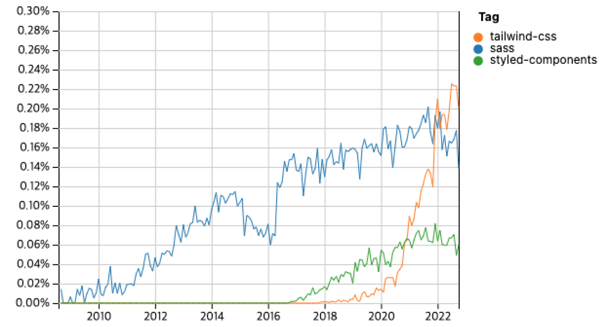
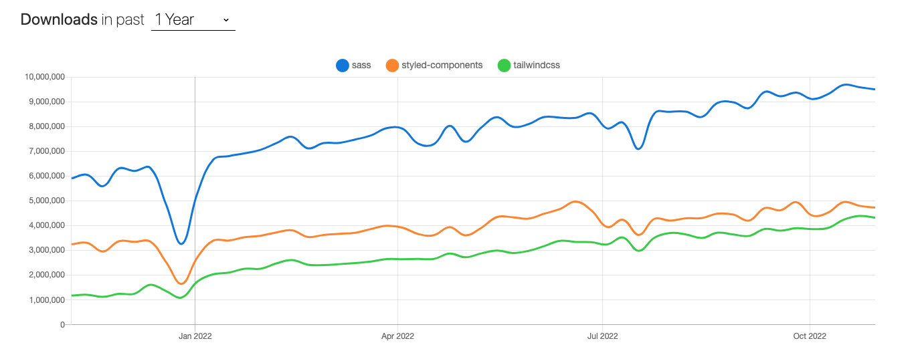

CSS 작성방법은 다양합니다. 전통적인 CSS, 기존의 CSS를 해결하기 위한 CSS-in-JS, Utility-First 등 더 편리하고 강력한 새로운 방법들이 많이 나왔습니다. 간단한 페이지라면 어떤 CSS를 사용하던지 크게 고민하지 않아도 됩니다. 다만, 많은 인터렉션이 발생하고 복잡해질수록 성능, 관리 등 다방면적인 검토가 필요하기에 CSS 기술 스택 선정은 프론트엔드 개발자에게 중요 고민거리가 되었습니다.

저 또한 우리 회사에 맞는 CSS 기술 스택을 선정하기 위하여 자료조사를 진행한 적이 있습니다. SCSS, Styled-components, TailwindCSS가 많이 쓰이고 있었기에 해당 기술 스택에 대하여 자료조사를 진행하였고, 해당 과정에서 도출된 각각의 특징들을 공유하려 합니다.

## 기본 특징

`SCSS`는 sass의 3번째 버전이며 기본 바닐라 CSS에서 중첩, 변수 선언, 연산자 등의 다양한 기능을 탑재한 전처리기입니다. 바닐라 CSS보다 단순한 표기법을 가지고 있고 CSS를 구조화하여 표현할 수 있다는 장점이 있지만 전처리를 위한 도구가 필요하고 기존 바닐라 CSS와 같이 네이밍 문제가 있습니다. 여기서 말하는 네이밍 문제란 스타일링을 하기 위해 필요한 이름을 지정하는 데 어려움을 겪는 걸 의미합니다.

`Styled-components`는 CSS-in-JS 라이브러리입니다. 컴포넌트에 특정 CSS를 추가하여 스타일링을 하는 방식이며 모든 스타일은 구성 요소에만 적용되므로 긴 클래스 이름을 사용하거나 CSS 중복 충돌 문제에서 자유롭습니다. 하지만 런타임 오버헤드와 번들 크기를 늘린다는 단점이 있습니다. 해당 단점은 아래의 성능 면에서 다시 다룹니다.

`Tailwind CSS`는 유틸리티 우선 프레임워크입니다. Bootstrap에서의 버튼, 카드와 같이 미리 설계된 구성요소를 사용하는 게 아니라 사용자가 직접 디자인을 빌드 할 수 있는 저 수준 유틸리티 클래스를 제공하여 커스텀 하기 용이합니다.

## 개발 생산성

`SCSS`는 바닐라 CSS보다 단순한 표기법으로 바닐라 CSS를 보다 구조적으로 표현할 수 있습니다. 기본 바닐라 CSS에서 중첩, 변수 선언, 연산자 등의 다양한 기능을 추가적으로 사용하여 가독성과 재사용성을 높여줄 수 있습니다. 하지만 바닐라 CSS와 같이 네이밍에 대한 문제가 여전히 존재합니다. 스타일을 지정해야 하는 모든 요소의 단일 클래스에 이름을 직접 지정해야 하는 어려움이 있고 이것은 개발 생산성 저해로 직결됩니다. 또한 개발이 진행됨에 따라 클래스 명이 늘어나고 클래스 끼리 충돌되는 문제가 발생할 수 있습니다.

`Styled-components`는 컴포넌트의 props를 전달받아 사용하는 것이 가능합니다. props의 값에 따라 다른 스타일링을 쉽게 구현할 수 있다는 장점이 있습니다. 또한 컴포넌트에 특정 CSS를 추가하여 스타일링 하므로 HTML 태그에 클래스 이름이 많아지지 않습니다. 독립적인 컴포넌트 단위로 스타일링 하므로 클래스끼리 충돌하는 문제도 발생하지 않죠.

그렇다면 SCSS보다 더 좋은 방법일까요? 꼭 그렇지 많은 않습니다. Styled-components 또한 컴포넌트 이름을 직접 정해야 하므로 네이밍 문제에서 벗어나 있지 않습니다.

`Tailwind CSS`는 저 수준 유틸리티 클래스를 이용합니다. 이미 만들어져 있는 유틸리티 클래스를 사용하기 때문에 클래스 이름을 정하는데 고민하지 않아도 됩니다.

## 러닝 커브

`SCSS`의 기본 스타일링 방법은 바닐라 CSS와 거의 비슷합니다. SCSS에서 제공하는 기능(Mixin, 포함, 변수, 중첩, 선택자) 정도만 알고 나면 배울 게 거의 없기 때문에 처음 사용한 개발자들도 빠르게 기술 습득이 가능합니다.

`Styled-components`는 바닐라 CSS와 다르게 JS 상에서 CSS를 다룬다는 차이점이 있어 러닝 커브가 있다고 생각될 수 있습니다. 하지만 자바스크립트가 익숙한 웹 개발자라면 크게 배울 것 없이 빠르게 기술 습득이 가능합니다.

`Tailwind CSS`는 이미 구현되어 있는 유틸리티 클래스를 이용하여 스타일링을 합니다. 처음 접한다면 한동안 공식 문서를 보며 유틸리티 클래스를 파악하여야 하기 때문에 초기 러닝 커브가 있다고 생각됩니다.

## 성능

성능 또한 기술 스택을 선정할 때 중요시되는 부분입니다. 개발이 고도화 됨에 따라 코드량이 점점 더 많이 질 것이고 그에 따라 성능에 문제가 생긴다면 유저 경험에 직접적인 영향을 미치기 때문입니다. 저는 성능 부분을 체크하기 위하여 각 기술 스택 별로 동일한 코드를 작성하여 Chrome의 성능(Performance) 탭으로 측정해 보았습니다.

측정한 결과 각 기술들의 `렌더링`과 `페인팅` 소요 시간에서는 큰 차이가 없지만, `스크립트`에서 SCSS는 Styled-components에 비해 1.5배 정도의, Tailwind CSS와는 약간의 성능 차이를 보여주었습니다. 초기에는 성능 부분이 문제가 되지 않을 수 있습니다. 하지만 한번 선택한 기술 스택을 나중에 변경하는 것은 매우 어렵기 때문에 선택하기 전 성능적인 부분을 필히 고려하여야 합니다. 아래는 실제 테스트한 결과물입니다.

**성능 측정을 위한 환경 세팅**

- 맥북 M1 프로
- Chrome의 성능(Performance) 탭으로 측정
  - 모든 작업을 상세히 보기 위함입니다.
- CPU 성능을 6X 감속
  - 속도 차이를 명확히 보기 위함입니다.
- `npx create-next-app@latest`를 이용하여 설치하였고 그 외 추가 모듈은 설치X
  - 동일한 환경에서 테스트 위함입니다.

<table>
	<th>종류</th>
	<th>결과</th>
	<tr>
	    <td>SCSS</td>
	    <td></td>
	</tr>
	<tr>
	    <td>Styled-components</td>
	    <td></td>
	</tr>
  <tr>
	    <td>Tailwind CSS</td>
	    <td></td>
	</tr>
</table>
<table>
	<th></th>
	<th>SCSS</th>
	<th>Styled-components</th>
	<th>Tailwind CSS</th>
	<tr>
	    <td>렌더링(ms)</td>
	    <td>6</td>
	    <td>9</td>
	    <td>9</td>
	</tr>
	<tr>
	    <td>스크립트(ms)</td>
	    <td>219</td>
	    <td>301</td>
	    <td>228</td>
	</tr>
  <tr>
	    <td>페인팅(ms)</td>
	    <td>4</td>
	    <td>3</td>
	    <td>5</td>
	</tr>
</table>

## 트렌드

기술 스택이 개발자들 사이에서 많이 사용되고 있는지는 중요합니다. 해당 기술을 사용하는 개발자가 많다는 의미는 그만큼 관련 오픈소스와 참고할 자료가 많다는 것을 의미하기 때문입니다. Stack Overflow Trends와 github Star에서는 Tailwind CSS가 가장 높은 결과를 보여주고 있고, 구글 트렌드에서는 Styled-components가, npm trends에서는 SCSS가 가장 높은 결과를 보여주고 있습니다.

<table>
	<th>종류</th>
	<th>사진</th>
	<tr>
	    <td>구글</td>
	    <td></td>
	</tr>
	<tr>
	    <td>스택 오버플로우</td>
	    <td></td>
	</tr>
  <tr>
	    <td>npm</td>
	    <td></td>
	</tr>
</table>

## 마치며

지금까지 카테고리를 나누어 각각의 CSS 기술 스택을 비교해 보았습니다. 회사 또는 개인마다 필요로 하는 사항이 다르기 때문에 어떤 기술이 더 좋은지는 판단하기 어렵습니다. 다만 무작정 기술 스택을 선정하기 보다 선정 전 어떤 것이 자기 상황에 적합한지 생각해 본다면 성장하는데 큰 도움이 될 것입니다.

제가 다니는 스타트업 특성상 아직 네이밍 규칙을 정하지 못한 상황이었고 트렌드 부분에서도 Tailwind CSS가 많이 사용되고 있었기에 Tailwind CSS를 선택하였습니다. 속도적인 면까지 좋은 결과를 보여주므로 적합한 선택이었다고 생각합니다. 여러분들은 어떤 걸 선호하시나요?

<br/>

```toc

```
